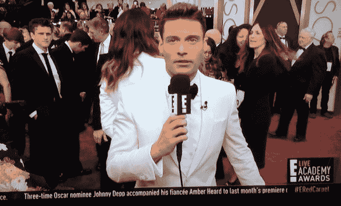

# 奥斯卡奖颁给了...三星、詹妮弗·劳伦斯和自拍

> 原文：<https://web.archive.org/web/https://techcrunch.com/2014/03/03/and-the-oscar-goes-to-samsung-jennifer-lawrence-and-selfies/>

虽然没有一个人真的拿走了小金人，但三星、詹妮弗·劳伦斯和一张众星云集的自拍绝对赢得了昨晚的奥斯卡，至少根据社交媒体的报道。

[PopTip](https://web.archive.org/web/20230130100805/https://techcrunch.com/tag/poptip/) 数据，[实时分析了 Instagram、脸书和 Twitter 上的自然对话](https://web.archive.org/web/20230130100805/https://techcrunch.com/2014/02/19/poptip-launches-zipline-analytics-on-instagram-letting-brands-monitor-photo-friendly-conversations/)，显示三星抢了风头。关于奥斯卡广告商的十大短语包括提及 Galaxy Note、Galaxy s5 和[三星赞助的自拍](https://web.archive.org/web/20230130100805/https://techcrunch.com/2014/03/02/thoreau-warned-us-about-ellens-oscar-selfie/)，这张照片最终成为有史以来被转发次数最多的照片。

事实上，这张 11 位名人(包括梅丽尔·斯特里普、布莱德利·库珀、茱莉亚·罗伯茨、布拉德·皮特和詹妮弗·劳伦斯夫人)的照片在 Twitterverse 上非常受欢迎，它打破了平台足足 20 分钟，有超过 200 万次转发。三星为奥斯卡提供了大量赞助，这只能说明这张历史性的自拍是用 Galaxy Note 拍摄的。

在整个节目中，这家电子巨头被提及超过 5000 次，关于艾伦的三星自拍的独特对话有近 3 万次。

这对三星意味着什么？嗯，有趣的是，三星已经将部分重心从 Galaxy S 系列转移到了增长迅速的 note 系列。三星还在展会期间首次发布了一则 Galaxy s5 广告。此外，每个名人都在人群和后台照片中愉快地使用三星产品发推特、上 Facebooking 和浏览 Reddit。

【YouTube http://www.youtube.com/watch?v=PmF-1WGwdhw&w=640&h=360]

同样值得注意的是，艾伦·德杰尼勒斯似乎在秀场后台用 iPhone (不是 Galaxy Note)发了后台照片和帖子。你知道，三星不会为此生气的地方。

在其他社交媒体新闻中，詹妮弗·劳伦斯仍然是我们在这个世界上最喜欢的人，考虑到她是在这个活动中关于名人的推特最多的人。“詹妮弗·劳伦斯摔倒”是红毯节目中最常被分享的短语，也是当晚推特上十大热门短语之一。总的来说，整个晚上有 18354 个关于詹妮弗·劳伦斯的独特对话。

三星、J-Law、名人自拍和 Aaron Levie's blue shoes 要感谢他们的家人、朋友和学院。(提示音乐。)

额外收获:如果你想在奥斯卡上自拍，试试这个小工具。