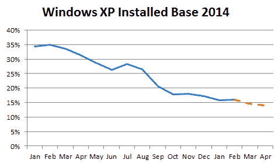

# Windows XP 挥之不去且令人不安的市场份额

> 原文：<https://web.archive.org/web/http://techcrunch.com/2014/03/04/windows-xps-lingering-and-troubling-market-share/?ncid=rss>

# Windows XP 挥之不去且令人不安的市场份额

二月份的市场份额数据已经出来了，看起来 XP 已经准备好站着死了，它掌握着全球操作系统市场的近三分之一。今年第二个月的数字表明 Windows XP 控制了 29.53%的桌面操作系统安装基数。

对 Windows XP 的支持将于 4 月 8 日，即 34 天后结束。在微软终止支持之日，Windows XP 将保持两位数的市场份额。

“虽然我们无法猜测单个用户的原因，但我们的指导一直并将继续是，消费者和组织都需要尽快淘汰 Windows XP，以确保他们拥有最新的安全性、移动性和生产力工具，”微软发言人告诉 TechCrunch。在昨天的一篇[博客文章](https://web.archive.org/web/20230315151900/http://blogs.windows.com/windows/b/windowsexperience/archive/2014/03/03/new-windows-xp-data-transfer-tool-and-end-of-support-notifications.aspx)中，该公司宣布了一个工具来帮助人们迁移出 Windows XP。

我们为什么要担心 PC 市场的一小部分在安全性方面落后呢？嗯，正如 Ars Technica 的 Peter Bright 今天早些时候指出的 ，人们会受到伤害:

> 虽然 Firefox 和 Chrome 都将在 Windows XP 上获得支持，但使用 Internet Explorer 6-8 的大量用户强烈暗示，这些 Windows XP 用户中的许多人不仅将使用不受支持的操作系统，还将使用不受支持的浏览器。
> 
> 对这些人的剥削是不可避免的，很难看到这样的好结局。

情况会比你想象的更糟。我采访了专注于云计算的安全公司 Qualys 的首席技术官 Wolfgang Kandek。他详细描述了剩余的 Windows XP 用户将被晾在一边的过程:随着微软在停止支持 Windows XP 后继续修补 Windows 7，它几乎将为旧操作系统的潜在漏洞绘制路线图。为什么？因为根据 Kandek 的说法，70%的 Windows 7 漏洞也会影响 Windows XP。所以坏人只需要看看 Windows 7 中修复了什么，并检查它是否伤害了 Windows XP。轰，新的战功在飞速涌现。

根据 Kandek 的说法，这不会马上发生，但到了今年 6 月或 7 月，球就会滚动起来。

企业级个人电脑购买者不是正在将他们的车队转移到 Windows 7 吗？是的，但鉴于 Windows 7 的市场份额在 2 月份有所下降，这似乎是有分寸的。Kandek 的公司估计，到死亡之日，14%的企业 PC 仍将运行 Windows XP:

这会变得很混乱。没有潜在的，未来的，“自由视窗”将阻止数百万台个人电脑成为难以置信的开放目标。

图片由 FLICKR 用户[奥斯汀方方正正](https://web.archive.org/web/20230315151900/http://www.flickr.com/photos/swruler/)在 [CC BY 2.0](https://web.archive.org/web/20230315151900/http://creativecommons.org/licenses/by/2.0/) 许可下(图片已被裁剪)