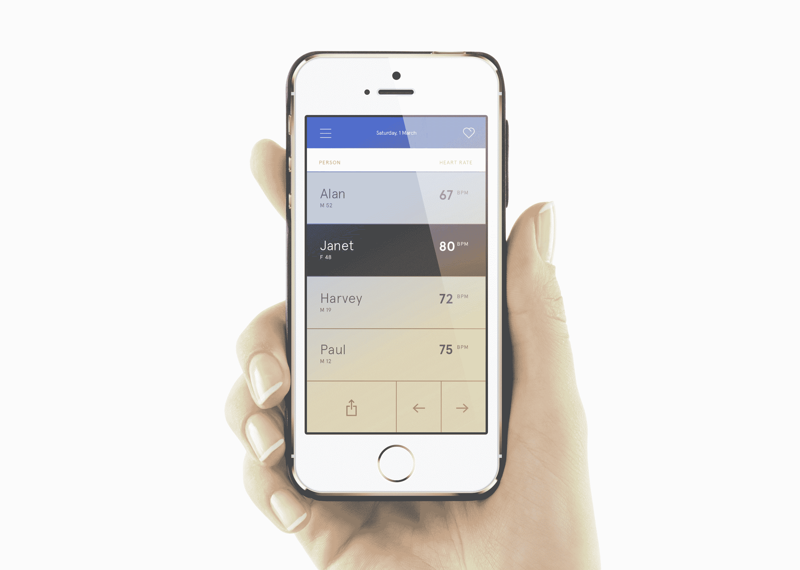
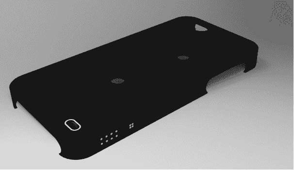

# Wello 用一个装有传感器的超薄健康跟踪 iPhone 外壳超越了 Galaxy S5 TechCrunch

> 原文：<https://web.archive.org/web/http://techcrunch.com/2014/03/06/wello-health-sensor-iphone-case/?ncid=rss>

# Wello 比 Galaxy S5 更胜一筹，它有一个超薄的、充满传感器的健康跟踪 iPhone 外壳

【YouTube http://www.youtube.com/watch?v=3c6QdNhy1Aw？feature = player _ 嵌入式]

智能手机制造商之间的下一场战争很可能围绕健康测量展开，而 [Wello](https://web.archive.org/web/20230129073141/http://azoi.com/) 是一款认识到这一点并希望尽早利用的 iPhone 配件。它为 iPhone 用户提供了一个心率监视器，就像三星在 Galaxy S5 中内置的那样，但除此之外，它还提供了更多功能，包括测量你的心电图、血压、血氧、体温等的传感器。

它使用嵌入在薄外壳中的特殊芯片和外壳背面的两个传感器来实现这一点。这提供了在任何给定时间你的健康状况的“快照”,它提供了上述信息，以及关于你在任何给定时间压力有多大的附加信息。外壳中的电池一次充电可以使用两个月，该应用程序支持多个用户配置文件，因此可以为您的整个家庭工作

Wello 认为这是一个整体健康的解决方案，这就是为什么它也可以与肺活量计连接，让你也可以测量肺活量。据制造 Wello 的 Azoi 公司的首席执行官 Hamish Patel 说，肺活量计和设备上的其他传感器一样，都是“医疗级”的。它还可以与外部硬件配合使用，插入第三方健身追踪器和无线体重秤，使其 API 可供 Fitbit 等外部开发人员使用，以跟踪这些配件测量和监控的活动。

Wello 的一个缺点是它使用了专有的充电电缆，但这是让它如此纤薄所必需的。它并不比苹果自己的 iPhone 皮套大多少，而且它有 iPhone 4s 和 iPhone 5/5s 两种型号。Wello 指出，由于它使用蓝牙 LE，它在技术上也可以连接到支持该标准的 Android 设备，该公司还在与外壳制造商谈判，以获得其芯片的使用许可，并探索自己的 Android 外壳版本的选择。

Wello 现在在美国以 199 美元的价格接受预购，预计将于今年秋天上市，但它需要首先获得 FDA 的批准，因为它是作为医疗设备进行营销的。在所有健康跟踪设备中，Wello 看起来是第一个在一个极其方便和便携的包中提供更全面的内部工作情况的设备。如果传言属实，苹果正在努力将自己的 [Healthbook 个人健康跟踪应用程序内置到 iOS 8](https://web.archive.org/web/20230129073141/https://techcrunch.com/2014/01/31/apple-ios-8-iwatch-health-medical-tracking/) 中，Wello 可能会变得更加相关，因为据报道，该软件将与第三方配件一起工作，以填充其存储的用户健康和健身记录。