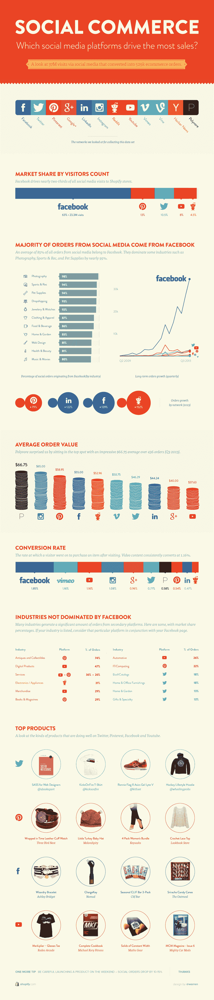

# Shopify 调查了商业网站的社交投资回报率，发现脸书占据主导地位，但 Reddit 正在增长 TechCrunch

> 原文：<https://web.archive.org/web/https://techcrunch.com/2014/03/10/shopify-examines-social-roi-for-commerce-sites-finds-facebook-dominates-but-reddit-is-growing/>

# Shopify 调查了商业网站的社会投资回报率，发现脸书占据主导地位，但 Reddit 正在增长

Shopify 汇编了来自其平台商家的数据，以确定商业网站从社交媒体参与中获得了多少价值，并将结果[放入大规模信息图](https://web.archive.org/web/20221209104640/http://www.shopify.com/blog/12731545-which-social-media-platforms-drive-the-most-sales-infographic#axzz2vQUQZQy2)。如果你和我一样，觉得信息图单调乏味，与有意义的分析背道而驰，那么你会很高兴地看到，我从这张巨大的图中挑出了最有趣的花絮，让你仔细看看。

有趣的是，Shopify 分析了其客户商店的 3700 万次社交访问，发现这些访问导致了 2013 年 52.9 万次电子商务销售。鉴于 Shopify 在 2013 年销售了价值 17 亿美元的商品，而且该调查涵盖了从 90，000 家在线商店收集的数据，这并不是来自社交渠道的巨额资金。但有一些关键的警告需要考虑，最大的是许多商家没有在社交上投入太多，或者实际上根本没有把它作为销售渠道。

至于什么在社交媒体商务中起作用，在将社交份额转化为电子商务美元方面，脸书仍然处于领先地位。2013 年，社交媒体对 Shopify 商店的访问量占总访问量的 63%，总计 2330 万次，社交媒体访问后的订单中约 85%也来自 FB。令人惊讶的是，Polyvore 的平均订单价值是所有社交网站中最高的，Instagram 也很高。这两家公司的平均订单都高于脸书、Pinterest 和 Twitter。Instagram 做得很好，尽管事实上可点击的链接只能通过一个账户的传记来访问。然而，脸书的转换率规则是 1.85%的访问量转化为销售额。

另一个有趣的花絮:Reddit 是社交网站中增长最快的订单来源，2012 年至 2013 年间订单量增长了 152%。FB 也在强劲增长，以 129%的增长率位居第二。

这些统计数据似乎表明，社交媒体以及如何利用它来推动电子商务业务仍然是一个值得大量探索的领域。脸书在大多数重要指标上都处于领先地位，但这可能与它的营销工具比其他网络更成熟、更发达有关。

