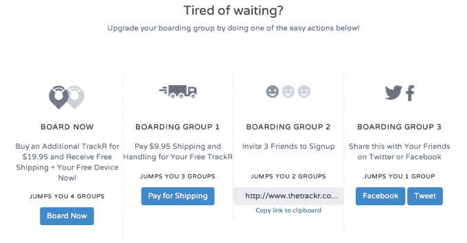

# TrackR 是一种硬币形状的加密狗，可以帮助你找到丢失的物品，现在它们可以互相交谈了 TechCrunch

> 原文：<https://web.archive.org/web/https://techcrunch.com/2014/03/10/trackr-the-coin-shaped-dongles-that-help-you-locate-lost-items-now-talk-to-each-other/>

[TrackR](https://web.archive.org/web/20221006023943/http://www.thetrackr.com/) 是一种蓝牙低能耗软件狗，可以帮助你找到丢失或放错地方的物品，如你的车钥匙、钱包、手提包或甚至你的狗，现在正在升级，以便与其他 TrackR 设备进行点对点通信，这样，当你不在范围内时，你就可以接入更大的网络，以获得更好的支持。因为这样的任务需要网络*实际*存在才有价值，该公司还赠送了价值 10 万美元的 TrackR 技术来启动其努力。

该公司原名为 [Phone Halo](https://web.archive.org/web/20221006023943/http://www.phone-halo.com/) ，由克里斯·赫伯特和克里斯蒂安·史密斯于 2009 年创立，是前一年加州大学圣巴巴拉分校工程学院一个项目的副产品。TrackR 的第一款设备“WalletTrackR”(顾名思义，是为放在钱包里而设计的)很快就众筹出来了。

后来又出现了一种更小的“StickR TrackR”加密狗，它可以用附带的带子添加到钥匙圈上，或者用双面胶粘到任何东西上，包括自行车座椅或狗项圈。正是这些 StickR TrackR 首先升级了额外的点对点支持，尽管大约五个月后的软件更新将为老 WalletTrackR 用户提供类似的东西。

这些加密狗本身提供用户可更换的电池，这是它们区别于一些竞争对手的一个方面，它们能够在 100 英尺的范围内与附近的 iPhone 或 Android 应用程序通信，这是意料之中的事情。(尽管在 TrackR 的案例中，加密狗本身也可以帮助定位运行其应用程序的失踪手机，反之亦然。)

然而，到目前为止，这些设备在超出范围时会断开连接，只为用户提供他们最后已知的 GPS 位置作为参考。

对点对点通信的新支持改变了这一点。TrackR 将这一功能称为“群体 GPS ”,解释说当一件物品丢失时，所有支持 TrackR 的手机都会加入搜索。这类似于 buzzy 的竞争对手 [Tile](https://web.archive.org/web/20221006023943/https://beta.techcrunch.com/2013/06/20/tile/) 今天做出的承诺，但不同的是，TrackR 可能会在市场上击败 Tile(后者仍在接受预购)。

除了简单地建立技术来支撑这个点对点网络，TrackR 还通过一个赠品来播种它的网络。该公司利用病毒式营销活动提供价值 10 万美元的技术，根据各种行为将用户分配到“寄宿组”，包括他们邀请朋友、在社交网络上分享、支付运费或以折扣购买额外设备的意愿。(通常是24.95 美元，但用户可以花 19.95 美元购买额外的一个)。那些挤进 1 & 2 组的人将会得到免费的加密狗。

在撰写本报告时，等候名单上目前有近 98，000 名用户在排队。

迄今为止，该公司已售出约 5 万至 6 万台 StickR TrackR 和 10 万台 WalletTrackR。它现在有超过 100，000 名活跃用户，并跟踪了 100 万件商品。

除了瓷砖，TrackR 还与 [Stick N Find](https://web.archive.org/web/20221006023943/https://beta.techcrunch.com/2013/01/13/sticknfind/) 、 [hipKey](https://web.archive.org/web/20221006023943/http://hippih.com/hipkey) 、 [Hone](https://web.archive.org/web/20221006023943/http://gethone.com/) 以及其他几个竞争对手。

[vimeo 87703541 w=500 h=281]