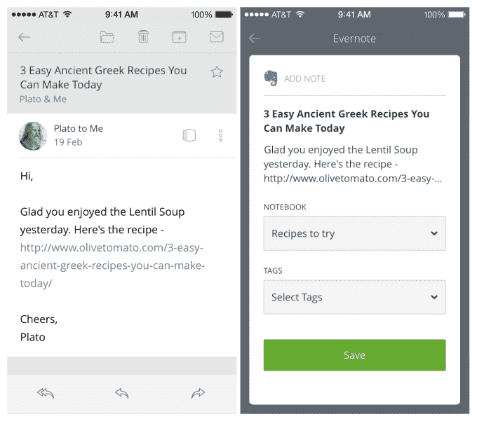
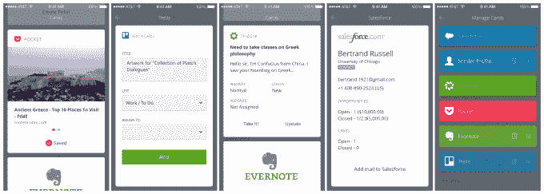

# CloudMagic 的电子邮件应用程序现在可以让您直接从收件箱中完成工作 TechCrunch

> 原文：<https://web.archive.org/web/https://techcrunch.com/2014/03/11/cloudmagics-email-application-now-lets-you-compete-your-work-right-from-your-inbox/>

[CloudMagic](https://web.archive.org/web/20221006224522/https://cloudmagic.com/) ，一个[个人搜索应用](https://web.archive.org/web/20221006224522/https://beta.techcrunch.com/2013/01/17/personal-data-search-engine-cloudmagic-goes-pro-hopes-users-find-it-useful-enough-to-pay/)的开发者，在二月份[改变方向](https://web.archive.org/web/20221006224522/http://blog.cloudmagic.com/2014/02/04/cloudmagic-search-is-shutting-down/)成为一个专注于搜索的电子邮件应用，今天早上发布了一个重大更新。该公司正在推出一项名为“卡片”的新功能，通过允许你在收件箱中完成工作流程，让你对电子邮件做更多的事情。这些可能包括更新服务台票证、将数据保存到 Salesforce、在 Evernote 中创建笔记、在 Pocket 中标记链接等等。

打开时双击电子邮件，或者单击发件人姓名旁边的小图标，就可以访问这些卡片。

CloudMagic 创始人兼首席执行官 Rohit Nadhani 解释说，cards 的想法是因为电子邮件与许多其他类别及其相关活动重叠，例如，包括 CRM、服务台、协作、营销自动化、人力资源和会计。他的意思是，电子邮件通常只是需要完成的更多工作的起点，而今天，这些工作很难在移动设备上完成，因为它的屏幕空间有限，而且必须从一个应用程序切换到另一个应用程序会产生心理负担。

另一家电子邮件初创公司 Acompli，[也有类似的想法](https://web.archive.org/web/20221006224522/https://beta.techcrunch.com/2014/02/20/acompli-raises-7-3m-series-a-from-redpoint-others-to-fix-mobile-email/)，即将工作流集成到其电子邮件应用程序中，但它没有从第三方集成开始，而是更专注于办公基础，如联系人、日历和文件。

“最新数据显示，70%的电子邮件首先在手机上阅读，人们每天查看手机邮件 40 次，”纳德哈尼指出。“在移动设备上，知识工作者“生活”在电子邮件应用程序中。他说:“CloudMagic Cards 将使用户无需离开电子邮件应用程序就能完成工作流程。

在发布会上，CloudMagic 正在制作七种新卡片，包括 Sender Profile(一种类似于 Rapportive 的联系人卡片)、Evernote、Pocket、Trello、Salesforce、Zendesk 和 MailChimp。更多的卡正在制作中，该公司还开放了其平台，因此任何开发者都可以展示自己的卡，如果他们愿意的话。

至于 CloudMagic 下一步将推出哪些卡片，Nadhani 说他们正在采取观望的态度。“我们将看到哪些卡正在起飞，然后在该类别上加倍下注，”他解释道。“例如，如果 Salesforce 正在起飞，我们将为 SugarCRM、Microsoft Dynamics CRM 等发布贺卡。”

这些卡片，无论是现有的还是即将推出的，都可以处理许多使用案例，无论是创建联系人或线索，将电子邮件转换为支持票，创建任务，保存文本或链接的文章以供日后阅读，查看发送者的个人资料数据，等等。

最终，这一想法将是对其中一些卡收费，但纳德哈尼说，价格尚未确定。然而，该公司将从第二季度开始尝试不同的定价方案。

虽然我个人很怀念 CloudMagic 早期的搜索工具，但自从它推出以来，我已经越来越喜欢它的电子邮件应用了。该公司表示，之所以转向电子邮件，是因为它发现，根据用户日志，80%的 CloudMagic 用户主要使用这项服务来搜索他们的电子邮件收件箱，而不是他们的其他云连接服务。这让该公司相信，在探索如何改进电子邮件本身方面有更多的机会，不仅包括更好的搜索，还包括其他活动，如今天的新卡片。

尽管纳德哈尼承认，当新应用于 2013 年 11 月推出时，没有多少用户从搜索转向电子邮件，随后搜索应用于次年 2 月被关闭。但用户真正想要的是更好的电子邮件的前提似乎是正确的:该公司的邮件应用程序下载量接近 50 万次，每周活跃 12.5 万次，每天活跃 7.5 万次。后两个数字分别以 15%和 19%的速度增长。

这家总部位于帕洛阿尔托的初创公司是由纳德哈尼的另一家公司 [Webyog](https://web.archive.org/web/20221006224522/http://www.crunchbase.com/company/webyog) 孵化和资助的，该公司是一家帮助客户监控和管理数据库的工具制造商。这使得 CloudMagic 跳过了种子阶段的融资，直接进入首轮融资，这可能会在今年进行。

这款新应用现在可以在 [iOS](https://web.archive.org/web/20221006224522/https://itunes.apple.com/us/app/cloudmagic-free-email-app/id721677994?mt=8) 和 [Android](https://web.archive.org/web/20221006224522/https://play.google.com/store/apps/details?id=com.cloudmagic.mail) 上使用。

【YouTube http://www.youtube.com/watch?v=s0-4WrA6YVQ])