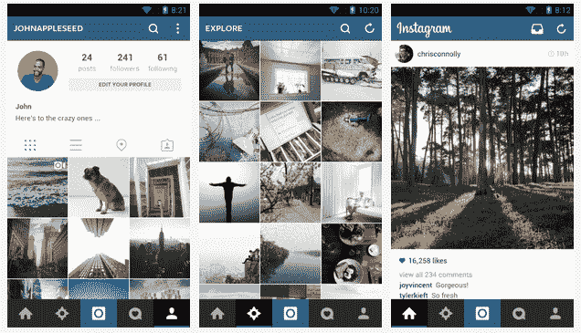

# Instagram 推出重新设计的 Android 应用，在更多设备上运行更快更好 TechCrunch

> 原文：<https://web.archive.org/web/https://techcrunch.com/2014/03/11/instagram-launches-a-redesigned-android-app-thats-faster-and-better-on-more-devices/>

# Instagram 推出了一款重新设计的安卓应用，在更多设备上运行更快更好

Instagram 今天在 Google Play 上发布了其应用程序的 5.1 版本，经过重新设计，带来了更快、更节省资源的体验。根据宣布这一消息的官方博客帖子，你的个人资料应该在一半的时间内加载，整个应用程序在更新后只有一半大。

该应用程序也有一个新的外观，在整个体验中有“简化的视觉效果”，使用户更容易参与。总的来说，它看起来像一个扁平化的用户界面，这更符合 Android 的一般做法，也符合 OEM 对他们自己的软件所做的许多改变。

Instagram 表示，重新设计不仅是为了让东西看起来更好、运行更好，也是为了让 Instagram 在更广泛的硬件上可以访问和愉快地使用，包括低端智能手机和安卓系统的“功能手机”，以及更大屏幕的设备，如世界上每个 OEM 厂商似乎都在制造的平板手机。