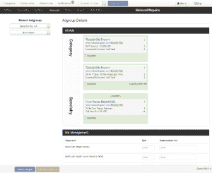
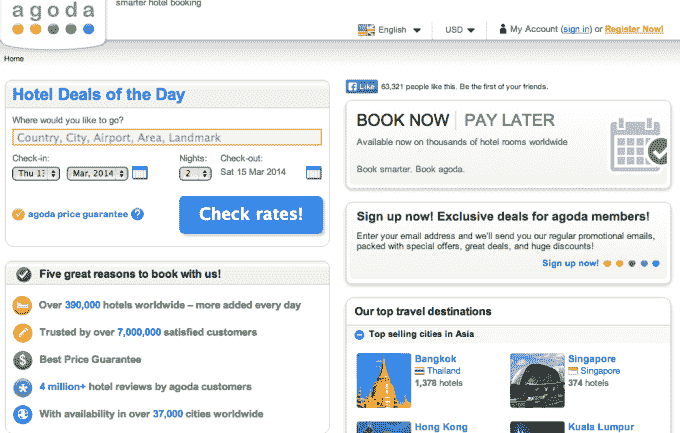
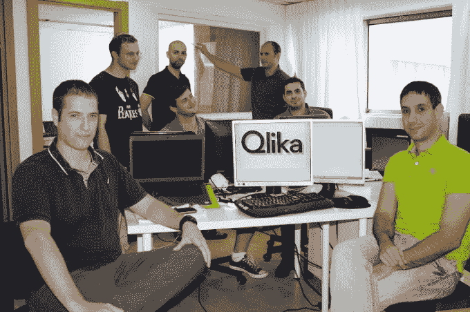

# Priceline 以 1500 万至 2000 万美元收购以色列 Qlika，借助火箭科学驱动的广告技术 TechCrunch 推动全球扩张

> 原文：<https://web.archive.org/web/https://techcrunch.com/2014/03/11/priceline-buys-israels-qlika-for-15-20m-to-boost-global-expansion-with-rocket-science-powered-ad-tech/?ncid=rss>

今年 3 月，Qlika 从 UpWest 的第四批以色列裔美国初创公司中脱颖而出，着手解决在线营销的一个大问题:本地化。换句话说，如果这些营销活动在加州和在悉尼看起来完全一样，那么在搜索、社交和展示方面花费数百万美元的营销活动又有什么意义呢？理想情况下，由于不同地点的转换率不同，公司应该定制他们的信息，瞄准客户人口统计数据，并以同样的方式调整他们的关键词竞价。

Omri Morgenshtern、Ittai Chorev 和 Idan Zalzberg 在与一些首席营销官坐下来讨论后，很快发现大多数大型组织都没有——尽管投入了资金——也没有为每个市场制定转化率或 ROI 目标。因此，联合创始人开发了正在申请专利的技术来帮助广告商做到这一点，并为每个特定的市场、媒体渠道和细分市场管理和优化他们的活动。

虽然这家初创公司的“微观市场定位”技术可以应用于一系列行业——这使其作为潜在的收购诱饵具有广泛的吸引力——但首先到达那里的是一家在线旅行社。本周，旅游预订和服务提供商 Priceline.com 证实，它将收购这家以色列初创公司，以支持其国际业务的增长，特别是在亚洲。

Priceline 和 [Qlika](https://web.archive.org/web/20221007062918/http://www.qlika.com/) 都拒绝透露交易条款的细节；然而，TechCrunch 从接近两家公司的多个渠道获悉，该交易的总价值在 1500 万至 2000 万美元之间，而不是最初报道的 300 万美元。此外，我们还了解到，虽然这家初创公司的 10 名员工中的大部分将全职加入 Priceline，但该团队不会跨越大西洋前往 Priceline 在美国的总部，而是与其 Agoda 领导的亚洲业务合作。

至于价格，Qlika 已经从以色列天使投资人和风投那里筹集了 170 多万美元，预计 2014 年的运营成本为 300 万美元，[正如我们去年 10 月](https://web.archive.org/web/20221007062918/https://beta.techcrunch.com/2013/10/23/with-a-fresh-1-7m-in-the-bank-qlika-wants-to-help-online-marketing-campaigns-go-hyperlocal/)报道的那样，300 万美元的现金价格实际上是一笔大甩卖。如果这家成立仅 3 年、正在努力赚钱的公司发生内爆，那就说得通了，但这家公司成立仅一年，6 个月就实现了 100 多万的收入，而且据说增长很快。

然而，更有趣的是这次收购对 Priceline 的潜在意义。从历史上看，这家在线旅游预订网站在其收购战略中表现出了惊人的精明和决心，结果今天拥有了 Booking.com、租车、Kayak 和 Agoda。虽然这些名字可能不会从页面上跳下来，但 Booking.com 是一个以合理价格收购的伟大例子(相对于[咳咳](https://web.archive.org/web/20221007062918/https://beta.techcrunch.com/2014/02/19/facebook-buying-whatsapp-for-16b-in-cash-and-stock-plus-3b-in-rsus/))，它将悄悄地返回其价值的许多倍——并成为一些人所说的(读:夸大其词)是[“十年来最有价值的旅行交易。”](https://web.archive.org/web/20221007062918/http://www.tnooz.com/article/why-pricelines-purchase-of-booking-com-was-the-most-profitable-travel-deal-of-the-2000s/)

Priceline 以 1.35 亿美元收购 Kayak 的交易在 2005 年没有像 7 年后 Kayak 更引人注目、更昂贵的收购那样受到关注，但这笔交易让 Priceline 获得了总部位于荷兰的 Booking.com 在欧洲规模虽小但快速增长的市场份额。

正如 1 he Street . com/story/12438063/1/priceline-shows-Facebook-there-than-a-one-way-to-do-growth . html " > The Street 指出的那样，Expedia 最初在欧洲在线旅行社市场份额中领先，但随着收购，Priceline 能够超越 Expedia。通过一些聪明的品牌和广告，Booking.com 今天已经成为 Priceline 最大的业务部门和欧洲领先的旅游品牌之一，拥有欧洲 45%的在线预订份额，[如果你问比尔·格利](https://web.archive.org/web/20221007062918/http://abovethecrowd.com/2013/04/18/a-rake-too-far-optimal-platformpricing-strategy/)，他是 Priceline 690 亿美元市值的重要贡献者。

同样值得注意的是，Booking.com[在 AdWords](https://web.archive.org/web/20221007062918/http://www.tnooz.com/article/is-booking-com-the-travel-king-of-google-adwords-infographic/) 上花费了巨额资金。碰巧的是，Qlika 从一开始就明确的目标是通过帮助开展大型全国性营销活动(如 Booking.com)的公司“避免在目标市场使用统一的出价和目标”，从公司每年花费在搜索广告上的 400 多亿美元中分得一杯羹

此外，[正如我当时在](https://web.archive.org/web/20221007062918/https://beta.techcrunch.com/2013/10/23/with-a-fresh-1-7m-in-the-bank-qlika-wants-to-help-online-marketing-campaigns-go-hyperlocal/)所写的，Qlika 不仅希望帮助公司理解“微观市场的差异”——比如客户愿意在一个市场和另一个市场为特定产品支付的平均价格，以及这与转化的关系——而且希望自动化整个过程。你可以想象，对于像 Booking.com 这样的公司来说，即使它通过应用这些成分而成为“广告词之王”，这样的技术能有多少价值。这有可能让 Booking.com 的 4000 万美元得到更多的回报。

回到 Priceline 聪明的收购策略，它或多或少地试图复制它在 Agoda 与 Booking.com 的成功，Agoda 是它在 2007 年以大约 1 . 4 亿美元收购的泰国旅游网站。它的影响程度不尽相同，但 Agoda 的专长是在亚洲提供酒店预订折扣，该地区是 Priceline 国际预订率强劲增长的关键驱动力。

虽然这纯粹是猜测，因为 Priceline 拒绝对其收购计划发表评论，但如果它计划利用 Qlika 来帮助它增加 Agoda 在亚洲的市场份额，并优化其营销支出，这将是非常合理的。毕竟，尽管这家初创公司打算将其技术广泛应用于各个垂直行业(尤其是零售行业)，但它最初的重点是家装和酒店业。

此外，它的目标是以比 AdWords 解决方案更高的分辨率为公司提供更精细的目标定位和活动可见性。它的大数据引擎处理大量的客户、人口和地理数据(等等)，发现市场和细分市场之间的相似之处，并相应地自动优化活动和出价。

由于 Priceline 拥有 Kayak、Booking.com 和 Agoda 等高流量资产，它拥有大量的客户和人口统计数据，Qlika 可以利用这些数据来开展更有针对性、更具成本效益的活动。如果它能在这里或那里提高几个百分点的转化率，在规模上，这可能意味着大笔的钱，1500 万到 2000 万美元，将使 Qlika 成为一笔大买卖。

