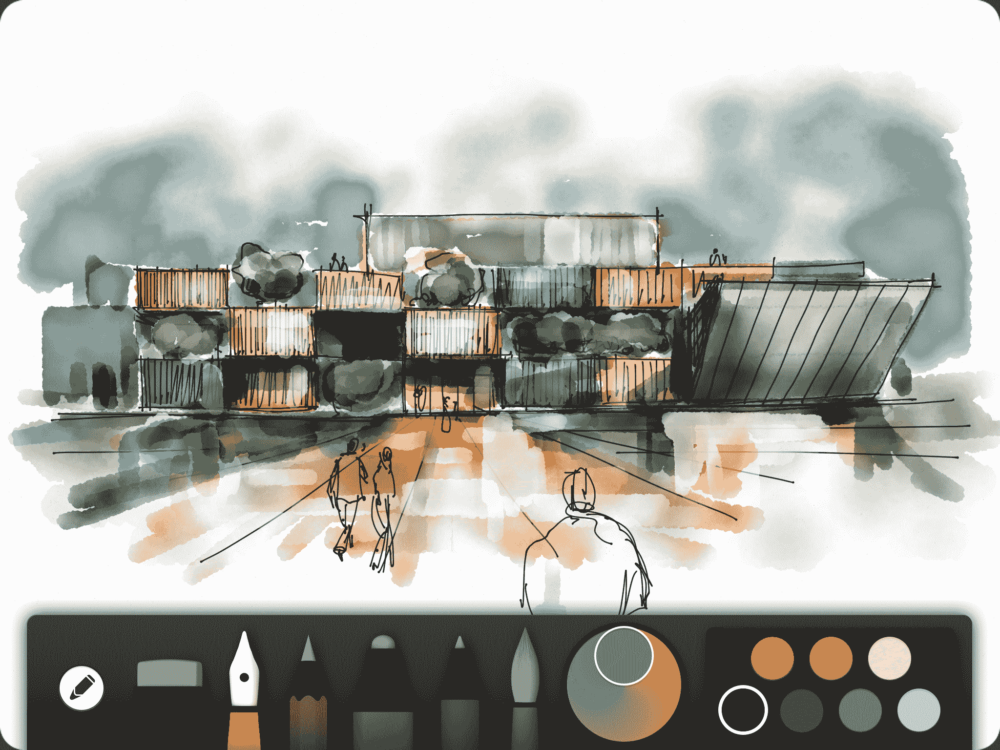

# FiftyThree 为 iOS 7 更新创意应用程序文件以改进导航和控制 TechCrunch

> 原文：<https://web.archive.org/web/http://techcrunch.com/2014/03/12/fiftythree-paper-ios-7/?ncid=rss>

# FiftyThree 为 iOS 7 更新创意应用程序文件，以改进导航和控制

由于其绘画和[创意应用纸](https://web.archive.org/web/20230209130702/http://www.fiftythree.com/paper)的大受欢迎，以及其[补充铅笔手写笔](https://web.archive.org/web/20230209130702/https://techcrunch.com/2013/11/19/fiftythree-pencil/)的发布，53 在过去几年里蓬勃发展。今天，它在改进创建过程方面迈出了一大步，对其纸质应用进行了更新，更新后的应用速度更快，响应更快，并为用户提供了更多工具。

Paper 已经是设计最好的平板电脑创作工具之一，自 2012 年推出以来，它已经赢得了各种奖项和赞誉。但新版应用更好，iOS 7 有了新的外观，FiftyThree 希望它能更容易阅读，并改善用户的整体创作流程。

重新发布应用程序使 53 在大的和小的方面改进了总体设计。“我们想借此机会让一切变得更干净、更明亮、更新鲜，”联合创始人安德鲁·艾伦告诉我。这包括通过更快的菜单、简化的图标菜单、更浅的颜色和更好的可读性来改进导航。

艾伦说，通过这次更新，公司更新了数以千计的视觉元素，其中一些即使是铁杆纸用户也不会立即注意到。iOS 7 本身比之前版本的操作系统有更精简的视图，这很有帮助。

“iOS 6 中有很多装饰被去掉了，”他说。“我认为我们实际上更新了纸面上的所有资产。几乎每个像素都被触摸过，甚至是你可能不会马上注意到的细微之处。”

它还能让用户在放大和缩小时有更细致的控制。放大现在可以调整绘图、颜色、擦除和混合工具的大小，让创作者更好地控制他们的项目。它更新了点在绘制和擦除中的工作方式，使用户能够快速点击以制作小点，或按住画布以创建更大的点。

当然，五十三并不是唯一一个发布名为 Paper 的应用的 iOS 开发者。脸书也开始使用品牌名称 T1，它发布了一个新的应用程序，这个应用程序重新定义了 T2 的移动新闻源 T3。53 随后[申请了商标](https://web.archive.org/web/20230209130702/https://techcrunch.com/2014/02/04/fiftythree-files-trademark-for-paper/)，但是还不清楚它的案件[在商标纠纷](https://web.archive.org/web/20230209130702/https://techcrunch.com/2014/02/03/facebook-vs-fiftythree/)中会有多强。

尽管如此，该公司似乎做得相当不错。它仍然是生产力类别中排名前 20 的应用之一，去年夏天从安德森·霍洛维茨、Highline Ventures、Thrive Capital、SV Angels 和杰克·多西那里筹集了 1500 万美元。