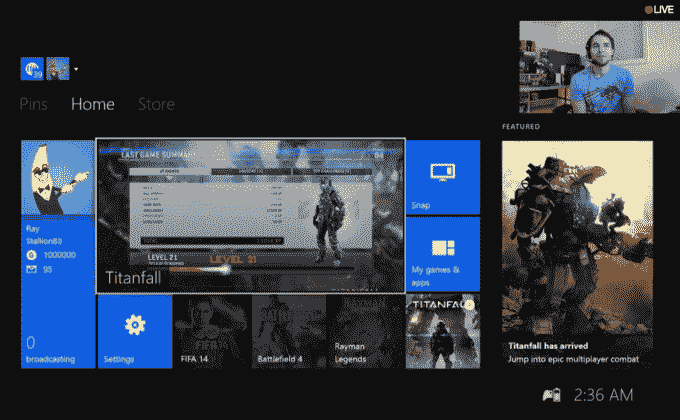

# 这花了 8 年时间，但有人刚刚在 Xbox Live | TechCrunch 上打破了 100 万玩家分数

> 原文：<https://web.archive.org/web/http://techcrunch.com/2014/03/12/it-took-8-years-but-someone-just-broke-one-million-gamerscore-on-xbox-live/?ncid=rss>

# 这花了 8 年时间，但有人刚刚在 Xbox Live 上打破了 100 万玩家分数

如果你曾经梦想清理掉所有未完成的 Xbox 游戏，并以某种方式成为第一个突破 100 万 gamerscore 的人:不要打扰——截至今晚，它已经完成了。

对于那些不熟悉 Xbox gamerscore 系统的人来说:它是你在所有 Xbox 360/Xbox One 游戏中获得的所有“成就”的累积分数。每个游戏都有不同的挑战(有些挑战比其他挑战更难，每个挑战都有固定的分数。每款游戏最高可获得 1000 分，以奖励每个玩家所取得的成就，不过他们可以在游戏推出后提供可下载的内容。简而言之:你完成的游戏越多，你的玩家分数就越高。

在过去的几年里，玩家们看着两个特别专注的人争夺一百万。然而，在过去的几个月里，很明显，他们中的一个——stallion 83，或者，他不在电视前时被称为 Raymond Cox——将首先击中它。

给你一个时间感，这里:这是考克斯自 Xbox 360 发布以来一直在争取的东西。是的，360——不是刚刚发布的那款。360 是 8 年前在 T4 发布的控制台。

疯狂的部分？在某一点上，挑战不在于征服成就，而在于*找到成就来征服*。直到最近，还没有足够多的游戏发布，也没有足够多的挑战，总计达一百万。

从整体来看:尽管 Xboxes 销量超过 8000 万台，但已知玩家分数超过 50 万的不到 200 名。

让他超越极限的游戏？泰坦陨落。还有什么。

这是我们生活在一个疯狂时代的标志:他在 Twitch 上向一百万人直播了比赛的最后几个小时。电视上，超过 10，000 人观看了他越过终点。不管怎样，伙计——我仍然在街边比萨饼店的吃豆人游戏机上获得最高分。