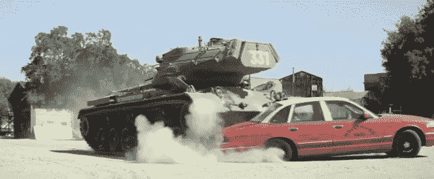

# 观看阿诺德·施瓦辛格用坦克碾压东西...为了慈善 TechCrunch

> 原文：<https://web.archive.org/web/https://techcrunch.com/2014/03/12/watch-arnold-schwarzenegger-crush-things-with-a-tank-for-charity/>

# 观看阿诺德·施瓦辛格用坦克压碎东西…为慈善事业

如果你曾经想看阿诺德·施瓦辛格用他的私人坦克碾碎一卷 5 英尺长的泡沫塑料(真的，谁没有呢？)，恭喜你！今天是你的幸运日。

就在几年前，Omaze 背后的人开始了一项相当值得称赞的探索:为慈善事业筹集资金，他们将出售实质上是无数“一生一次的机会”的彩票——从与名人约会一天，到参观 SpaceX 总部。

当时，我怀疑他们会想“嘿——也许有一天我们会让阿诺德·施瓦辛格开着他的坦克到处转，碾碎出租车、巨大的复活节彩蛋、生日蛋糕和一大卷泡沫塑料。为了慈善。”

**但他正在这么做。下面是视频:**

[https://web.archive.org/web/20221130211056if_/https://www.youtube.com/embed/w4lnVx2BAYk?feature=oembed](https://web.archive.org/web/20221130211056if_/https://www.youtube.com/embed/w4lnVx2BAYk?feature=oembed)

视频

奥马兹比赛还有两天就结束了。如果你赢了，你可以和阿尼本人一起打滚，在他的油箱里砸东西，抽雪茄，可能还会随意引用阿诺德·施瓦辛格的电影，你会立刻觉得这样做很尴尬。如果你没赢呢？不要太难过:大部分的钱都给了课后全明星队，这有助于资助孩子们的课后健身计划。

(有趣的事实:这个[的想法来自一个 redditor](https://web.archive.org/web/20221130211056/http://www.reddit.com/r/ArnoldSchwarzenegger/comments/1t7hmh/give_me_some_advice/) 。阿诺德实际上是这些地区的常客。他做过几个 ama，并不时地在健美子网站上投放知识炸弹。)