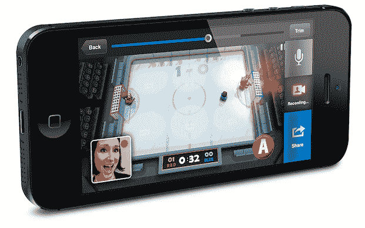

# Unity 收购 Applifier，为更多游戏带来可共享的即时回放 TechCrunch

> 原文：<https://web.archive.org/web/http://techcrunch.com/2014/03/13/unity-acquires-applifier-to-bring-shareable-instant-replays-to-more-games/?utm_source=dlvr.it&utm_medium=twitter>

你的朋友拿出他的手机。在给你展示一个特别疯狂的场景之前，他说:“Duuude——你一定要*去*看看这个游戏。”。

一个游戏真的还有更有效的广告吗？

Unity 不这么认为。这就是他们刚刚收购 Applifier 的原因，Applifier 是一家帮助开发者在他们的游戏中添加即时回放类型录音的公司。

如果你没有听说过[申请人](https://web.archive.org/web/20230128091613/https://everyplay.com/)，不要觉得太糟糕——他们是一种幕后交易。那些制造东西来帮助其他人制造东西的公司之一。

他们制作的东西之一叫做 [Everyplay](https://web.archive.org/web/20230128091613/https://everyplay.com/) 。这是一个 SDK，允许移动游戏开发人员快速将重播添加到他们的游戏中，从而允许游戏玩家记录和分享他们玩游戏时发生的精彩事情。当你在游戏中做一些很酷的事情时，你可以点击录制按钮，通过 DVR 风格的界面选择你想要的预先录制的片段，然后在脸书、Twitter 或 Everyplay 自己的视频网络上分享。

一月份，Everyplay 分享了 60 万次重播；今年 2 月，这一数字升至 65 万。迄今为止，它已经被集成到大约 300 款游戏中。

这是它实际运行的样子:

【YouTube http://www.youtube.com/watch?v=Qu1V2OGk6FI？feature = player _ embedded & w = 640 & h = 360]

如果你没有听说过 Unity，那是你的事——他们在游戏开发领域已经相当重要了。他们的事？他们开发了一个游戏开发引擎，可以让你一次开发一个游戏，并在多种平台上运行——iOS、Android、Windows Phone、黑莓、Windows、Mac、Linux 等等。—代码更改最少。Unity 首席执行官大卫·赫尔加松告诉我，仅在过去的 30 天里，就有超过 600，000 名开发人员参与了一个 Unity 项目。

收购的直接目标很简单:更好地整合 Everyplay/Unity。Everyplay 已经与 Unity 兼容，但赫尔加松告诉我，他希望增加回放/视频共享支持“只需点击一个复选框”。

Applifier 首席执行官 Jussi Laakkonen 提到了一个很酷的细节:Everyplay 的视频记录系统实际上在不降低游戏性能的情况下工作，鉴于视频转码是相当资源密集型的，这有点违反直觉。

它是怎么做到的？通过点击正确的专用硬件。大多数 iOS/Android 智能手机内部都有专门用于编码视频的芯片，主要用于配合相机工作。但是当你在玩游戏的时候，这些芯片通常不会做很多事情。通过将视频游戏回放编码任务推送到这些芯片上，你手机的 CPU/GPU 可以自由处理游戏本身。

此次收购还将 Applifier 的视频广告网络 [GameAds](https://web.archive.org/web/20230128091613/https://everyplay.com/gameads) 置于 Unity 旗下。

交易的条款没有披露(当然，我们正在挖掘更多)，但鉴于 Unity 想要这项技术，Applifier 有 40 多名员工，这听起来肯定不仅仅是一次收购。