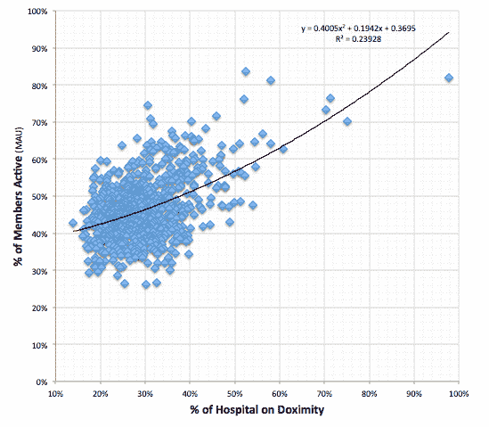
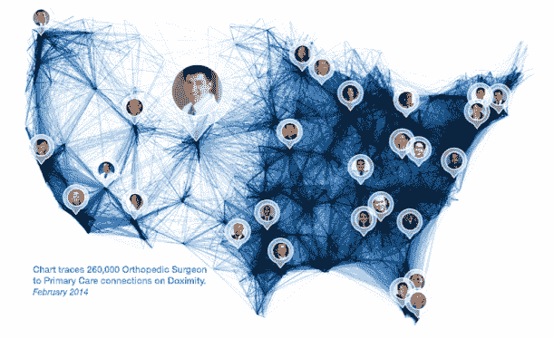

# 随着 40%的美国医生注册，Doximity 的 Jeff Tangney 揭示了医学博士的社交网络如何达到临界点 TechCrunch

> 原文：<https://web.archive.org/web/https://techcrunch.com/2014/03/15/with-40-of-u-s-doctors-signed-on-doximitys-jeff-tangney-reveals-how-the-social-network-for-m-d-s-hit-the-tipping-point/>

随着奥巴马医改的到来，数百万没有保险的美国人第一次进入了医疗保健系统。当这些新病人高兴地涌入候诊室时，医生们正在努力跟上不断增长的需求。在候诊室的闪电战中保持高标准的护理需要医疗实践的更高效率，医生们迫切需要可以帮助减轻一些压力的解决方案。

通过让医生更容易在团队、医院和整个卫生系统之间进行联系和沟通， [Doximity](https://web.archive.org/web/20221221125045/https://www.doximity.com/) 希望为全国的医学博士提供一个释放阀。这家总部位于圣马特奥的公司于 2011 年初推出，为医疗专业人士提供一个免费的、符合 HIPAA 标准的 LinkedIn 替代品，从那以后它就像杂草一样生长。

这部分是因为 Doximity 一直在努力将自己从一个社交网络(以及 LinkedIn 的垂直版本)转变为一个平台。今天，Doximity 不仅作为专业网络和个人资料页面为医生提供服务，还作为一种为患者找到相关专家的方式、一个名片夹、一个继续医学教育工具、一个新闻门户、一个电子邮件和文本服务以及一个虚拟休息室。

创始人兼首席执行官[杰夫·唐尼](https://web.archive.org/web/20221221125045/http://www.crunchbase.com/person/jeff-tangney)希望该平台成为医疗保健专业人员和医生的公用事业，并通过求助于社区内的医生来帮助其做出产品决策，从而帮助他们完成工作。Doximity 并不是 Tangney 第一次坐在健康技术的旋转木马上，他曾创建移动健康软件应用巨头 Epocrates 并担任总裁和首席运营官。

然而，随着医疗社交网络今天宣布它现在覆盖了 40%的美国医生——大约 25 万人——全国医学博士对 Doximity 的需求(和支持)甚至让唐尼感到惊讶。

在 TechCrunch 的独家采访中，Doximity 的首席执行官停下来提供了一点关于这家初创公司如何能够达到临界点的见解，以及推动这一增长的因素，以及公司未来计划的高峰。

Doximity 可能发展很快，但让我们倒回去一点，为什么医生不使用 LinkedIn 或脸书来满足他们的专业社交需求呢？Doximity 是如何从巨头中脱颖而出，为医生提供更多价值的？

嗯，首先，作为一名医生并不是一份普通的工作。我的意思是，还有什么职业需要九年的研究生教育，一个完整的拉丁语词汇，并发誓？因此，我们的网站与社交和专业网络中熟悉的名称有很多不同之处，比如 HIPAA 隐私、专业论坛、研究提醒、医学教育学分等等。

但我想说，我们发展如此迅速的主要原因是安全的电子邮件。我无法想象没有电子邮件的工作，但事实上这是我们要求每个美国医生做的。想想都有点疯狂。

**现在，美国 40%的医生都是你，告诉我们你们是如何达到临界点的？**

我们看到，转折点真的发生在次级市场。在我们的例子中:一家医院，一个城市，或者一个专业。每一个都有一点不同，但这是一个神奇的点，在一个预先存在的社会或经济群体中，如果他们不在其中，就会感到“被排除在外”。

下图显示了 Doximity 在美国前 1000 家医院的覆盖率和使用情况。毫不奇怪，一家医院的医生越多，我们从每家医院获得的使用就越多。这是网络效应和梅特卡夫定律在起作用。

同样，不足为奇的是，规模较小的市场首先倾斜。对我们来说，是阿拉斯加。阿拉斯加北坡的医生需要专家的帮助，但是经常缺乏时间或金钱将他们的病人空运到几个小时以外的医院。因此，他们开始使用我们的移动应用程序来查找其他医生，并发送安全照片。由于那里只有 1500 名医生，仅用了几个月就达到了临界规模。即使在今天，它仍然是我们最活跃的州之一。

**我想有些人会惊讶地发现，Doximity 既是一个平台，也是一个社交网络……能够扩展 Doximity 功能的核心用例有哪些？医生真正想要的是什么？是为了社交和与同龄人的联系，还是教育资料，或者电子邮件，传真和短信服务？**

是的，平台部分真的很酷。我们有超过 75 个合作伙伴网站现在使用我们的 OAuth“使用 Doximity 登录”按钮来验证医生。这使得医生更容易验证和证明他们自己拥有所有这些正在涌现的伟大的新的健康服务。

至于我们的其他用法，我认为我们的模式与 LinkedIn 或脸书大体一致。主要用途是通过转诊搜索浏览“医疗图表”,查看个人资料，与过去的同事重新联系。大约 25%的医生定期使用我们的安全信息(包括我们的免费 eFax ),三分之一的医生每月使用我们的继续医学教育和研究警报工具。

**医生是否真正参与了产品开发，如果是，是如何参与的？**

我的创业生涯始于听我在斯坦福大学的内科室友的话，15 年后在 Doximity，这仍然是我喜欢做的事情。我们有 5 名医生，加上顾问委员会，每月和每年的医生会议…我们投入了大量的精力来真正了解医生的需求。

与上面两个问题相关:你如何增加医生的参与度，并鼓励他们使用 Doximity？

医生超级忙，所以快速、设计良好的功能是关键。像很多创业公司一样，我们做了很多拆分测试。我们甚至进一步开展内部竞赛，例如，我们让两个数据科学团队对“你可能认识的人”算法进行 A/B 测试。获胜者可以得到舒适的新办公椅，而失败者必须“炫耀”(穿上服装)去卡拉 ok 酒吧。

我们也寻求大量的实时反馈——与医生共度的一年一度的周末，每月一次的聚餐，等等。我们的一些最好的想法来自于吃饭时听医生的谈话。我们的一些最好的想法——如继续医学教育学分、转诊模板、efax、医院排名调查和在线时间表——都来自这些会议。

**Doximity 的增长是否融入了我们在数字健康领域看到的任何主要趋势？推动 Doximity 和数字医疗整体采用的主要因素是什么？**

在过去的五年里，大约三分之一的医生从私人诊所转到医院系统工作。奥巴马医改正在加速这一转变。这正在改变医生交流的方式和他们思考职业的方式。我们在这里帮助他们度过这些转变，并优化与他们的同事和病人护理的沟通。总体而言，这是医疗保健更加透明的大趋势的一部分，无论是对患者还是对提供者而言。

【Doximity 在业务和产品方面的下一步是什么？

如今，近 40%的医生都在使用 Doximity，我们有了一些伟大的想法，但还没有什么可以公开讨论的。我只想说，我们相信我们可以通过集体(新疗法)和合作(患者水平)来推进医学的智慧。

LinkedIn 的成功/扩张——尤其是成为专业人士的内容网络——对你的发展方向产生了怎样的影响？用户是否将 Doximity 视为医生搜索引擎——许多人在提到李时的主要使用案例？

就像商界的 LinkedIn 一样，我们是大多数医生的“记录档案”。如果这就是我们所做的，我们会非常高兴，因为医学真的需要一个主目录，让我们更容易找到利基专家，浏览保险网络等。

在内容方面，我们去年尝试了一项研究提醒服务，效果相当不错，所以我们现在正在向所有专业推广。核心想法来自我们一次晚宴上的一位医生。像大约一半的美国医生一样，他撰写了公开发表的研究，就他的情况而言，是关于一种罕见的主动脉疾病。其他人引用了他的研究，但他每个月都要去国家医学图书馆查找是谁。所以我们开始发送警报，现在每月能提醒 70，000 名医生，新的研究引用了他们的研究。此外，我们让他联系其他医生进行合作，这导致了。

跟上新的医学文献是医生工作的一部分，但跟踪出版物、发送安全信息、获得推荐和规划职业道路也是如此。我们发现一个特别值得关注的统计数据是，一项专门的新医学创新在美国传播的平均时间是 17 年。对于正确的新疗法，我们认为这个数字应该是 17 天。

**医生和医疗专业人士对数字化有多了解？有很多相互矛盾的信息……他们真的准备好大规模提供这种服务了吗？**

与普遍的看法相反，我认为医生实际上非常精通数字技术，尤其是在移动领域。他们可能没有办公桌，但 90%的人都有智能手机。在我们大多数人听说过应用程序之前，他们已经下载了我上一个创业公司的产品(Epocrates ),这使得我们成为有史以来第一个移动应用程序 IPO。

问题的一部分是健康 IT 软件。它首先是为医院会计部门设计的，其次是医生(如果包括法规，则为第三)。所以你会听到医生对电脑抱怨很多，但实际上他们是在抱怨软件。他们是对的。他们被迫使用的软件相当糟糕。

【Doximity 如何赚钱？你的现金流是正的吗？你如何赚钱，但保持服务的吸引力，而不吓到潜在的成员？商业方面的增长率是怎样的？

我们的商业模式与 LinkedIn 非常相似，今年我们在招聘方面也看到了强劲的增长。我们现在有 200 多家医院和卫生系统作为客户。

事实上，这里有一个大新闻:我们有 52 名员工，比计划提前了一年，我们在一月份刚刚完成了第一个现金流为正的月份。我们正在壮大我们的团队以满足需求，并将在圣马特奥把我们的办公空间扩大一倍。

那么 Doximity 是如何帮助招聘人员的呢？你如何确保它不会成为招聘人员发送垃圾邮件的机会，以及医生想要选择的东西？

这是一个很好的问题。我们对此非常担心。与 LinkedIn 不同，Doximity 上的招聘人员被要求提前说出他们提议的薪资。这条规则，加上医生可以设置的过滤器，可以非常具体地描述他们感兴趣的工作类型、头衔、呼叫职责和位置，使这种体验与忙碌的医生非常相关。我们招聘信息的点击率超过了 24%。Doximity 是当前医学招聘体系的一大进步。

**Doximity 的移动战略是什么？**

Doximity 从一开始就是一家“移动优先”的公司。早在 1998 年我创建 Epocrates 时，移动技术就已经是医生的热门技术，从那以后，它在医生的日常工作流程中变得越来越重要。由于大多数医生从一个检查室到另一个检查室，然后回到另一个检查室来看病人，而不是坐在办公室的办公桌前，移动设备对他们来说确实是最好的工具。我们让他们能够轻松地与同事保持联系，并在不需要登录台式电脑的情况下传输患者信息。