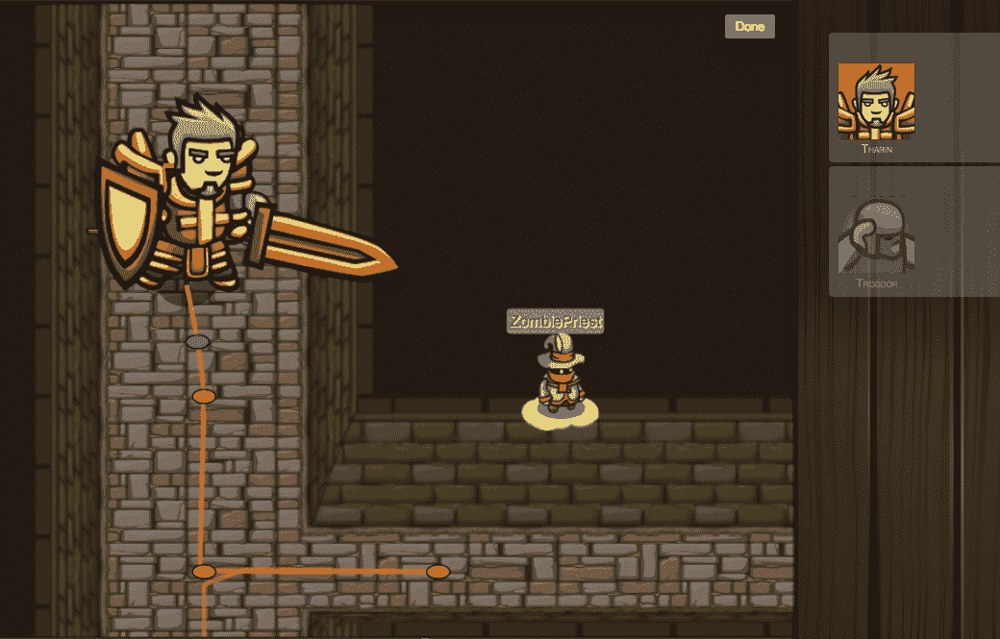

# YC 支持的 CodeCombat 希望你通过玩游戏来学习编码

> 原文：<https://web.archive.org/web/https://techcrunch.com/2014/03/19/yc-backed-codecombat-wants-you-to-learn-to-code-by-playing-games/>

所以你决定要学习编码，但是不知道从哪里开始。有几十种服务可以帮助你找到自己的路，但是一家 YC 支持的新公司想教你如何通过游戏化来编码。

《T2》这款基于网络的游戏通过强迫你在游戏中编写代码来教授基本的 JavaScript 基础知识，包括你在计算机科学入门课程中学到的一切。为了从一个级别进入下一个级别，您必须理解所教授的课程，并通过编写自己的代码来证明这一点。

这是一个 RPG 风格的游戏，有一个初学者，单人战役，以及更高级的程序员的多人选项。这款游戏的目标用户是那些希望以有趣的方式学习基础知识的高中生，据创始人之一乔治·塞恩斯称，这款游戏“发展得非常快”

该公司成立于 2013 年 2 月，下周即将从 Y Combinator 毕业。自发布以来，他们在去年 10 月推出测试版之前，已经将该平台的 Alpha 版本放在了 Reddit 上。今年 1 月，该团队开源了整个产品，发布了一个级别编辑器，以便用户可以自己创建内容。

“这是我们今后面临的最大挑战，”塞恩斯说。“我们已经证明，人们在玩游戏，喜欢这个平台，但创造内容需要很多时间。”

到目前为止，自推出关卡编辑器以来，该平台迄今已有 103 名贡献者。

这款游戏是完全免费的，塞恩斯声称它将保持这种状态。公司反而会通过招聘来赚钱。因为 CodeCombat 可以看到你在日志中输入如何解决游戏带来的问题和挑战的方式，以及你构建算法的方式，它对你作为程序员的天赋有着难以置信的洞察力。

这些信息可以传递给寻找开发人员的潜在雇主(因为现在谁也不找开发人员)，CodeCombat 将获得安置费。

CodeCombat 是免费的，可以在这里找到[。](https://web.archive.org/web/20230325034519/http://codecombat.com/)

[YouTube http://www.youtube.com/watch?v=1zjaA13k-dA&w=640&h=360]