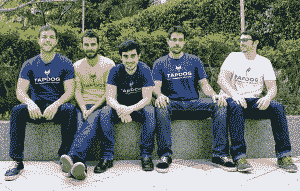
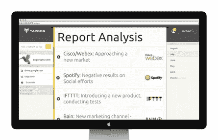

# 获得新资金后，Alexa 的竞争对手 SimilarWeb 收购了竞争情报引擎 tap dog TechCrunch

> 原文：<https://web.archive.org/web/https://techcrunch.com/2014/03/20/fresh-off-new-funding-alexa-competitor-similarweb-acquires-competitive-intelligence-engine-tapdog/>

# 获得新资金后，Alexa 的竞争对手 SimilarWeb 收购了竞争情报引擎 Tapdog

总部位于特拉维夫的网络排名提供商 SimilarWeb 是 comScore 和 Alexa 等服务的竞争对手，它今天宣布收购了以色列初创公司 [Tapdog](https://web.archive.org/web/20221007003307/http://tapdog.co/) ，这是一个竞争情报引擎的制造商，旨在利用数据科学和机器学习技术模拟分析师的思维方式。

这笔交易的财务条款尚未披露，但我们知道这笔交易是“数百万美元的范围”

五人 Tapdog 团队包括开发人员、设计师和产品经理，他们都已经搬进了 SimilarWeb 的办公室。迄今为止，该公司已经筹集了 50 万美元的外部资金。

这家初创公司是硅谷 UpWest 实验室加速器项目的毕业生，由一群前军事情报官员创建。为了使其引擎工作，该公司专注于深入了解信息源的行为、特征以及它与其他源的关系。然后，Tapdog 将使用机器学习技术对预测因素进行分类，对更重要的业务发展进行聚类，并最终对这些发现得出可操作的见解。

Tapdog 看起来有点像 SimilarWeb 的竞争对手，例如，它也提供关于公司流量和 SEO 排名以及社交存在的数据。然而，它实际上曾经是一个 SimilarWeb 客户端——将 SimilarWeb 的数据拉入其平台。Tapdog 还深入到公司内部，跟踪媒体提及、企业的团队结构(如果这种情况发生了变化)，它还致力于跟踪企业的广告活动。它的匿名客户可以在线访问这些竞争情报，或者在有变化时通过电子邮件提醒得到通知。

SimilarWeb 有多余的钱进行收购，因为它最近自己筹集了数千万美元的 C 轮融资，完全来自南非跨国公司 [Naspers](https://web.archive.org/web/20221007003307/http://www.naspers.com/) ，该公司持有腾讯和 Mail.ru 等主要互联网公司的少数股权。这次收购对该公司来说也是有意义的，因为它也有一个强大的内部数据科学团队来帮助使其网络和移动分析估计更加准确。

