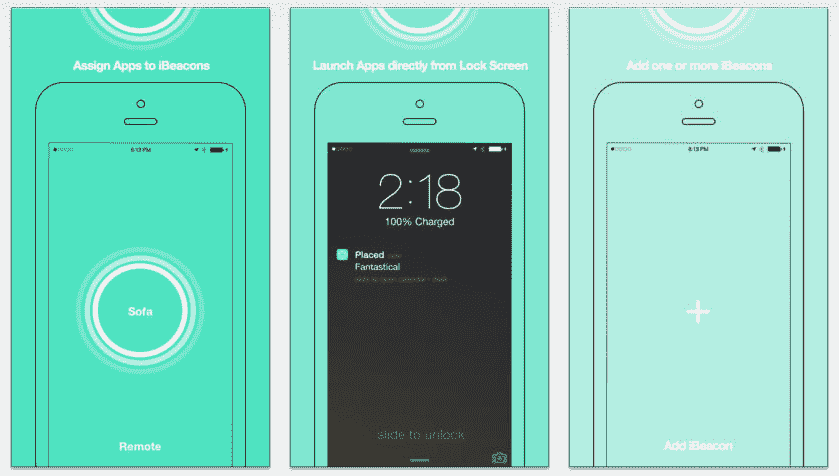

# iBeacons 不只是零售:Placed 可以让你在家里把它们当作 iPhone 的快速发射器

> 原文：<https://web.archive.org/web/https://techcrunch.com/2014/03/21/ibeacons-arent-just-for-retail-placed-lets-you-use-them-as-iphone-quick-launchers-at-home/>

# iBeacons 不仅仅用于零售:Placed 可以让你在家里将它们作为 iPhone 的快速启动器

[vimeo 83200227 w=640 h=360]

自从去年秋天推出 iOS 7 以来，关于 iBeacons 的讨论一直很多，但大部分焦点都集中在它们如何让零售商受益，并增加店内购物体验。然而，它们有更广泛的潜在用途，其中一部分也是以消费者为中心的。 [Placed 是一个新的应用程序](https://web.archive.org/web/20221007201323/http://placed.awwapps.com/)，通过将 I beacon 绑定到特定的应用程序并提供快速启动功能，向您展示 I beacon 如何惠及家中的任何人。

这到底是什么意思？嗯，如果你走进你的厨房，经过一个挂在你烤箱门上的 iBeacon，你的 iPhone 可能会醒来，并自动启动一个厨房定时器应用程序。打开冰箱可以调出购物清单，坐在客厅里欣赏苹果电视上的网飞可以打开你的远程应用程序。换句话说，Placed 可以把你的 iPhone 变成一个能够感知环境、自动对你的环境做出即时反应的移动软件瑞士军刀。

如果你的手机被锁定，并且你在一个已被分配到 Placed 内支持的应用程序(或你选择的自定义启动 URL)的 iBeacon 附近，它会向你的手机推送通知，告诉你你在哪里以及你将触发什么软件。然后，你滑动通知，直接进入应用程序。目前支持 Placed 内置功能的应用程序包括 Remote、Timer、Waymate、Wunderlist、Safari 和 Fantastical，但任何支持启动 URL 的应用程序都可以手动添加，构建 Placed 的 Aww 应用程序团队正在努力尽快添加更多预设。

要进行设置，你需要某种 iBeacon 硬件，你可以用 Raspberry Pi 和蓝牙 LE 发射器来黑自己，或者使用未使用的 iOS 硬件和特定的应用程序。最简单的方法是挑选一些预制的 iBeacon 硬件，比如初创公司目前以 99 美元的价格在三个单元的开发套件中提供的 [Estimote Beacons](https://web.archive.org/web/20221007201323/http://estimote.com/) 。当您距离 iBeacon 硬件一米(三英尺)左右时，将会触发放置通知。这款应用本身售价 2.99 美元。

这是一个早期的例子，展示了我们最终如何在家中使用嵌入式 BLE 信标来自动完成大量基于邻近度的任务，但这是一个强有力的例子，展示了 iBeacons 为 iOS 生态系统带来了什么，你现在就可以以相对较低的门槛来查看。