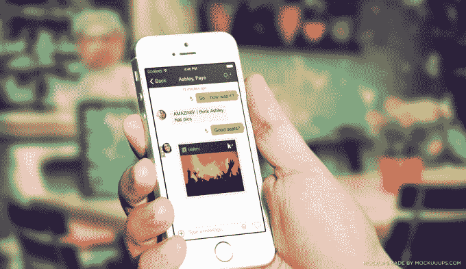

# WhatsApp 之后:业内人士对消息传递下一步的看法 TechCrunch

> 原文：<https://web.archive.org/web/http://techcrunch.com/2014/03/22/after-whatsapp-an-insiders-view-on-whats-next-in-messaging/?ncid=rss>

More posts by this contributor

**编者按:** *泰德·利文斯顿(Ted Livingston)是 Kik 的创始人兼首席执行官，Kik 是一家移动优先的公司，在全球拥有超过 1.2 亿注册用户。Ted 于 2007 年开始在 mobile 工作，当时他还在滑铁卢大学学习。*

我正开车去旧金山参加一个会议，突然收到一条消息:“脸书将以 190 亿美元收购 WhatsApp。”我把车停在路边，看着信息开始涌入。每个人都有同样的问题:脸书疯了吗？作为美国唯一一个比 WhatsApp 更受欢迎的智能手机 messenger 的首席执行官，我给了他们同样的答案:“不。”事实上，我们已经期待这样的事情很长时间了。正如我们现在看到的由中国阿里巴巴集团牵头的 Tango 的 2.8 亿美元融资，对这一领域的兴趣显然不会很快消失。

消息传递是一个复杂的话题。这也是当今科技领域最容易被误解的领域之一。WhatsApp 和 GChat 有什么区别？为什么不用短信呢？为什么脸书在收购 Beluga 三年后又需要收购另一个消息应用呢？然而，与此同时，消息传递有望成为移动领域中赌注最高的战斗之一，就像搜索之于网络，或者生产力软件之于个人电脑一样。

那么，短信对手机意味着什么？

这是我们 Kik 思考了很久的问题。事实上，鉴于我们是在 2010 年推出的，我们可能比几乎任何人都更关注它。现在，由于马克·扎克伯格的最新购买，这个问题似乎在每个人的脑海中。所以我想和你分享我这些年来学到的东西。喝杯咖啡，因为这可能需要一些时间。

## **手机信使的出现**

这个故事始于 2007 年，当时我在黑莓工作，是每学期聘用的 1000 多名实习生中的一员。当时 iPhone 还没有上市，数据套餐非常昂贵，只有华尔街的银行家才能负担得起。然而，在 RIM，我们都得到了配有全套数据套餐的黑莓手机。我们疯狂地利用 BBM。多亏了 MSN Messenger，我们已经习惯了即时通讯，但不知何故这是不同的。它更直接，更亲密。

有了 MSN，你总会看到有人关掉电脑或者把电脑放在办公桌前。但是现在电脑一直和你在一起，一直开着，一直连接着。第一次没有了线下这种东西。

多年来，MSN、Facebook Messenger 和 Skype 等应用程序增加了移动接入，但它们的桌面遗产仍然存在:“离线”设置始终是一个迫在眉睫的选项。另一方面，有了 WhatsApp、Kik 甚至 SMS，信息社区就与手机捆绑在一起了。那么，默认情况下，没有离线这种东西——只有在线，一直在线。

所以，如果你晚了五分钟去见你的朋友喝咖啡，你不用通过 Skype 给他们发短信。你给他们发短信。为什么？因为你想让他们最大限度地了解你的信息。只有纯移动社区才能保证每个人都随时在线。

如果说 BBM 是第一个手机信使，那么 WhatsApp 就是第二个。那是 2009 年，我刚刚离开 RIM，创建了一个“黑莓 Spotify”。我们计划将它插入 BBM 以方便分享。但在 2009 年底，我们意识到 iPhone 实际上将成为一个东西，我们的音乐应用程序需要同时在黑莓和 iPhone 上运行。

几乎在同一时间，WhatsApp 起飞了。这基本上是 iPhone 用户的 BBM。后来发现他们也计划在黑莓手机上发布。这是个绝妙的主意。我们找到 RIM，要求他们在 iPhone 上推出 BBM。我们的音乐应用程序不仅需要它，我们还认为这是与 WhatsApp 竞争的唯一方式。然而，RIM 需要 BBM 来销售黑莓，并选择不跨平台销售。我们决定自己动手，推出我们自己的跨平台信使。

一晃四年过去了，今天的世界是一个非常不同的地方，手机上有成千上万种发送信息的方式。但说到智能手机信使，真的只剩下五个信使了:WhatsApp、微信、Line、Kakao 和 Kik。是的，有像 Tango 和 Viber 这样的语音应用程序，也有像 Instagram 和 Snapchat 这样的照片应用程序，但说到“五分钟后到”这一基本实用程序，这些才是重要的。

这五个应用程序非常相似，只是在三个方面有所不同:身份、地区和平台。

## **名称和地点**

对我来说，第一个移动信使是 BBM，但对大多数人来说，它是短信——而且短信工作得很好。它只适用于手机，并预装在每部手机上。短信领域的公司面临的关键问题是:如何让用户远离短信？最明显的答案是:让它免费。

美国人很容易低估“免费”的重要性，因为对我们大多数人来说，短信已经是免费的了。我可以发短信，为什么还要用 WhatsApp？因为在世界上大多数其他国家，发短信很贵。

这就是 WhatsApp 引人注目的原因:它是短信，但不花钱。只有一个条件:你的朋友也需要在 WhatsApp 上。

结果 WhatsApp 疯狂传播。在亚洲，一些公司反应迅速，能够参与竞争。在中国，腾讯推出了微信；在日本，Naver(其实是韩国公司)推出了 LineKakao 作为一家初创公司在韩国迅速崛起，推出了 KakaoTalk。不过，在很大程度上，WhatsApp 消费了全世界。除了美国

除了不免费，短信还有一个问题:不能屏蔽人。对大多数人来说，这没什么。但有些时候，你会希望在 Instagram、Tumblr 或 SoundCloud 上遇到你的人私下和你联系。在这样的服务上公布你的电话号码是不可能的，因为这样你就向各种垃圾邮件和怪人打来的电话敞开了大门。一旦发生这种情况，停止不想要的联系的唯一方法是获得一个新号码。

我们选择将 Kik 账户建立在用户名的基础上，这样你就不必交出你的电话号码。因此，我们现在看到人们分享他们的 Kik 用户名，以促进各种服务的连接，包括社交应用程序、游戏应用程序和健身应用程序。

其他一些应用程序背后的公司已经看到了所有这些活动，并试图将他们自己的信息构建到产品中。以 Instagram Direct 或 Twitter 的直接消息为例。到目前为止，这些举措还没有真正奏效。人们不希望他们使用的每个应用都有一个 messenger，他们希望他们使用的所有应用都有一个 messenger。

## **消费者还会想要更多吗？**

我记得在 RIM 的时候，他们对黑莓有一个简单而独特的愿景:在你的手机上收发电子邮件。就这样。有一段时间很有效。黑莓比所有人都成长得快，变得比所有人都大。iPhone 出来的时候我们都笑了。

“你看电池多烂！”

“看邮件多慢啊！”

“所有这些应用程序！谁想要应用程序呢？他们只是妨碍了电子邮件。”

有一段时间，RIM 是对的。智能手机是一个足够大的飞跃，消费者需要一个简单的价值主张，如“手机上的电子邮件”，以了解他们。不过，很快，消费者开始理解手机上的电子邮件。最终，他们会有一个新的问题:“我还能在手机上做什么？”

WhatsApp 感觉自己现在也处于类似的境地。该公司简单的“短信免费”的主张点燃了世界，但在某个时候，消费者会发现这种服务平淡无奇吗？他们会不会开始问:“我还能用短信做什么？”我们马上就会知道了。

剩下的四个信使都有 WhatsApp 碰不到的滩头阵地。线有日本。KakaoTalk 有南韩。微信有中国。Kik 有跨 app 聊天。所以我们都不会离开。但是我们每个人都想要更多。我们都渴望胜利，渴望找到从 WhatsApp 夺走用户的方法。我们每个人都决定用同样的方式去做:建立一个平台。

## **平台:简单与差异化**

一个平台可以让你为那些只想要消息的人保持简单，同时为那些想要更多的人提供服务。*你只是想和你的朋友聊天吗？*好的，就这么办。*哦，你想和你的朋友玩游戏吗？当然，试试这个。*现在想和朋友一起去买鞋吗？这个怎么样……**

平台让我们保持核心信使的简单性，同时也创造了差异化。在 Kik 上，你可以和朋友聊天，和朋友玩文字游戏，也可以和他们一起听音乐。在 KakaoTalk，你可以出售数码产品。在网上，你很快就能制作并出售自己的贴纸。在中国使用微信，你可以直接从应用程序中支付出租车和咖啡的费用。

一旦你把开发者加入进来，一个全新的计算生态系统将会发展起来。由于智能手机和移动互联网连接的巨大普及——我们预计到 2017 年将有 50 亿手机用户——这是一个可能超越我们迄今所见的任何东西的生态系统，包括 Windows 和脸书。这就是“消息应用”的发展方向。

这种平台游戏一直是 Kik 这样的信使的游戏计划，Kik 的平台独特地构建在 HTML5 中。我们都是从“短信但免费”开始的，但这个迷因很快变成了“短信但更多”我们已经从黑莓花了太长时间对 iPhone 做出回应中了解到，如果这种重大转变再次发生，对 WhatsApp 来说可能已经太晚了。

## **两个关键问题**

我们一直知道消息传递将是一个有价值的领域，但不知何故，一笔 190 亿美元的收购让这一切变得更加真实。从现在开始，只有两个问题很重要。

1.  除了免费短信，人们还想从他们的 messenger 中得到更多吗？
2.  搭建平台最好的方法是什么？

如果第一个问题的答案是“不”，那么 WhatsApp 很可能已经赢了。

如果第一个问题的答案是“是”，那么 WhatsApp 很可能已经输了，这将取决于其他四家公司的斗争。

然后你就剩下第二个问题了，这个问题更有趣，也更有利可图。WhatsApp 没有第二个问题的答案，所以答案必须来自其他地方。对于 Kik 的我们来说，这是真正令人兴奋的部分。这是信息传递的未来。