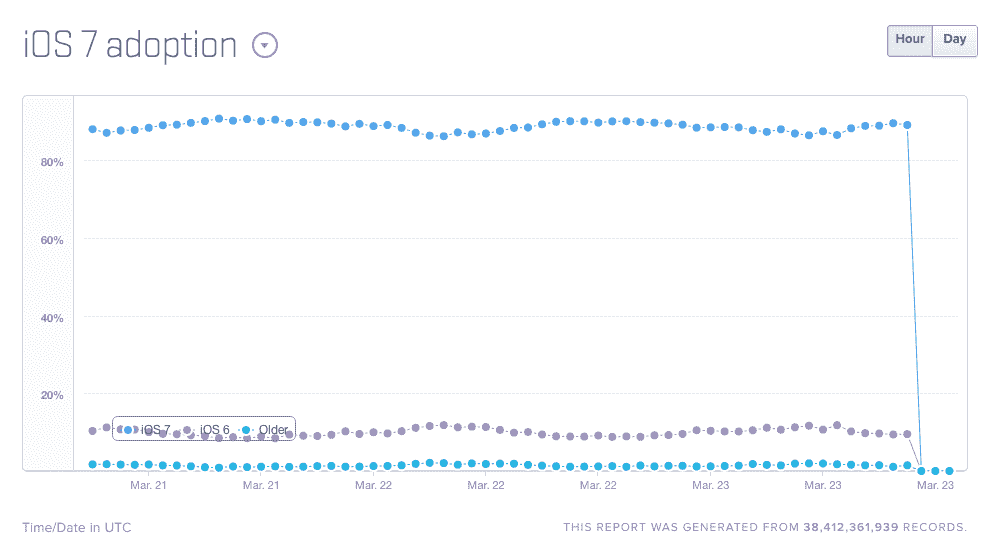
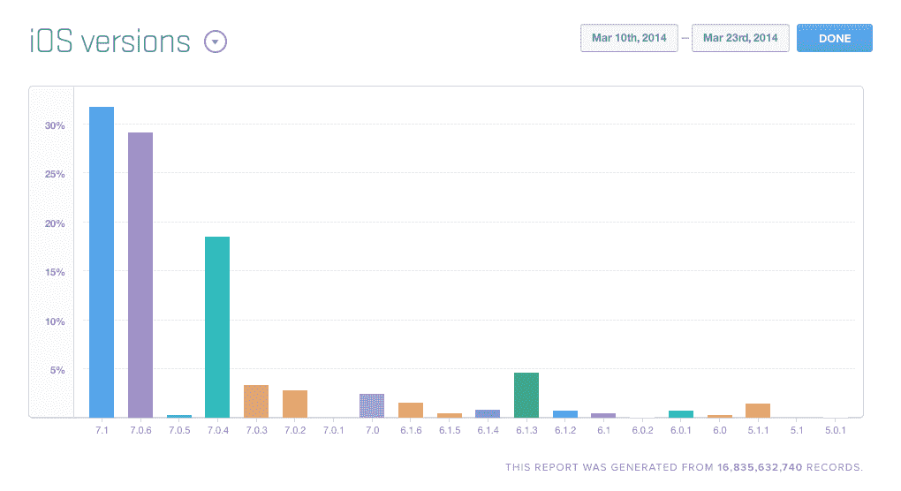

# Mixpanel: iOS 7 的采用率为 90%，而 Android Kit Kat 的采用率仍低于 10%

> 原文：<https://web.archive.org/web/https://techcrunch.com/2014/03/23/mixpanel-ios-7-adoption-at-90-while-android-kit-kat-remains-at-under-10/>

# Mixpanel: iOS 7 的采用率为 90%，而 Android Kit Kat 的采用率仍低于 10%

移动分析公司 Mixpanel 的 iOS 7 采用率覆盖了绝大多数苹果移动设备，其实时采用率统计追踪器根据每小时的浏览数据显示，88%至 90%的设备采用了 iOS 的最新主要版本。相比之下，你可以看到，根据其 Android 设备信息，在使用谷歌移动操作系统的用户中，只有大约 8%的人使用 Kit Kat (4.4)或更高版本。

这张统计照片显示，苹果用户擅长在他们的设备上保持最新，这对开发者来说也是一个好消息，因为为 iOS 7 设计的应用程序可能与为早期版本的 iOS 创建的应用程序截然不同。苹果在碎片化问题上的优势意味着花在确保软件能在一系列不同操作系统版本上运行的钱更少，而这是 Android 仍然远远落后的地方，这一点从当前的 Kit Kat uptake 中可以明显看出。

至于苹果最新版本的 iOS 7，iOS 7.1，自 3 月 10 日发布以来，已经占据了 Mixpanel 合作伙伴应用和网站的大部分访问量。从那一天到今天，Mixpanel 有 31%的访问来自 7.1，相比之下，7.0.6 有 29%的访问来自第二接近的版本。一句话:苹果用户更新速度很快，而且没有表现出越来越不愿意更新的迹象，这反过来意味着为 iOS 开发软件相对于 Android 的效率优势不太可能很快消失。

