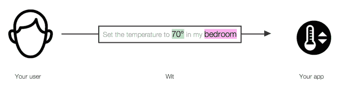
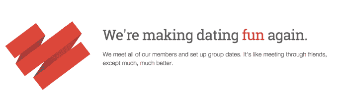
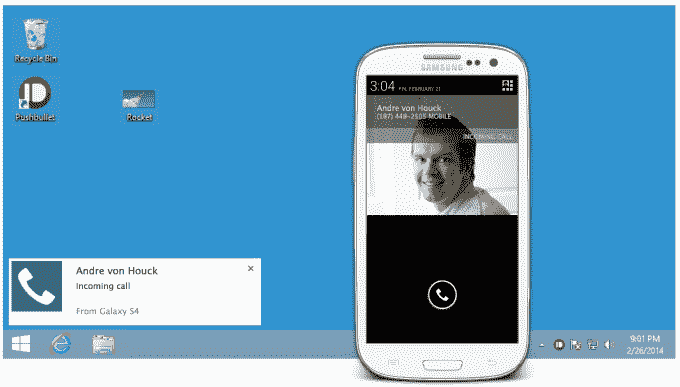
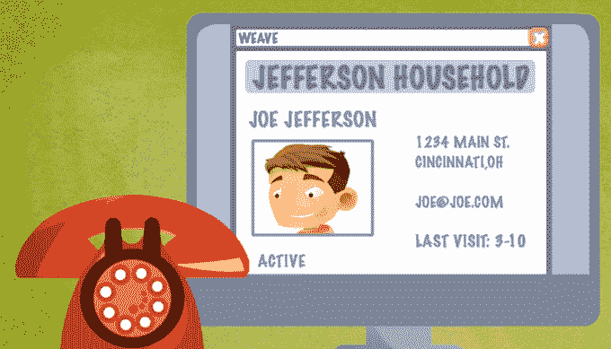
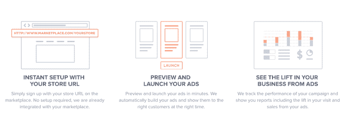
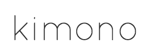
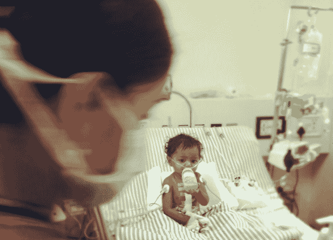

# TechCrunch 的精选:Y Combinator W14 演示日的 8 大初创公司

> 原文：<https://web.archive.org/web/https://techcrunch.com/2014/03/25/best-y-combinator-demo-day-startups/>

虽然今天保罗·格拉厄姆亲自将控制权交给了 new Y Combinator 总裁萨姆·奥尔特曼，但演示日更大的轰动是大多数投资者认为这是迄今为止最好的 YC 课程。在那些颠覆性行业中，有不性感的创业公司，有深度的 B2B 专业化以满足特定公司的需求，还有一些非营利组织是为了让世界变得更好，而不是让自己变得更富有。

在格雷厄姆被授予一条全班签名的卡其布短裤后，68 家创业公司在山景城计算机历史博物馆登台。55，你可以在我们对[批次 1](https://web.archive.org/web/20230404150459/https://techcrunch.com/2014/03/25/yc-w14-batch-1/) 、[批次 2](https://web.archive.org/web/20230404150459/https://techcrunch.com/2014/03/25/y-combinator-demo-day-winter-2014-batch-2-the-dating-ring-unbabel-pushbullet-airhelp-and-more/) 和[批次 3 和 4 的概述中了解所有这些。](https://web.archive.org/web/20230404150459/https://techcrunch.com/2014/03/25/y-combinator-winter-2014-batches-3-and-4-meet-kimono-labs-twotap-abacus-and-more/)(如果你想成为下一轮 YC 的一部分，加速器目前[接受申请](https://web.archive.org/web/20230404150459/http://ycombinator.com/apply.html)。)

尘埃落定后，TechCrunch 的团队询问了与会的顶级投资者，并聚在一起选择我们本季的精选。随着空洞的社交应用和无人需要这种服务的初创公司越来越少，这一次尤其艰难，但以下是我们的选择:

[**wit . ai**](https://web.archive.org/web/20230404150459/https://wit.ai/)**–语音接口 API**

语音是我们控制对键盘来说太小的设备的方式，比如手表、耳塞和大部分“物联网”但是对于开发人员来说，建立他们自己的语音系统是一项繁重的工作，需要自然语言处理、语音识别和其他工程要求。因此，Wit.ai 创建了一个语音接口 API，开发人员可以通过管道进入他们的应用程序，以启用语音命令。这可以让他们提供应用内语音搜索、无按钮硬件控制等等。

其联合创始人将他的最后一家公司卖给了语音技术巨头 Nuance，现在 Wit.ai 拥有 3000 名开发用户，如 Pebble 和三星，并且每周增长 29%。每个应用程序很快都会需要语音技术，任何能够为 Nuance 或(可能)谷歌等大型提供商提供替代方案的初创公司都将在吸引或收购方面处于有利地位。[从 TechCrunch 阅读更多关于 Wit.ai 的内容](https://web.archive.org/web/20230404150459/https://techcrunch.com/2014/03/17/with-a-voice-interface-api-for-any-app-wit-ai-wants-to-be-the-twilio-for-natural-language/)。

—

**[交友圈](https://web.archive.org/web/20230404150459/http://thedatingring.com/)——红娘辅助网恋**

“约会应该像优步那样运作，有了约会戒指，确实如此，”这家初创公司的联合创始人说。目前，网上约会是一个大麻烦。你筛选个人资料或火绒卡片，批准一些人，等待匹配，并进行闲聊。如果你幸运的话，会进展到真正的约会，但是你的伴侣可能看起来一点也不像你的伴侣。

有了约会戒指，你申请加入。通过第一个酒吧，你会亲自与约会戒指媒人见面五分钟。他们会评估你的风格，并开放与三男三女(或同性恋用户的四人小组)进行集体约会的能力。但与石斑鱼不同，媒人保证你更有可能爱上你的约会对象。用户为初次约会支付 25 美元，每次约会支付 20 美元。当约会集团宣布计划众筹满载女性的飞机，将飞机从纽约运送到孤独的旧金山男人时，它当然引起了轰动。

约会戒指的收入在过去六个月中每月增长 60 %,这是有利可图的，70%的用户会进行第二次约会。虽然一年只有 20 亿美元花在这个领域，但约会圈想要做大馅饼。人们愿意为爱情付费似乎是合理的……或者至少是去进行真实的、匹配的约会，而不是无休止地在网上浏览个人资料。[从 TechCrunch 上阅读更多关于约会戒指的信息](https://web.archive.org/web/20230404150459/https://techcrunch.com/2014/02/13/the-dating-ring-sf/)。

—

**[推送](https://web.archive.org/web/20230404150459/https://www.pushbullet.com/)–同步跨网络和移动推送通知**

当你在电脑前时，你仍然需要打开手机来查看推送通知，这太疯狂了。Pushbullet 会同步它们，这样你就可以在你当前使用的设备上进行响应，包括通过 Chrome/Firefox 扩展的网络。你甚至可以在手机和电脑之间来回发送文件。但是 Pushbullet 也可以让你把网站上的变化变成推送通知，即使一个网站没有移动应用。例如，你可以要求在耐克下一次推出新系列的鞋子时收到提醒。

Pushbullet 现在每天为 10 万周用户和 6 万日用户处理 1000 万条通知。推送正迅速成为联系人们的最强有力的方式，并且正在吃掉电子邮件的午餐。Pushbullet 可以通过提高标准并将其引入更多设备和站点来击中靶心。[从 TechCrunch 了解更多关于 Pushbullet 的信息](https://web.archive.org/web/20230404150459/https://techcrunch.com/2014/03/24/pushbullet-instantly-blasts-alerts-from-your-android-phone-to-your-computer/)。

—

**[空中救援](https://web.archive.org/web/20230404150459/http://www.getairhelp.com/):贴航空公司**

AirHelp 希望帮助乘客在航空公司出错、晚点或取消航班后获得他们依法有权获得的赔偿。每年的总金额为 160 亿美元。你可以回到三年前，这意味着还有 480 亿美元的潜在资金。

AirHelp 负责处理细节。您[输入您的航班号](https://web.archive.org/web/20230404150459/http://www.getairhelp.com/)，如果您能得到报酬，他们会处理的。如果能给你钱，公司会削减四分之一的费用*。除非你是一家航空公司，否则这不是一个糟糕的商业模式。*

**[编织](https://web.archive.org/web/20230404150459/http://www.getweave.com/):医生用集成手机/软件系统**

Weave 是一种电话服务，可以更好地连接患者及其医疗服务提供者。去看牙医大致和去看牙医一样有趣。该公司希望通过帮助牙医跟踪他们的患者信息和需求，并将其集成到他们的通信系统中，从而使情况更好。当您打电话时，接待员会立即看到您的个人资料与您的电话号码相连。这样他们就不用让您稍等片刻，他们可以立即看到您过去就诊的信息，他们甚至可以发现收入机会，比如您的配偶两年没刷牙了(eww)。

在 Y Combinator 之前，Weave 的年度经常性收入为 79 万美元。邮政 Y Combinator，这个数字现在是 180 万美元，在此期间每月增长 38%。Weave 挑选了牙医开始工作，因为他们很富有，也不遵守规定。该产品将扩展到其他垂直健康领域。Weave 的服务收费为每个地点每月 300 美元。北美有 190，000 家牙科诊所，这表明其潜在市场相当大。Weave 决心将其系统扩展到其他医疗垂直行业，使医疗保健整体上更好、更友好。在 TechCrunch 上了解更多关于 [Weave 的信息。](https://web.archive.org/web/20230404150459/https://techcrunch.com/2014/02/19/an-att-for-dentistry-y-combinator-backed-weave-launches-to-bring-modern-telecom-to-smbs/)

—

**:对商场卖家的广告帮助**

Airbnb 和 Etsy 等市场上有 3000 万卖家，他们都希望增加销售额。Bettable 让他们可以轻而易举地发布广告，推销他们的出租公寓或自制工艺品。卖家只需注册并向 Boostable 发送他们的列表或商品的 URL，选择他们的预算，Boostable 就会在脸书上运行高效的 A/B 测试广告活动，很快谷歌就会使用高级重定向功能将它们展示给合适的人。

由于每笔销售也能赚到市场的钱，他们很乐意把 Boostable 和他们的卖家联系起来。Airbnb 已经与这家初创公司建立了合作关系。根据目前的交易，Boostable 可能会有 50 万名卖家。如果它能说服广告新手，他们需要花钱来赚钱，Boostable 可以吸引足够多的小广告合同，以获得巨额收入。

—

**[和服实验室](https://web.archive.org/web/20230404150459/https://www.kimonolabs.com/):一键网页抓取**

和服把网站变成 API。这意味着你可以将和服指向一个网站，设置参数，并从中获取数据。你可以把它想象成一个小型的谷歌，专门针对一个网站来满足你的需求。

到目前为止，已经有 20，000 名开发者注册使用这项服务，这个数字正以每周 15%的速度增长。在短短 10 周左右的时间里，和服声称已经帮助在线公共 API 的数量增加了两倍。我真的很有兴趣看看人们可以用和服、TechCrunch 和 CrunchBase 数据做些什么。当数据结构化时，它变得更有价值。[从 TechCrunch 了解更多关于和服实验室的信息](https://web.archive.org/web/20230404150459/https://techcrunch.com/2014/02/18/kimono-is-a-smarter-web-scraper-that-lets-you-api-ify-the-web-no-code-required/)。

**[电池](https://web.archive.org/web/20230404150459/http://www.gbatteries.com/):更好的电池寿命管理** 

根据 BatteryOS 的说法，如果你将电池充电到 100 %,它会迅速降低电池本身的性能。经过多次循环后，电池的容量会下降。该公司声称，有了 BatteryOS，你就可以将电池充满电，而不会出现电量下降的情况。

该公司声称，如果雪佛兰伏特使用电池，它将有两倍的范围，并持续 8 年以上。该公司没有解释其产品如何工作，但确实暗示有数万台的订单。从 TechCrunch 的报道中了解更多关于 BatteryOS 的信息。

—

T4【优秀奖】

**[Noora Health](https://web.archive.org/web/20230404150459/http://www.noorahealth.org/) :家庭保健培训**

Noora Health 培训家庭在他们从医院回来后照顾他们的亲人。比方说，对于居住在离专业医疗机构 100 英里以外的家庭来说，基本的医疗保健知识可能会很匮乏。想象一下，有一个患有严重心脏病的孩子，并强调你可能会对他们的药物治疗、护理或饮食做错了事，这可能会使他们回到医院或更糟？Noora Health 为家庭提供可以带回家的培训，从而使门诊病人更加健康。

他们不会回去当护士，但个人从 Noora Health 接受的培训可以减少 36%的并发症。这家非营利组织估计，迄今为止，它的培训已经拯救了 124 条生命。该公司迄今已培训了 7000 个家庭。

该公司正在向美国的医院销售其产品，并使用这些资金支付其在其他地方的工作费用。该公司告诉聚集的投资者和媒体，它正在建立一些不依赖于捐助者的美元。这是一个聪明的模式，让 Noora 感觉更像一个创业公司，而不是一个慈善机构。为了更深入地了解 Noora Health，查看 TechCrunch 的[过去的报道](https://web.archive.org/web/20230404150459/https://techcrunch.com/2014/03/23/noora-healths-training-program-for-patients-and-caregivers-improves-recovery-and-reduces-readmission-rates/)。

