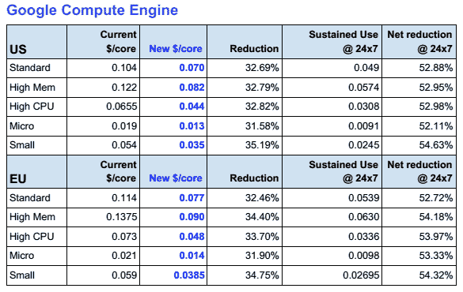
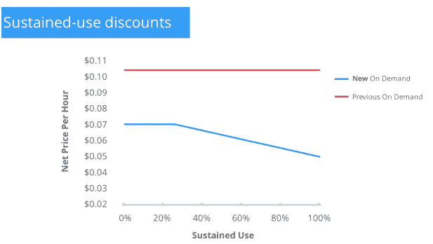

# 谷歌宣布其云计算服务和存储大幅降价，推出持续使用折扣

> 原文：<https://web.archive.org/web/https://techcrunch.com/2014/03/25/google-drops-prices-for-compute-and-app-engine-by-over-30-cloud-storage-by-68-introduces-sustained-use-discounts/>

今天在旧金山举行的[云平台活动](https://web.archive.org/web/20230110085910/https://cloud.google.com/events/google-cloud-platform-live/)上，谷歌宣布了几乎所有云计算服务的大幅度降价。该公司还决定通过取消一些费用并合并其他费用来降低其定价图表的复杂性。

谷歌计算引擎在所有地区、规模和阶层的价格都下降了 32%。应用引擎价格下降了 30%，该公司还简化了价格结构。

云存储的价格下降了 68%，降至每月每千兆字节 0.026 美元和每月每千兆字节 0.2 美元/DRA。按照这个价格，新的定价仍然低于那些在谷歌云中存储超过 4,500TB 数据的用户可以享受的[原始折扣](https://web.archive.org/web/20230110085910/https://developers.google.com/storage/pricing)。

其他云存储选项的价格，包括云 SQL 和云数据存储，在这一轮更新中没有变化。如果谷歌不尽快在这方面做出一些改变(或者统一这些服务的存储定价)，我会感到惊讶。

谷歌用于进行大数据分析的数据库 BigQuery 的价格降幅最大，为 85%。该团队将每千兆字节的存储定价从 0.08 美元/GB 降至 0.026 美元/GB，降幅达 68%，交互式查询现在的成本为 5 美元/TB，而不是 35 美元/TB。批量查询现在的成本也是 5 美元/TB，而不是以前的 20 美元/TB。

正如谷歌云平台产品总监格雷格·德米奇利(Greg DeMichillie)上周告诉我的那样，在过去几年里，这个行业不知何故已经偏离了最初的云梦想。在云中供应服务器应该比自己动手简单且便宜。但是现在建立一个云服务器通常需要大量的工作，而且云定价并没有完全遵循摩尔定律。

公共云价格每年下降 6%至 8%，但硬件成本实际上每年下降 30%至 45%。“的确，云不仅仅是硬件，”DeMichellie 告诉我。“我们试图让这个行业的价格回到他们遵循这条法律时应该达到的水平。”

为了简化定价，谷歌现在将向在其云上运行持续工作负载的用户提供自动折扣。谷歌现在不再需要处理预约和预付费实例，这是他们自己的一种锁定，当他们使用一台机器超过一段时间时，谷歌将自动给平台上的所有开发者折扣(T2)。这些折扣在一个月的第一个季度后自动生效，随着这个月的继续，折扣会越来越大。然后，价格在月初再次重置，循环往复。即使你每月只使用该服务两周，折扣也会在第二周生效。

在 Compute Engine 上，使用 24/7 服务的开发人员可以看到价格下降超过 50%。这样，如果您想在一个月后更改为不同的实例类型，您不会被锁定，也不会失去折扣。

即使没有持续的使用折扣，谷歌的定价现在也比其竞争对手的按需定价低，并且经常低于亚马逊预订实例的 [EC2 价格](https://web.archive.org/web/20230110085910/http://aws.amazon.com/ec2/pricing/)。

到目前为止，谷歌、亚马逊和微软一直在匹配彼此的云托管价格，而且有可能在未来几周我们也会看到谷歌的竞争对手降价。当然，亚马逊将在本周晚些时候举办自己的以云为中心的活动，我们也可能会从他们那里听到更多关于定价的消息。

