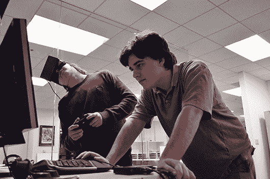
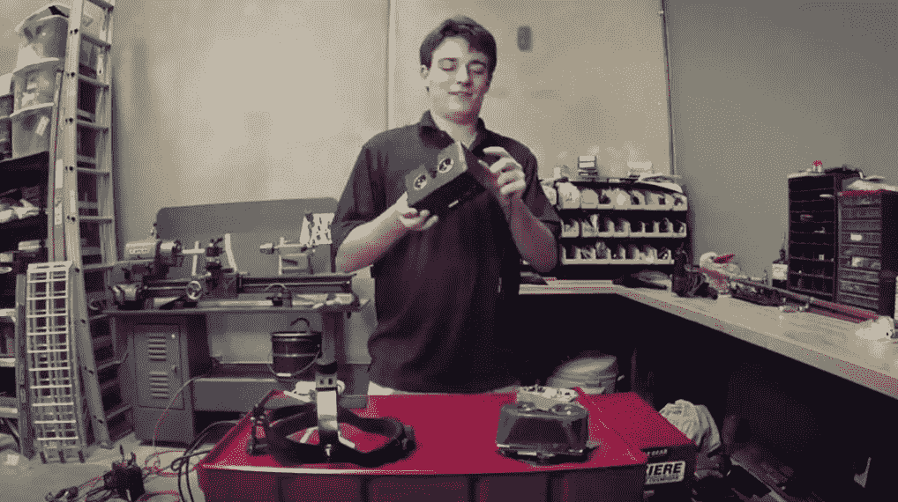
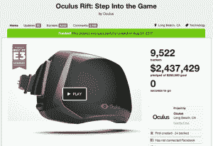
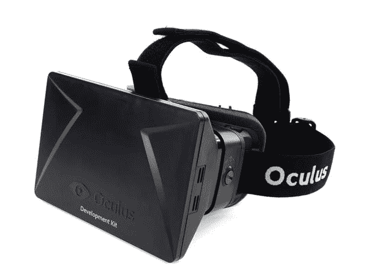
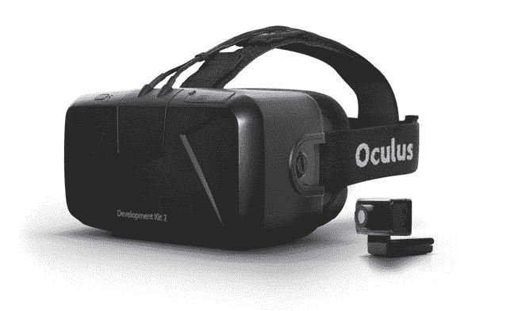

# Oculus TechCrunch 简史

> 原文：<https://web.archive.org/web/https://techcrunch.com/2014/03/26/a-brief-history-of-oculus/>

不到两年前，Oculus 在 Kickstarter 上筹集了 250 万美元。

昨天，他们被脸书以 20 亿美元收购。

写下“Oculus 简史”这几个字有点滑稽——因为事实上，该公司非常*的存在*一直很短暂。从启动 Kickstarter 活动到大规模收购，仅仅过去了 601 天。

这家公司在其短暂的生命周期中无疑产生了相当多的关注——然而，许多人*许多人本周才第一次听说这个团队。*

对于那些人，对于那些可能已经错过了一些细节的人，这里是他们的故事。

## 早期:

15 岁左右，Palmer Luckey 开始爱上虚拟现实的概念。

白天，他在当地社区大学上课。晚上，他是 ModRetro 的创始人和管理员，这是一个致力于修改老式游戏机的社区。拿一个 N64，让它便携；把 Xbox 扭曲成只有原来一半大小的包装——诸如此类。

如果说电子游戏教会了玩家们喜欢什么的话，那就是收集东西——越稀有越好。帕尔默最喜欢捡的东西？虚拟现实耳机的早期尝试。

在整个 80 年代末和 90 年代，数十家公司试图将 VR 头戴设备转化为商业成功。他们都失败了——很艰难。有些太贵了；大多数都毫无价值。所有这些都太超前了(部件太贵，买不起，大多数家用电脑太弱，不能驱动任何值得玩的东西。)

从行业清算销售到政府拍卖，他到处寻找自己的收藏，为了避免支付运费，他自己开车去卖家那里，以不到 100 美元的价格买到了曾经价值近 10 万美元的耳机。根据他自己的估计，帕尔默拥有世界上最大的虚拟现实耳机私人收藏。

大约在 16 岁的时候，帕尔默有了一个新爱好:为他自己的制造耳机。由于对自己所获得的一切表现不满，他开始着手打造更好的*。一些原型是从他的收藏中拼凑出来的；其他的是其他爱好者组装的显示器的修改版本；其他的完全是由现成的零件建造的。*

 *尽管如此，还不完全清楚是否有一家公司正在形成。他在加州州立大学长滩分校上课，攻读新闻学学位。与此同时，他在南加州大学的混合现实实验室担任工程师，尝试虚拟现实和头戴式显示器。

## 成为一家公司:

在网上闲逛，你永远不知道会遇到谁。

在帕尔默的案例中，数字路径的随机交叉建立了一种联系，这种联系将很快定义该公司，使其从“一些疯狂的聪明人在车库里制作虚拟现实护目镜”上升为业内几乎每个人都在关注的东西。

在另一个论坛中，帕默发现自己在和约翰·卡马克——约翰·卡马克聊天。如在，id 软件的联合创始人；《毁灭战士》、《沃尔芬斯坦 3D》和《地震》的首席程序员。说到游戏巨头，他们中的大多数都舒适地坐在卡马克的阴影下。

幸运的是，卡马克一直在玩自己制作虚拟现实护目镜的想法，修改他手头的耳机。帕尔默提到了他建造的原型。

正如他去年告诉欧洲玩家:

> “……他最终看到了我的头戴式显示器作品，并问我，‘嘿，你的东西看起来很有趣——我有可能买一个吗？’他是约翰·卡马克，”Luckey 不屑地说，“我只是给了他一个，你不能拒绝他。"

这也许是 Luckey 所能做出的最好的决定。几个月后，卡马克在 E3 向任何愿意观看的人展示了 Luckey 的一个原型——一大堆胶带和任何方便的组件。

突然间，这件事不再仅仅是一个激情项目。随着“卡马克的新虚拟现实项目”的讨论，互联网突然*火了起来——尽管卡马克在一年多后才正式加入该公司。*

发生了一些事情。几乎在一夜之间，事情变得令人震惊地清楚:如果帕尔默有时间做这件事，真的有时间做这件事，那就是现在。

几周之内，他的新闻学学位刚刚过半，帕尔默就从大学辍学创办了一家公司。2012 年 6 月，帕尔默组建了 OculusVR。

## Kickstarter

当帕尔默第一次开始考虑启动虚拟现实耳机时——远在他遇到卡马克之前，远在他成立公司之前——他希望他能得到 100 名左右的爱好者支持他的项目。

“我不会从这个项目中赚取一分钱的利润，目标是支付零件、制造、运输和信用卡/Kickstarter 费用的成本，剩下大约 10 美元用于庆祝披萨和啤酒。”[写帕尔默【2012 年初。](https://web.archive.org/web/20221214184845/http://www.mtbs3d.com/phpBB/viewtopic.php?f=120&t=14777)

然后是卡马克的支持。其他行业巨头，如 Valve 公司的加布·纽维尔，也支持这个项目。只卖 100 个耳机的想法已经成为泡影。

2012 年 8 月 1 日，Oculus 启动了他们的 Kickstarter 活动。对于一个有着如此雄心勃勃(如果是新发现的)计划的公司来说——复兴整个流派，在十年前许多人失败的地方取得成功——他们有一个相当适中的竞选目标:25 万美元。这比帕尔默收藏的一些 90 年代的虚拟现实耳机上市时的价格还低。

24 小时内，他们从 2750 人那里筹集了 67 万美元。

三天之内，他们突破了一百万美元。

(供参考:大约在 Kickstarter 结束的时候，Oculus 有 10 名员工。当他们卖给脸书时，他们已经 100 岁了。)

## 开发套件 1:

现在，他们没有使用 Kickstarter 来推销他们不知何故凭空变出来的一些令人难以置信的精致、完美的虚拟现实耳机。

这是某种…别的东西。更粗暴的事情。请注意，它比那台老式的胶带味的 E3 原型机要漂亮得多，但是，由于相对较弱的规格和笨重的设计，它不是他们打算放在商店货架上的东西。

相反，这第一次发布是为了让开发者和早期采用者接触虚拟现实。清除过去耳机留下的任何不好的味道。让人们在虚拟现实中建造东西。

这款开发套件(后来被称为 Oculus Rift DK1)让大多数人第一次看到了 Oculus 的潜力，它明确了一件事:这款价值 350 美元的小耳机已经比之前的所有产品都要好。但它并不完美。

它的低分辨率屏幕(与放大镜头相结合，有助于将图像包裹在您的视野周围)使得即使是渲染最美丽的 3D 环境看起来也过时了。这就好像你坐得离一台旧电视太近了，或者透过纱门盯着显示器(很恰当地，这个缺点很快被称为“纱门效应”)

这款最初的耳机还缺少一个只有在你注意到它不在的时候才真正显得重要的功能:位置跟踪。而耳机的传感器可以记录你的头部角度(你在抬头吗？下来？向左转？)，它完全不知道你的头每时每刻都在哪里。你可以俯视一个物体——但如果你试图靠得更近，你的游戏角色什么也没做。嘭！沉浸粉碎。

与此同时，抱怨耳机引起晕动病的情况并不少见。低分辨率的屏幕，早期的软件，缺乏位置追踪——所有这些都交织在一起，让一些人的内耳翻出来，胃翻出来。

尽管有这些缺陷，Oculus 还是成功销售了他们能制造的所有耳机。他们采购了足够的组件来制造大约 65，000 台第一次迭代——在 2014 年 2 月 21 日，他们正式售罄。

他们能制造更多吗？是的。但这意味着要花时间为一款现在已经过时的产品采购组件，因为它们距离……

## 开发套件 2:

3 月 19 日上午(就在脸书收购案前一周)，Oculus 开始接受第二次硬件发布的预购。

它仍然不是 Oculus 打算向消费者推出的*确切的*产品，但已经很接近了。

基于 Oculus 几个月前开始展示的原型，Developer Kit 2(或 DK2)修复或改进了最初耳机的许多缺陷。

那台旧的低分辨率显示器？他们大幅提高了像素，从每只眼睛的 640×800 提高到 960×1080——总像素增加了 100%以上。“纱门”效应并没有完全消失，但是已经不那么明显了。

至于晕车？Oculus 发现，这很大程度上是由显示器模糊运动的趋势引发的。他们用三种方式反击:

*   他们将驱动显示器的技术从 LCD 切换到有机发光二极管，后者提供更亮的屏幕，运动模糊更少
*   他们将耳机的延迟(你移动头部和屏幕上的内容做出相应反应之间的延迟)从 60 毫秒减少到 30 毫秒
*   他们开始在其他帧之间插入完全黑色的帧(显示速度如此之快，以至于人眼基本上看不见)，以欺骗你的大脑看到一个平滑移动的图像。

最重要的是，他们引入了一种全新的硬件:外置摄像头。通过使用这个摄像头来跟踪 DK2 耳机内置的巧妙隐藏的红外 led 阵列，他们现在不仅能够检测到你的头部角度，还能检测到*在哪里*。开发人员突然有可能支持这样的事情，比如通过身体前后倾斜来阅读文本，或者偷看角落，或者越过窗台。

## 介于两者之间的一切:

从 Oculus 发布他们的第一批开发者工具包(2013 年 3 月 29 日)到开始预订第二版(2014 年 3 月 19 日)仅仅过了一年，但在这段时间里发生了一件*吨*的事情。

*   2013 年 3 月底，Oculus 找到了两大视频游戏开发引擎的支持:Unity 让所有 Oculus 开发者免费使用他们的专业级引擎 4 个月，Epic Games 开始向任何拥有开发工具包的人赠送他们的新的 Oculus 版本的虚幻引擎。
*   6 月 1 日，悲剧发生了。他们的创始员工和首席工程师之一，安德鲁·赖斯，在一次肇事逃逸事件中被[杀害。](https://web.archive.org/web/20221214184845/https://beta.techcrunch.com/2013/06/01/oculus-vr-co-founder-andrew-scott-reisse-killed-at-33-the-victim-of-a-hit-and-run/)
*   6 月 17 日，Oculus 筹集了他们的第一轮大型传统风险投资(相对于 Kickstarter)。他们从 Spark Capital 和 Matrix Partners 筹集了 1600 万美元。
*   11 月 22 日，约翰·卡马克正式离开他在 id(他联合创立的公司)的职位，加入 Oculus 担任首席技术官。
*   就在第一轮融资六个月后， [Oculus 在 2013 年 12 月再次融资](https://web.archive.org/web/20221214184845/https://beta.techcrunch.com/2013/12/12/oculus-vr-raises-75-million-to-help-bring-virtual-reality-goggles-to-the-masses/)——这一次，来自安德森·霍洛维茨、星火资本、矩阵合伙人和第八编队的 7500 万美元。
*   Valve 是游戏世界最受称赞的公司之一，[承诺与 Oculus 分享](https://web.archive.org/web/20221214184845/https://beta.techcrunch.com/2014/01/19/valve-expects-virtual-reality-to-be-awesome-within-2-years/)他们的虚拟现实研发成果。几周后，Valve 在 T2 的首席虚拟现实研究员之一加入了 Oculus

## 现在怎么办？

在收购之前，Oculus 的待办事项列表上有两个大复选框:运送他们获得的第二个开发套件的所有预订单，以及最终完成并运送消费产品。

然而，随着昨天脸书收购他们的消息，他们给自己带来了一个巨大的新挑战:让人们站在他们一边。

Oculus 最大的优势之一一直是人们对它的看法。你只是*希望*支持他们——你怎么能不支持呢？这是科技界最受欢迎的故事:一个才华横溢的神童把他的车库项目变成了一家公司，赚了数百万。

此外，该公司在 Kickstarter 上推出产品，Oculus 似乎已经锁定了“本土”的信誉。一些“独立”的东西——甚至当他们继续从传统风险投资家那里筹集近 1 亿美元时。

所以当然，他们被脸书收购遭到了一些他们最大粉丝的强烈反对。对他们来说，Oculus 就像是他们最喜欢的乐队——这是他们“出卖”自己。

声明发布几个小时后，reddit 上最热门的帖子是一幅 reddit 的吉祥物在 Oculus 的坟墓上献花的画。许多人承诺取消他们的 DK2 订单，并指导其他人如何做同样的事情。《我的世界》的创造者 Notch 立即([并且相当公开地](https://web.archive.org/web/20221214184845/https://beta.techcrunch.com/2014/03/25/minecraft-creator-cancels-the-oculus-rift-version-because-facebook-creeps-him-out/))否决了该公司打造 Oculus 版本的计划。

Oculus *坚称*他们将在脸书保持绝对独立，发布的不是[一个](https://web.archive.org/web/20221214184845/http://www.oculusvr.com/blog/letter-to-the-team-from-brendan-iribe/)，不是[两个](https://web.archive.org/web/20221214184845/http://www.oculusvr.com/blog/the-future-of-virtual-reality/)，而是 *[三个](https://web.archive.org/web/20221214184845/http://www.oculusvr.com/blog/oculus-joins-facebook/)* 帖子也是这么说的。当我给该公司发了一封电子邮件，对这篇文章提出了一些问题时，我(匆忙中)用了“退出”这个词来描述这次收购，他们*立即*对这个术语提出了异议。“这不是一个出口，”他们写道。“Oculus 保持独立。”

他们现在面临的挑战是如何让世界相信这一点。

脸书在这里能做的最好的事情是什么？暂时(长时间)不要碰它。向它扔钱，但保持他们的品牌和影响力(没有人，我是说*没有人*想要一个脸书品牌的虚拟现实耳机。)让他们运送他们承诺的硬件，并让他们运送的东西比他们迄今承诺的任何东西都好。如果这是一场长期游戏，脸书的短期策略应该是远离这个鬼地方。*