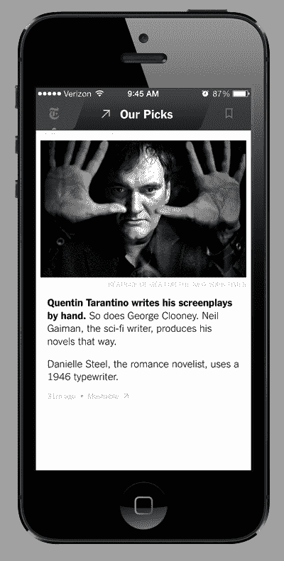

# NYT 现在是格雷女士在移动、专用移动编辑器上进入原生广告的第一步 TechCrunch

> 原文：<https://web.archive.org/web/https://techcrunch.com/2014/03/26/new-nyt-now-app-marks-the-grey-ladys-first-step-into-native-ads-on-mobile-dedicated-mobile-editors/>

“所有适合印刷的新闻”是《纽约时报》多年来可行的商业模式，但如今，随着报纸成本上升，读者从别处寻找信息，《灰色女士》专注于加快其数字游戏。

如今，随着 NYT Now 的推出，这一战略向前迈进了一大步。这款面向 iPhone 和 iPod 的新付费移动应用将于 4 月 2 日首次亮相，每月费用为 8 美元，将专注于聚合和管理，编辑们可以从 NYT 和更广泛的互联网上选择故事，以获得“快速和引人入胜的新闻体验”这也标志着 NYT 脱离常规展示广告的最大举措，NYT 上的所有广告现在都以“付费帖子”的形式出现，这是 NYT 对原生广告的称呼，或者过去被称为广告式广告。

除了 NYT Now 和付费帖子，NYT 还宣布了一款名为 Times Premier 的高端产品，提供额外的“幕后”好处和所有内容的访问。每月花费 45 美元，它的目标是超级用户和(很可能)成本可能会变得昂贵的商业市场。

这实际上使 NYT 现在和总理的书结束了 NYT 目前的订阅范围运行在 15 至 35 美元每月。一位发言人拒绝透露 NYT Now 何时可以用于 iPad 或其他平台。

在伦敦举行的英国《金融时报》数字媒体会议上，纽约时报公司首席执行官马克·汤普森指出，这是该公司推动数字产品弥补更多传统领域下滑的长期计划的下一步。根据 ComScore 的数据，在这个领域，截至 2014 年 2 月，NYTimes.com 每月有 4200 万来自 NYT 的独立访客，其中大约一半的流量来自移动端，包括应用程序和移动网络。2014 年 1 月，我们的智能手机应用程序的下载量为 2760 万次，平板电脑应用程序的下载量为 1120 万次。

但是将这些量转化为付费用户是很棘手的。截至 2013 年 12 月,《纽约时报》各种数字订阅包、电子阅读器以及《纽约时报》和《国际纽约时报》的复刊有 76 万付费订户。

> “不到一年前，我们概述了扩大我们数字产品组合的战略，以继续增加数字收入，”他说。“下周，这一战略将随着 NYT Now 和泰晤士报 Premier 的推出而付诸实施，这是 2014 年推出的第一批新产品。我们付费产品战略的下一个阶段的目标是，通过让新订户能够以适合他们的价格选择他们想要的访问量，满足时报新闻的需求，并提高我们为现有忠实订户提供的价值。”

当然，这些远远不是 NYT 在这一领域的第一步。早在 2012 年，它就与 Flipboard 合作，通过流行的移动应用程序提供付费内容。

Flipboard 也[一头扎进了原生广告](https://web.archive.org/web/20221206121547/https://beta.techcrunch.com/2014/03/05/more-on-flipboards-acquisition-of-zite-the-deal-whisperer-behind-the-sale-zites-fate-the-price-tag/)，尽管在我看来它并没有参与其中。NYT 的一位发言人告诉我，创意“要么由品牌开发，要么由我们内容工作室(位于我们业务的商业方面)的团队与品牌密切合作开发。”她补充说，在 NYT Now 的发起赞助商卡地亚的情况下，卡地亚开发了自己的创意。

付费的职位现在不仅会降级到 NYT。该公司表示，在未来几个月，它们还将开始出现在 NYT 的主应用程序中。目前还不清楚这是否也将取代更多的常规展示广告，或者两者是否会同时出现。(我们在问。)

该公司指出，NYT 现在也标志着 NYT 首次组建了一个专门负责移动产品的编辑团队。克里夫·利维将领导一个由 10 名编辑组成的团队。

这里的前提是与一类新的读者对话，他们可能不想要 NYT 全脂牛奶的体验，而选择更半脱脂的东西。你可以想象，NYT 承诺提供“文章、视频、信息图表和幻灯片”——这种组合既是对 Vox.com 和 BuzzFeed 等新型新闻机构崛起的回应，也是对 NYT 自己展示信息的实验进展的回应。([降雪](https://web.archive.org/web/20221206121547/http://www.nytimes.com/projects/2012/snow-fall/?forceredirect=yes)在这里尤其具有开创性。)

其他部分将包括一个上午的简报和一个晚上的简报，这是 NYT 现在的“每日提示”的一部分，涵盖世界，国家，商业，文化和其他类别。“我们的精选”将汇集来自其他出版物的故事。

NYT 的独立订阅现在包括对新应用程序的无限制访问，但 NYT 指出，所有现有的印刷和数字订阅者都将免费获得这一额外的好处。现有的送货上门订户可以每月额外支付 10 美元获得《泰晤士报》的 Premier 服务。

照片由 Flickr 用户 [Alexander Torrenegra](https://web.archive.org/web/20221206121547/http://www.flickr.com/photos/8536685@N07/3167575006) 在一个 [CC by 2.0 许可下](https://web.archive.org/web/20221206121547/https://creativecommons.org/licenses/by/2.0/)