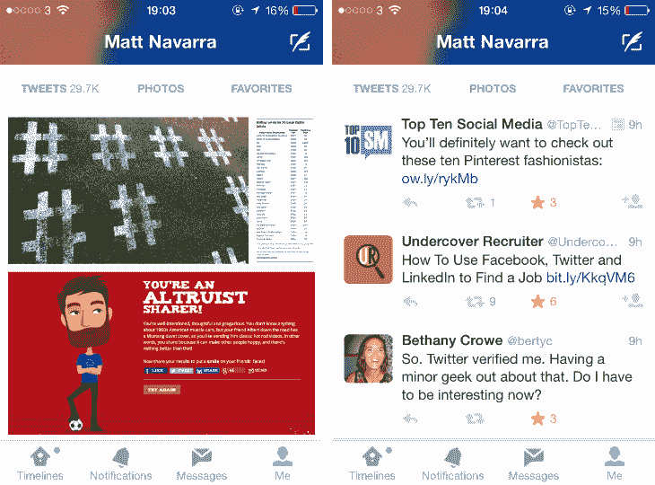

# Twitter 在手机上测试更具吸引力的个人资料设计 TechCrunch

> 原文：<https://web.archive.org/web/https://techcrunch.com/2014/03/26/twitter-tests-more-inviting-profile-designs-on-mobile/>

整个冬天，Twitter 都在疯狂地测试设计，包括一个类似于 T2 瓷砖的推文格式和一个脸书风格的网页页面。

但是 [TNW](https://web.archive.org/web/20221007010108/http://thenextweb.com/twitter/2014/03/26/testing-profile-redesign-web-twitter-ios-app/#!BvLHi) 在 Twitter 应用程序中发现了一个更新(考虑到我的应用程序版本没有显示出变化，这是作为测试部分推出的)，给移动设备带来了相同的个人资料外观。

新设计不再是居中的个人资料图片，用户简历隐藏在左滑动后，而是在屏幕左侧的白色背景下显示个人资料图片，封面照片卷曲在顶部，简历信息就在个人资料图片下方。

重新设计还在应用程序的个人资料部分加入了两个新的提要，一个只显示嵌入的照片推文，另一个显示用户所有喜爱的推文。

这里的想法是让 Twitter 成为一个伟大的消费场所，而不仅仅是分享。发布一条推文很容易，也很简单，但是当你试图通读你的订阅源或者通过查看某人的个人资料来更好地了解他时，Twitter 会变得有点烦人。与 Instagram 相比，这不仅是一次时光倒流的旅行，而且是一次文本内容丰富的体验。

通过给用户一种只看媒体的方式，他们可能会更乐意在 Twitter 上跟踪他们的朋友和过去的恋人，而不是在脸书和 Instagram 上。此外，显示被收藏的推文提供了另一个窗口，让人们了解某个特定的人是什么样的 Twitter 用户，这有助于决定如何与他们互动。

转变是显而易见的。Twitter 现在不再向你展示用户的姓名、推文数量和关注者数量，而是专注于以最前沿的简历、照片订阅和收藏夹订阅的形式，向你提供关于一个人是谁的切实证据。

Twitter 一直在拼命努力成为一个更加用户友好的工具，而不是早期用户和精通技术的年轻人的首选平台。随着用户增长放缓，这项业务的未来取决于新用户是否从一开始就习惯使用 Twitter。

虽然 Twitter 的设计一直在不断迭代，让事情变得更加用户友好，例如[的对话视图更新](https://web.archive.org/web/20221007010108/https://beta.techcrunch.com/2013/08/28/twitter-updates-android-ios-and-web-with-new-conversation-view-abuse-reporting/)，这将是该公司自推出以来最激烈的设计更新。

事实上它看起来很像脸书的个人资料？嗯，就像我说的，新用户必须对在 Twitter 上挺身而出感到舒服。还有什么更好的方法可以让他们自动地把设计和分享联系起来呢？

我们已经联系了 Twitter 进行评论，但是还没有收到任何回复。如果有，我们会及时通知你。

