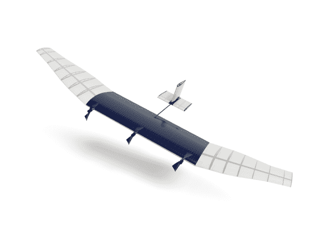
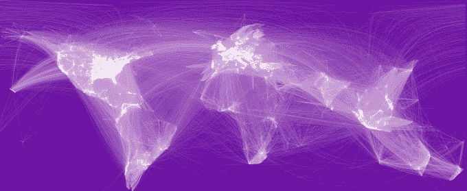

# 脸书在狩猎加入谷歌，展望未来

> 原文：<https://web.archive.org/web/https://techcrunch.com/2014/03/27/facebook-joins-google-in-the-hunt-for-the-future/>

我们现在生活在一个时代，马克·扎克伯格[快速拨号](https://web.archive.org/web/20230404070738/https://techcrunch.com/2014/03/13/zuckerberg-called-obama-to-express-frustration-over-new-nsa-revelations/)奥巴马，控制无人机舰队，一周内促成 190 亿美元的收购，并购买整个虚拟世界。脸书的使命已经改变。虽然它曾经只是“让世界变得更加开放和互联”，但它已经扩展到“赋予人们分享的权力”如果这能让脸书更接近那个目标，没有什么是太疯狂的。

如果你眯着眼睛看，这个策略很像脸书早期的口头禅，“快速行动，打破常规”，但规模要大得多。早在 2000 年代，脸书就不怕向所有用户一次性推出新闻订阅等全面的新功能，或者在没有警告的情况下彻底检查隐私，即使它不得不道歉并收回原话。

## 剪贴簿

但随着脸书接近首次公开募股，事情发生了变化。所有的想法似乎都转向了货币化。产品本身似乎在放缓，而业务却在增长。脸书开始在其神圣的新闻源中注入广告。它与游戏开发商斗争，通过其虚拟货币 Credits 对他们的应用内购买征收 30%的税。它开始要求页面付费来获得他们自己的粉丝。

当股价在 IPO 当天暴跌时，脸书的下一个危机显然是移动领域。它在那里几乎赚不到钱，但它的整个用户群都在那里。因此，它抛弃了薄弱的 HTML5 移动网络标准，完全以原生方式重建应用程序以提高速度。它对私人信息非常重视，对其独立的 Messenger 应用进行了大量投资。最关键的是，它看到拥挤的应用商店让开发者难以发现和增长，所以它推出了移动应用安装广告。

现在，它的应用程序更受欢迎，Messenger 成为了真正的竞争对手，应用程序安装广告变成了摇钱树。帮助脸书成为移动优先的广告公司，超过 50%的广告收入来自小屏幕。仅移动收入一个季度就超过 10 亿美元。这一切使股价走出了困境，升至最近一直波动的 60 美元区间。

证明了自己已经为移动时代做好了准备，摆脱了华尔街的干扰，脸书终于能够把目光放远了。

## 勇敢的新脸书

自从脸书的股价在 8 月份突破 38 美元的首次公开募股大关以来，我们已经看到它表现得像一个更大胆的公司:

*   它与六家电信巨头一起推出了[Internet.org](https://web.archive.org/web/20230404070738/https://techcrunch.com/2013/08/20/facebook-internet-org/)，目标是连接目前缺乏互联网的 50 亿人。
*   它在 NYU 的校园里创办了[脸书人工智能](https://web.archive.org/web/20230404070738/https://techcrunch.com/2013/12/09/facebook-artificial-intelligence-lab-lecun/)实验室，研究数据科学、深度学习、机器学习和能够自我思考的软件。
*   它承认它的移动应用程序不能满足所有人，并公布了[脸书创意实验室](https://web.archive.org/web/20230404070738/https://techcrunch.com/2014/01/30/facebook-creative-labs/)计划，从激进设计的[脸书论文](https://web.archive.org/web/20230404070738/https://techcrunch.com/2014/02/04/hands-on-with-facebook-paper/)开始建立独立的移动体验。
*   它花了 190 亿美元收购 WhatsApp，试图统治第三世界的移动通讯。对许多人来说，WhatsApp 是他们第一次接触互联网。
*   它[以 20 亿美元收购了 Oculus](https://web.archive.org/web/20230404070738/https://techcrunch.com/tag/FacebookOculus/)，以控制它认为是下一个关键计算平台和人类连接的未来。
*   今天，它公布了脸书连接实验室，该实验室正在建造太阳能无人机和卫星，向发展中国家传输互联网。

与过去几年中任何七个月的变动相比，扎克伯格似乎开始看太多科幻电影了。但实际上，他一直在将脸书的新三部曲变成现实。在宣布收购 Oculus 之后，首席执行官在[电话会议上向投资者](https://web.archive.org/web/20230404070738/http://www.scribd.com/doc/214950394/Facebook-To-Acquire-Oculus-Investor-Call-Transcript)解释了他的计划:

> “我已经把我们的战略框定为未来十年的三个高层次目标——连接每个人，一；二、认识世界；第三，建立知识经济。
> 
> 通过这次收购，现在除了我们重要的近期工作之外，这些计划中的每一项都有一个与之相关的雄心勃勃的长期赌注。
> 
> 首先，连接每个人，从长远来看，我们有 Internet.org，我们的倡议，使免费的基本互联网服务提供给世界上的每个人。为了将每个人联系起来，我们还将在近期努力宣传和发展。
> 
> 第二，理解世界，我们有一个雄心勃勃的人工智能研究小组，它试图建立一个统一的模型来描述世界上每个人(内部)是如何相互联系的。在近期，我们的努力方向是搜索和新闻订阅，将帮助你的网络向你提供更多有用的信息。
> 
> 第三，建立知识经济，这实际上是建立未来的技术平台。我们现在有 Oculus 加入我们，从长远来看，它可能是下一个重要的计算平台之一。当然，作为这项工作的一部分，我们将继续专注于构建广告平台这一极其重要的工作。"

随着这一战略的展开，脸书看似不稳定的上市、收购和投资成为焦点。脸书正在打两场比赛。一个是今天，由广告驱动的消息和新闻，另一个是明天，由连接到网络和脸书的全球驱动的人工智能和虚拟现实。随着“社交网络”标签的增长，脸书似乎并不介意被认为是令人毛骨悚然的，只要它在进步。

只有另外一家公司似乎比 T2 想得更远，那就是谷歌。它有用于连接的 Project Loon、用于增强现实的 Glass、用于人类长寿的 Calico、用于机器人的 Boston Dynamics、用于联网家庭的 Nest、自动驾驶汽车和用于人工智能的 Deep Mind。

两人都意识到技术比在桌面和智能手机上展示广告要重要得多。他们正在利用这个时代的收入来资助研究和收购，这样他们就可以为下一代创新买单。这些技术中的一些可能需要几年时间才能面向消费者市场，甚至更长时间才能被广泛接受。但这就是他们现在开始的原因。发明和整合需要时间。当然，两者都可能浪费数十亿美元。如果用户避开脸书旗下的 WhatsApp，或者开发者放弃 Oculus，事后看来，这些大赌注可能会被视为巨大的失误。但对这些巨头来说，赌博似乎比坐在一堆现金上风险更小。

社交时代悄悄来到了谷歌，移动时代悄悄来到了脸书。现在，脸书的小屏幕战略正在蓬勃发展，它有带宽和勇气与谷歌一起寻找未来。'

—

*金麦卡特勒补充报道。影像学分:[一个勇敢的新世界叙事插画家伯德](https://web.archive.org/web/20230404070738/http://www.huxley.net/)，[技术解决](https://web.archive.org/web/20230404070738/http://www.ideasevolved.com/techsquared/)*