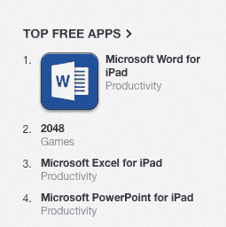
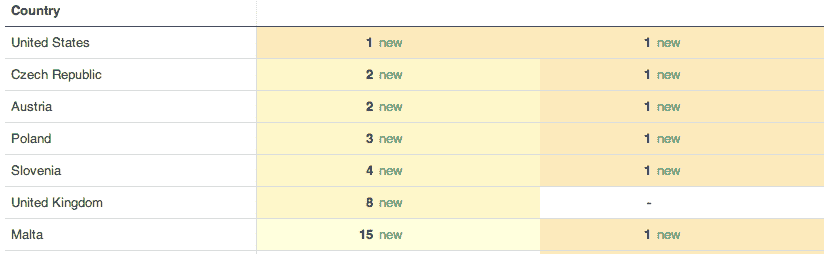

# Office For iPad 大受欢迎:Word 跃居美国第一，Excel 跃居第三，PowerPoint 跃居第四 TechCrunch

> 原文：<https://web.archive.org/web/https://techcrunch.com/2014/03/27/office-for-ipad-is-a-hit-word-jumps-to-1-in-us-excel-to-3-powerpoint-to-4/>

# Office For iPad 大受欢迎:Word 在美国跃居第一，Excel 第三，PowerPoint 第四

微软[建立了它](https://web.archive.org/web/20221007200702/https://beta.techcrunch.com/2014/03/27/microsoft-launches-office-for-ipad-available-at-11am-pt-today/)，他们来了:iPad 版 Office 正在享受一个盛大的首日，iPad 版 Word 在上线仅五个小时后就成为美国最受欢迎的应用程序。

新发布的 Word、Excel 和 PowerPoint 应用程序的数据仍然有些空白，因为这些应用程序还很年轻，但它们看起来不错。例如，PowerPoint 是美国第四大最受欢迎的应用程序，Excel 稳坐第三把交椅:

以下是 Words 目前为止的记分卡【所有数据: [App Annie](https://web.archive.org/web/20221007200702/http://www.appannie.com/) 】:

左边的数字代表其整体排名，右边的数字代表“生产力”类别。

在 Office for iPad 发布之前，人们有时会问一个问题:有人会在意吗？相反，谈话的中心是苹果平板电脑上 Office 的外观会从 Windows 的肺中吸走多少氧气。事实证明，那些认为市场对平板电脑上的 Office 有真实需求的人是正确的。

应用程序本身看起来相当不错，这并没有什么坏处。TechCrunch 对产品的[评论是正面的。TechCrunch 将密切关注图表，但看起来对雷德蒙来说是个好日子。](https://web.archive.org/web/20221007200702/https://beta.techcrunch.com/2014/03/27/office-for-ipad-review-surprisingly-worth-the-wait/)