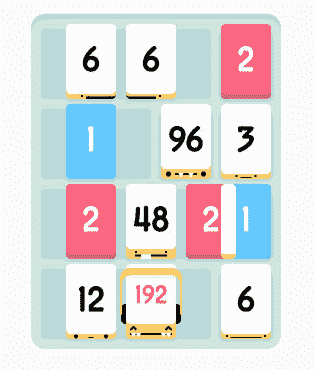

# 《Threes》的创作者发表了一篇史诗般的工作日志，展示被克隆是多么令人沮丧

> 原文：<https://web.archive.org/web/https://techcrunch.com/2014/03/27/threes-developers-publish-an-epic-work-log-to-show-how-frustrating-it-is-to-be-cloned/>

# “三”的创造者发表了一篇史诗般的工作日志，展示被克隆是多么令人沮丧

模仿是最真诚的奉承，对吗？

不完全是。那只是人们喜欢不假思索地说出来的话，因为听起来很好听，让他们感觉更好。有点像说“没有负面新闻这回事。”当-当然有。

事实上，被模仿可能是毁灭性的——尤其是当你被模仿的东西是你已经努力了一年多的东西。

*three 背后的开发者！*(阿瑟·沃尔默和格雷格·沃尔文德)花了 14 个月设计他们的游戏。在发行的 3 周内，他们的第一个大“克隆”(一个修改过的但非常相似的名字叫做 1024)出现了。到了月底，另一个(2048)出现了——在那之后的几周内，Threes 的开发者发现他们的游戏被称为抄袭。

现在 app store 里有几十个 3/1024/2048 的克隆版本。我们[首先报道了大量模仿者涌入这里](https://web.archive.org/web/20221207013540/https://beta.techcrunch.com/2014/03/24/clones-clones-everywhere-1024-2048-and-other-copies-of-popular-paid-game-threes-fill-the-app-stores/)。

为了证明他们在最初的游戏中投入了多少工作，[他们出版了一份史诗般长度的细目表](https://web.archive.org/web/20221207013540/http://asherv.com/threes/threemails/)，列出了游戏 14 个月设计中几乎所有的沟通(约 45，000 字)和规划。

他们的目标？我不会把话放在他们嘴里，但这句话是问题的关键:

> 我们想庆祝我们的想法和想法的迭代。太棒了。2048 是一种更简单、更容易的三分形式，值得研究，但当大多数三分玩家还没有时间理解我们对游戏系统所做的一切，以及为什么我们花了 14 个月来制作它时，这让我们感到悲伤。
> 
> 表达这些矛盾的感觉很复杂也很难，但希望这是一个开始。我们对 Threes 以及它的表现和所有的反应感到非常高兴。说真的。甚至写这篇文章感觉就像我们在抱怨一些我们没有理由感到酸的酸葡萄。就像有时我们的感觉是不对的。但是我们有。

至少，[把头伸进](https://web.archive.org/web/20221207013540/http://asherv.com/threes/threemails/)是值得的。你可能不会看完所有的内容——但这就是重点。