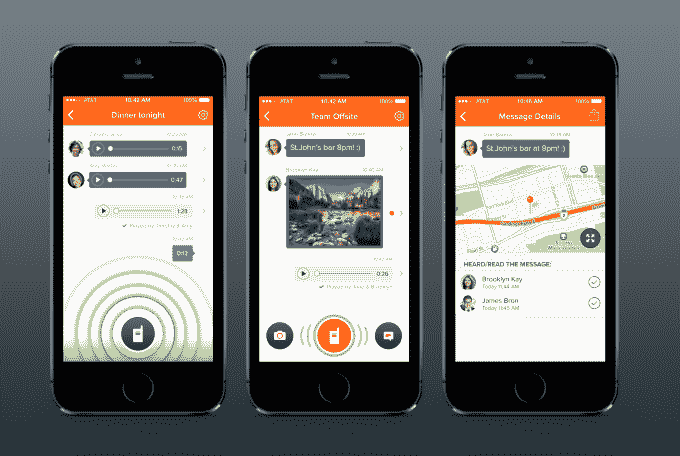

# Voxer 的一键通信使推出了重新设计、速度更快的 3.0 版 TechCrunch

> 原文：<https://web.archive.org/web/https://techcrunch.com/2014/03/31/voxers-push-to-talk-messenger-debuts-a-redesigned-speedier-version-3-0/>

一键通移动消息服务制造商 Voxer 今天推出了其 iOS 应用程序的重大升级([版本 3.0](https://web.archive.org/web/20221007121332/https://itunes.apple.com/us/app/voxer-walkie-talkie-ptt/id377304531?mt=8) )，引入了重新设计的用户界面、速度和电池寿命改进，以及新功能，包括阅读回执和无限数据存储。

作为背景，该公司长期以来一直在竞争对手中脱颖而出，因为它专注于语音。

该应用程序提供了常见的移动信息功能，如共享文本、照片和你的位置，但它的主要区别在于类似对讲机的功能，可以实时发送和记录信息，并保存在收件箱中。

这使得 Voxer 成为曾经使用对讲机或一键通手机的企业的流行替代产品，如建筑行业、酒店、现场服务等。Voxer 认为，每个用户每月 10 美元的商业服务实际上比各种按键通话选项更便宜，同时还提供了管理员工账户的商业仪表板等等。

Voxer 的产品主管 Irv Remedios 解释说:“语音一直是我们应用程序的主导部分，事实上，大多数用户在我们的应用程序中使用语音发送信息，我认为这与消息领域的其他应用程序不同。”“前提是，尽管语音仍然是一种非常好的交流方式，但我们使用语音进行交流的工具并不是最好的，”他补充道。

虽然该公司没有透露用户数量的具体情况，但它表示，Voxer 应用程序的下载量已经达到“数千万”，该服务上超过 50%的消息在第一个 16 秒内得到回复，这表明用户群非常活跃。

在 3.0 版本中，Voxer 终于用更符合 iOS 7 的扁平设计更新了它的移动应用程序，并将其一键通按钮扩大了 26%，以便于访问。该公司还利用网络层的改进(通过 iSPDY)来降低延迟和改进消息传递时间。它现在可以预加载消息，以减少应用程序启动后加载消息的时间。

该公司还对其音频引擎进行了改进，以更好地延长电池寿命，并增加了几个显著的功能，包括支持阅读回执和无限数据存储，这意味着专业用户现在可以保留无限数量的音频、文本和语音信息。

然而，就现实世界的功能而言，最好的改进可能是对讲机功能现在在后台运行，即使在屏幕锁定时也是如此。“你仍然可以从 Voxer 接收音频内容——它会流过，就像对讲机一样，”Remedios 说。"所以你不再需要在应用程序中."

后一个功能可能会使 Voxer 对更普通的消费者用户不那么有吸引力，因为对讲机有一种干扰性，不是每个人都希望在消息应用程序中使用，但应该会受到 Voxer 的商业客户的欢迎。

你可能还记得，该公司在发现财富 1000 强中的许多人都在使用这项服务，并愿意为附加功能付费后，去年将重点转移到了更多地迎合商业用户上。

今天，Voxer 的商业用户群包括只有几名员工的小型企业和大型企业组织。

更新后的 [iOS 应用程序现已发布](https://web.archive.org/web/20221007121332/https://itunes.apple.com/us/app/voxer-walkie-talkie-ptt/id377304531?mt=8)(更正——发布后我们被告知，由于公司沟通不畅，它将在太平洋时间上午 10 点发布)，因为 Android 应用程序去年已经更新过。