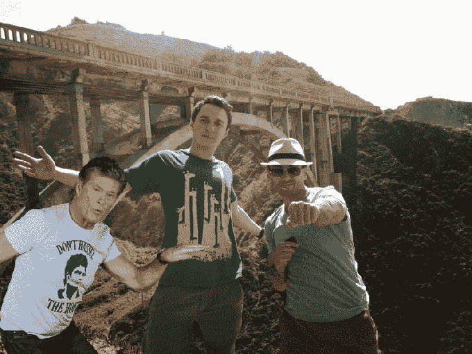
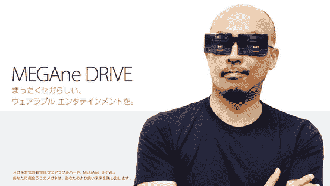
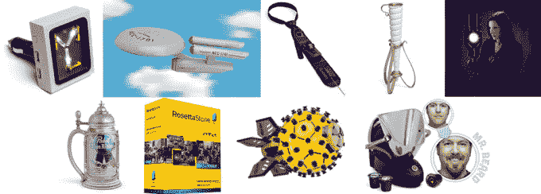
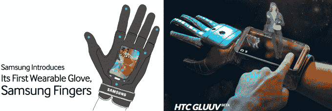
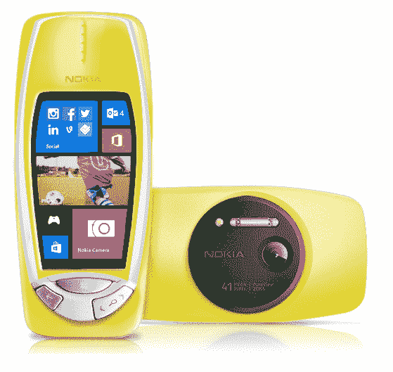
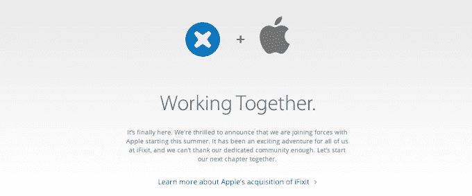
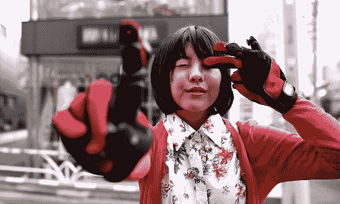
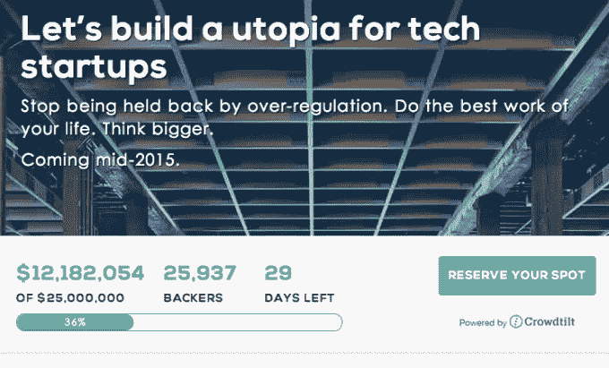

# 2014 年愚人节:最佳 TechCrunch 综述

> 原文：<https://web.archive.org/web/https://techcrunch.com/2014/04/01/best-of-april-fools-2014-roundup-list/>

又到了一年中的这个时候了，朋友们。当“上”变成“下”的那一天，谎言变成真理，狗变成人，当互联网变成有点让人无法忍受的一天左右。

今天是愚人节！*耶。*

作为这些地区的一个传统，我们保留了一个很大的最佳(/最差？)当今来自广阔互联网的笑话。当新的东西进来时，一整天都要回来检查。

[ *顶级形象鸣谢:TeeterTV.com*

# 谷歌:

一直走在最前沿的谷歌，昨天真的决定开始他们的愚人节活动了。(去他妈的！让我们从二月份开始愚人节吧。你知道我喜欢说什么吗？ABF。总是在开玩笑。)

## 神奇宝贝挑战:

昨天早上，谷歌地图的团队推出了一款他们永远不会真正发布的视频游戏的预告片，拨动了世界各地每个极客的心弦:一款真人增强现实口袋妖怪游戏。

【YouTube http://www.youtube.com/watch?v=4YMD6xELI_k？feature = player _ embedded & w = 640 & h = 360]

稍微缓和一下打击*，地图团队*[在他们的应用](https://web.archive.org/web/20221207111111/https://beta.techcrunch.com/2014/03/31/google-maps-pokemon-challenge-asks-you-to-prove-youre-the-very-best-like-no-one-ever-was/)中偷偷放了一个真实的口袋妖怪收集小游戏——只是不像视频中的那个那么可笑。**

 **## 神奇之手:

带给你买谷歌日本，这是*魔手*！当你可以用你的手做一个机器人的手打字时，为什么要用你自己的手打字呢？

【YouTube http://www.youtube.com/watch?v=0u1zoaJYAmw？feature = player _ embedded & w = 640 & h = 360]

## 航班巢

Rich Branson 为他飞机上的每位乘客介绍了个人气候控制，由 Nest 为您带来。

真正的恶作剧实际上是提醒我们这个*并不存在*，取而代之的是我们得到的那个奇怪的灰色小乳头，它吹出的温热空气似乎总是闻起来像放屁。

【YouTube http://www.youtube.com/watch?v = zocNCBXHVQo？feature = player _ embedded & w = 640 & h = 360]

## Gmail Shelfie:

“Shelfie”是“可共享自拍”的简称。通过用一张你的大脸代替你的 Gmail 背景，Gmail 确保了你永远不会远离你的收件箱去放纵自己。

## 自动超赞照片炸弹:

谷歌+的自动超赞功能做了很多超赞的事情。它会自动从一系列照片中制作出 gif，所以你不必这样做！它会为你的一天制作时髦的小视频剪辑，所以你不必这样做！

现在它会将大卫·霍索夫随机插入您的假期照片中，*所以您不必这样做。*

## YouTube 预测 2014 年的迷因趋势:

[YouTube http://www.youtube.com/watch?v = 0YUbYohGMOg？功能=player_embedded&w=640&h=360]

YouTube 已经决定停止自己制作所有 T4 的好视频，让其他人也参与进来。

# 传统物理键盘的快捷键:

[YouTube http://www.youtube.com/watch?v=-QfhTWJIDCM？功能=player_embedded&w=640&h=360]

# 世嘉:

您*可以*佩戴 Oculus 裂谷。*或*你可以把两个世嘉创世纪绑在脸上。你的决定，真的。

# Roku 手表:

谷歌得到一个可穿戴设备！苹果得到一个可穿戴设备！为什么 Roku 不应该弄个可穿戴的？配有高清电视天线和一个方便的遥控器，当你的手腕太远时使用。

# ThinkGeek:

每年，ThinkGeek 都会推出一系列他们实际上并不打算销售的山寨产品。每年，*至少有*一个产品受到如此多的关注，以至于 ThinkGeek 决定把它变成一个真实的东西。这是不是有点像 ThinkGeek 的自由市场测试？当然可以！但这没关系，因为他们想出的东西一般都是*高明的*。

以下是他们今年的成果(上图，从左至右):

任何可能成为现实的投票？我会选择通量电容汽车充电器。我知道有十几个人会买那个。我可能是其中之一。

# 三星和 HTC

[三星](https://web.archive.org/web/20221207111111/http://global.samsungtomorrow.com/?p=35430)和 [HTC](https://web.archive.org/web/20221207111111/http://www.htc.com/www/go/gluuv/) 都想出了同样的主意:一只智能手套(powerglove！)为您的手机。 *Aaawkwaaaaard。*

# 诺基亚:

【诺基亚】[将它抛回到 2000 年](https://web.archive.org/web/20221207111111/http://conversations.nokia.com/2014/04/01/nokia-3310-gets-41-megapixel-windows-phone-makeover/)，带回了经典的(也是几乎坚不可摧的)诺基亚 3310，只做了一些小改动:它运行 Windows Phone。哦，它有一个 4100 万像素的摄像头。

# 欧洲核子研究中心去漫画无:

一些世界上最聪明的人决定使用世界上最笨的字体:

# Sphero 的自拍机器人:

【YouTube http://www.youtube.com/watch?v=ZaR4X2iJo6M？feature = player _ embedded & w = 640 & h = 360]

超级马里奥世界最终 boss 战[中看起来像布瑟的飞行器的加分。](https://web.archive.org/web/20221207111111/https://www.youtube.com/watch?v=vctZg1TItQA)

# iFixit:

如果微软出售修理小玩意的工具，并且经常抨击苹果公司让用户修理自己的东西太难了，那么它就假宣布自己已经被苹果公司收购了。他们立即开始宣传苹果 Care+是“你需要的唯一工具”，并决定苹果的产品并不难修复。

# 体式:

组任务管理器[体式宣布快照任务](https://web.archive.org/web/20221207111111/http://blog.asana.com/2014/04/snaptask/)，对于在查看后 10 秒就消失的任务。工作，工作，工作。

# Flipboard:

[YouTube http://www.youtube.com/watch?v=QHKoCskKBtc？功能=player_embedded&w=640&h=360]

Flipboard 决定进军游戏领域，他们的首张专辑名为 [FlappyBoard](https://web.archive.org/web/20221207111111/http://flip.it/flappy) ，完全不受任何游戏的启发:

# 东芝:

[更多手套！](https://web.archive.org/web/20221207111111/https://beta.techcrunch.com/2014/04/01/toshibas-imaginary-wearable-computing-gloves-win-april-fools-day/)今年，似乎很多公司都从同样的可穿戴设备中汲取了灵感。

# 前后:

Frontback 为企业推出自拍。因为自拍。

[vimeo 90612993 w=500 h=281]

# 拥挤倾斜:

Crowdtilt [发起众筹活动](https://web.archive.org/web/20221207111111/http://siliconisland.crowdtilt.com/?utm_medium=Post&utm_source=Facebook&awesm=crowd.tc_siliconisland&utm_campaign=siliconisland)成立硅岛，这是一个距离加州海岸 65 英里的人工岛，专门为创新而建，没有监管。拉里·佩奇大概就像[“等等，为什么这是个笑话？”](https://web.archive.org/web/20221207111111/https://beta.techcrunch.com/2013/05/15/larry-page-wants-earth-to-have-a-mad-scientist-land/)

# Lyft:

Lyft 车+世界上最差的 Lyft 司机+隐藏摄像头=喜剧金。

【YouTube http://www.youtube.com/watch?v=fwXrd94ragQ？feature = player _ embedded & w = 640 & h = 360]

## 随着时间的推移，我们将更新此列表，敬请关注！如果我们错过了任何精彩的，请在评论中告诉我们。**