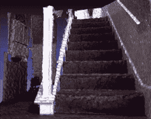

# LazeeEye 希望为任何智能手机提供 3D 绘图功能 TechCrunch

> 原文：<https://web.archive.org/web/https://techcrunch.com/2014/04/01/lazeeeye-kickstarter/>

智能手机的硬件附件继续涌现，让移动用户以新的有趣的方式扩展他们设备的功能。这里是最新的:[lazeeye](https://web.archive.org/web/20221006065759/https://www.kickstarter.com/projects/332648737/lazeeeye-turn-your-smartphone-into-a-3d-camera?ref=discovery)是一个原型附加软件，目前正在通过 [Kickstarter](https://web.archive.org/web/20221006065759/https://www.kickstarter.com/projects/332648737/lazeeeye-turn-your-smartphone-into-a-3d-camera?ref=discovery) 寻求众筹，它希望用激光驱动的 3D 地图功能来增强你现有的手机——并且只需要很少的额外费用。

它旨在与您的手机的板载马力配合工作，进行必要的 3D 处理，以及一个立体视觉应用程序，以可视化和播放正在捕捉的 3D 场景。最终目标是为新一代 3D 照片应用和服务提供动力——例如，可以帮助你想象新沙发在你的前屋会是什么样子。或者从多个角度观看照片。

目前，LazeeEye 只是一个概念。目前的原型看起来真的像是用一些细绳连接起来的。但这个想法本身很有趣，如果 LazeeEye 的制造商能够改进和缩小他们的硬件，优化他们的算法和软件，并兑现他们的价格承诺，他们可以让更多的人接触到 3D 地图技术——假设他们实现了他们雄心勃勃的 Kickstarter 目标，并筹集到实现所有这些所需的资金。所以是的，很多如果。不过，这是个很酷的主意。

谷歌在二月份发布了自己的 3D 智能手机原型:一款内置深度传感器的 Android 手机，手机用户可以绘制和可视化内部空间。

该项目仍处于试验阶段。它来自谷歌的先进技术和项目硬件 skunkworks，没有迹象表明山景城急于将其推向消费硬件。谷歌最初的关注点似乎是找出开发者用这样一个触手可及的设备开发什么样的应用。

但即使谷歌最终推出内置 3D 传感器的 Nexus 手机，人们也需要购买新手机才能获得 3D 地图功能。LazeeEye 的视觉是一个硬件插件，可以直接插入现有的手机，以扩展其功能。

除了 Project Tango，LazeeEye 也在排队与 [Occipital 的结构 3D 传感器](https://web.archive.org/web/20221006065759/https://beta.techcrunch.com/2013/10/18/occipital-raises-1m-and-counting-on-kickstarter-to-bring-3d-scanning-to-the-masses/)竞争 iOS 设备。

但它的目标是在价格上低于 Occipital 后者的 [3D 传感器](https://web.archive.org/web/20221006065759/https://beta.techcrunch.com/2013/09/17/occipitals-new-structure-sensor-turns-your-ipad-into-a-mobile-3d-scanner/)价格约为 350 美元。而 LazeeEye 有一个 50 美元的 DIY 套件，供那些乐于自己组装硬件的人使用，或者 75 美元的组装版。对于不同纳米波长的激光，也有一些更昂贵的承诺水平，125 美元或 150 美元。

LazeeEye 位于马萨诸塞州的制造商 [Heuristic Labs](https://web.archive.org/web/20221006065759/http://www.heuristiclabs.com/) 正在寻求通过 Kickstarter 筹集相当可观的 25 万美元，以推动该项目的发展。如果他们实现了这个目标——他们还有很长的路要走，但给了自己大约两个月的时间来实现这个目标——他们的目标是从今年 6 月开始向支持者发货。