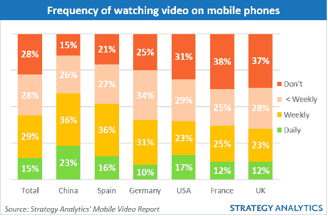

# 更大的手机屏幕推动移动视频消费 TechCrunch

> 原文：<https://web.archive.org/web/https://techcrunch.com/2014/04/01/phablets-love-mobile-video/>

不，这不是一个搞笑的分析师愚人节玩笑。虽然，基本的逻辑可能表明并非如此:大屏幕手机——如[平板手机](https://web.archive.org/web/20221006142826/https://beta.techcrunch.com/tag/phablet/)——是增加移动视频消费的关键驱动力。

这是分析机构 Strategy Analytics 的一项新研究的发现之一，该研究对美国、中国、英国、法国、德国和西班牙的 3，000 多名移动用户进行了调查，询问哪些因素会让他们在移动设备上观看更多视频。

除了更大的屏幕，受访者提到的另外两个移动视频驱动因素是更好的视频质量和 4G 网络。这些都是基本的。要让移动视频有价值，视频本身必须值得观看，帧速率和大小都值得观看。这肯定不是火箭科学。

根据该分析师的数据，目前，近四分之三(72%)的消费者在手机上观看视频，但频率很低——不到一半(44%)的人每周观看一次或更多。每天这样做的人不到七分之一(15%)。

调查发现，中国人是手机视频的最大消费者，59%的人每周观看手机视频，而美国人只有 40%。

拒绝手机视频的最大部分是法国人，38%的人说他们不会用手机看任何视频，紧随其后的是英国人(37%)。

尽管 4G 在许多地区的普及进展缓慢，随着移动屏幕的膨胀，几乎在每个价位都提高了屏幕的平均尺寸，越来越多的大屏幕智能手机出现，但 Strategy Analytics 表示，其数据表明移动视频的渗透率可能正在接近峰值——目前不在手机上观看视频的手机用户中，只有 8%的人表示希望或打算在未来观看视频。

在现有的移动视频消费者中，不到一半(40%)的人报告每周观看不足 30 分钟；超过五分之一(22%)的人说他们看电视的时间在 30-60 分钟之间；21%的人说他们消费 1-3 小时；和 14%的眼球每周超过 3 小时。

该调查还发现，移动视频的使用大多发生在浏览器中，而不是应用程序中——70%的移动视频观众表示他们通过浏览器观看内容，而略多于三分之一(35%)的人通过应用程序观看内容。相当大的一部分人——超过五分之一(22%——说他们在手机上下载视频观看。

在网络方面，移动视频观众通过 Wi-Fi 向手机传输内容的可能性几乎是通过移动网络的 3 倍，其中 68%通过 Wi-Fi 传输，四分之一(24%)通过蜂窝网络传输。3G/4G 移动视频流媒体在法国(33%)和美国(30%)的份额最高。

至于供应商，YouTube 被评为那些现在观看移动视频和打算在未来观看移动视频的人最喜欢的移动视频供应商，64%的人认为这是他们的首选。其次是谷歌(49%)，其次是手机制造商(27%)、苹果(26%)、亚马逊(22%)和移动网络运营商(也是 22%)。

Strategy Analyst 指出，尽管 YouTube 一直很受欢迎，但“很大一部分”移动视频仍通过手机制造商和移动运营商的渠道消费——因此，它表示，移动视频内容提供商应继续将手机供应商和运营商视为推动移动视频消费的关键合作伙伴。