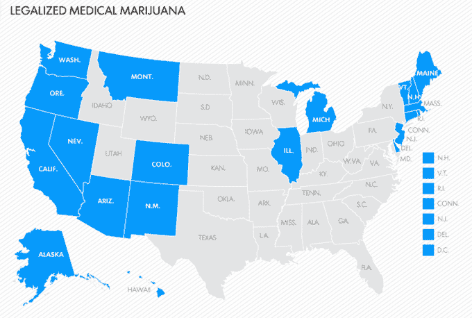

# Weedmaps 花费 3000 万美元在纽约合法化大麻 TechCrunch

> 原文：<https://web.archive.org/web/https://techcrunch.com/2014/04/01/weedmaps-new-york/>

说白了， [Weedmaps](https://web.archive.org/web/20221007093529/https://weedmaps.com/) 可不是闹着玩的。大麻药房的 Yelp 年收入已经增长到 3000 万美元，现在它在时代广场的大屏幕上宣传大麻合法化。在接下来的 60 天里，一个 8 秒钟的 Weedmaps 广告将在哥伦比亚广播公司的超级屏幕上播放，将纽约人引向一个合法化资源和请愿的网站。*420，倡导它*

Weedmaps 萌芽于 2008 年，旨在帮助人们找到哪里可以买到合法的奶酪。它不仅能嗅出该抽什么，而且通过提高定价透明度，它创造了竞争，降低了消费者每八分之一的成本。

从那时起，它被一家上市公司收购，这帮助它[以 420 万美元的价格收购了社区网站 Marijuana.com](https://web.archive.org/web/20221007093529/https://beta.techcrunch.com/2011/11/28/weedmaps-acquires-marijuana-com-for-a-kushy-4-20-million/)和药房销售点系统 [MMJmenu](https://web.archive.org/web/20221007093529/https://mmjmenu.com/) 并进行一系列收购。但在两年后，通用大麻公司(被一堆方块重新命名为 SearchCore)将 Weedmaps 交还给了最初的创始人。

*建议配乐。*

随着鸡块在科罗拉多州和华盛顿州合法化，以及 20 个州对医用魔法西兰花的冷淡，Weedmaps 的生意蒸蒸日上。它向数千家 sinsimilla 商店和 dank 送货服务公司收取费用，列出它们的评论。MMJmenu 支持 900 家药房，ganja Groupon clone Weedmaps Deals 每月收入约 25 万美元。很快，它计划将专卖店、水培店、蒸发器等打包进 Weedmaps.com

今天，它的目标是在纽约这样的新市场将自己的名字烙进人们的大脑，药用大麻有望在 2014 年获得批准，休闲大麻可能在几年内合法化。

“在大麻禁令下受苦的人越少越好，”联合创始人兼首席执行官贾斯汀·哈特菲尔德告诉我。“我们想教育纽约人，主动宣传我们的品牌。这是 Weedmaps 第一次面向主流进行营销。”

广告照亮了通往资源网站[Weedmaps.com/nyc](https://web.archive.org/web/20221007093529/https://weedmaps.com/nyc)的道路，该网站[赞扬合法化的拥护者，斥责反对合法化的缉毒警察](https://web.archive.org/web/20221007093529/https://weedmaps.com/nyc/get_weed_freed/)。就像你在高中认识的那个满眼血丝的大麻爱好者的数字化版本一样，该页面还推出了一份大麻法律改革的请愿书，一份当地最佳吸烟点的愚蠢指南，以及关于疯狂吸食大麻的教育文章链接。

如果大麻法律改革让你兴奋，去看看大麻多数，这是一个旨在从政策制定者和名人那里获得合法化支持的网站。

一些人担心，只要大麻合法，他们友好的邻居经销商就会看到他们的生计化为灰烬。哈特菲尔德说，这不仅仅是妄想症。“它将被公司化、职业化，业余选手将被淘汰。”尽管如此，合法化将使人们远离消耗纳税人金钱的刑事司法系统，创造巨大的新商业机会，并使大麻更加安全。

例如，有一种新的高科技吸烟方式被称为“dabs”THC 含量比大麻高得多的难以置信的强效丁烷 hash 油被涂在用喷灯加热的钛钉上产生烟雾。问题是，由于禁令，秘密制作 dab 是危险的。它需要在大麻上运行液态丁烷来提取精神活性元素。没有规定的安全预防措施，丁烷爆炸已经发生。如果丁烷在被烟熏之前没有完全从地沟油中煮出来，它可能是危险的。

因此，虽然 Weedmaps 可以从合法化中获得很大的经济利益，但它也试图让这个世界成为一个对瘾君子来说更安全的地方。

