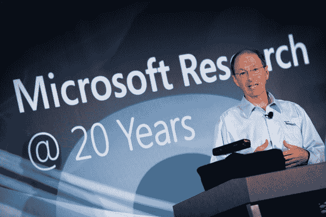

# 微软研究 20 年 TechCrunch

> 原文：<https://web.archive.org/web/https://techcrunch.com/2011/09/27/20-years-of-microsoft-research/>

本月标志着微软研究院成立 20 周年，这可能是这个庞大的软件公司最令人感兴趣的部门。[花几分钟仔细阅读他们工作的时间表](https://web.archive.org/web/20230205021014/http://research.microsoft.com/en-us/um/redmond/about/timeline/)，从面向消费者的工作，如 Cleartype 和垃圾邮件识别，到晦涩难懂的、学术的和不切实际的。这些想法背后的名字不太可能被认出来，但它们包括天才、幻想家、骑士和人道主义者。每年花费数十亿美元来提高技术的影响力和价值是一项重要但却费力不讨好的工作。

当然，像 Office、Exchange 和其他企业产品构成了微软的大部分收入，但我不认为微软成立的初衷是成为一家办公工具公司。微软的愿景是让每家每户都有一台电脑，并让这台电脑尽可能地多功能和强大。微软研究院也许比其母公司多年来更符合这一理念。

如果我必须选择一个在微软工作的地方，毫无疑问就是研究。不幸的是，我不是一个有成就的计算机科学家或工程师，所以我不得不满足于偶尔报道令人兴奋的创作，如使用 Kinect 实时绘制 3D 房间图的。诸如此类的事情让我对他们正在做的事情感到兴奋。这个网站上有这么多公司都把目光放在了这些小问题、小应用上，以至于不管他们获得了多少资金，我都无法让自己对他们有任何感觉。如果 Instagram 每年有 10 亿美元用于研发，他们会花在什么地方？更多过滤器？

对于 MSR 和谷歌来说，寻找感兴趣的项目尤其容易，因为这两家公司都希望有这样的东西。随着摩托罗拉的收购，我认为谷歌可能只是开始修补。苹果公司可能也在做很多有趣的研究，但是他们的秘密性质不允许窥探。这也是我喜欢微软研究院的原因。他们协作和分享的半学术模式意味着论文和演示视频经常就在那里供你浏览。当然，对于像 Kinect 这样的新兴产品，他们必须保守秘密，但对于更深奥的项目，一切都是公开的。

罗布·克尼斯[在这里](https://web.archive.org/web/20230205021014/http://research.microsoft.com/en-us/news/features/anniversaryoverview-092611.aspx)描述了 MSR·雷德蒙导演李家杰对该部门未来几年的乐观态度，并回顾了过去 20 年的发现和调查。研究已经发展到包括全球 12 个机构的 850 多名研究人员。微软每年在研发上花费 90 亿美元，尽管他们可能会在 T4 遇到一些困难，但 MSR 仍然是一个物有所值的创意工厂。