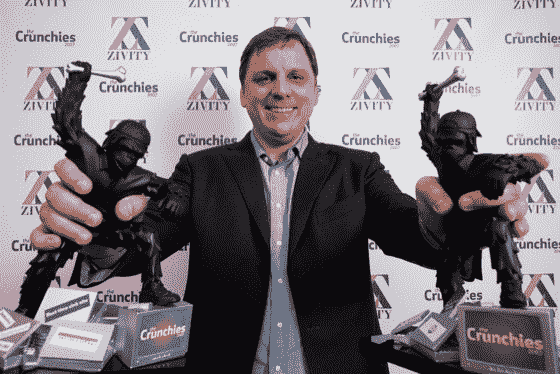
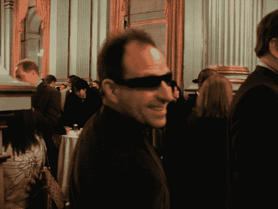
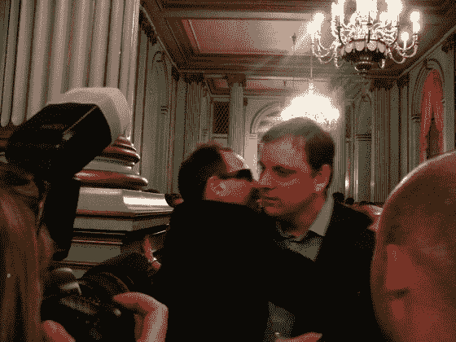
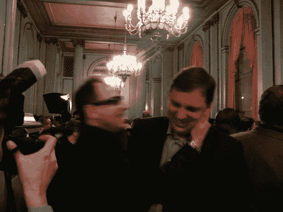
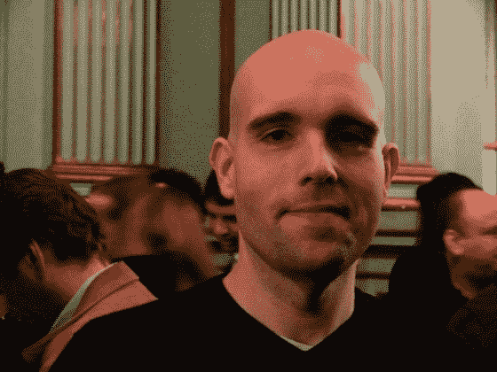
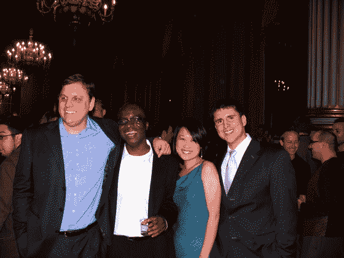
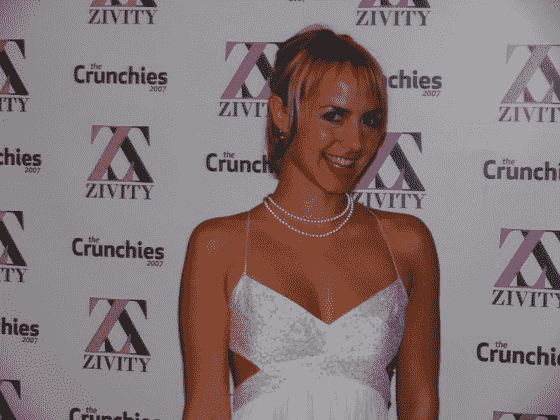
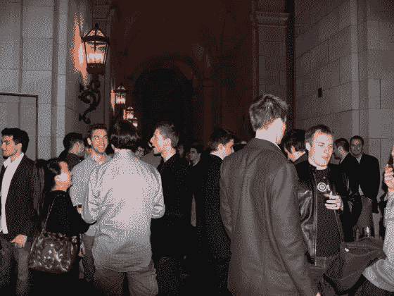
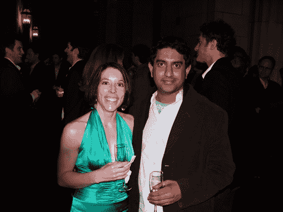
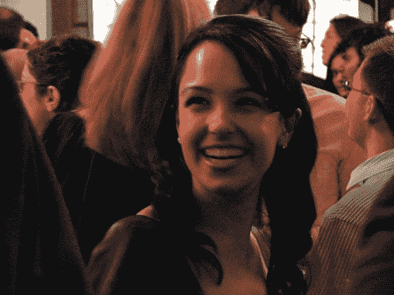

# 2007 年 Crunchies 派对报道:兄弟之爱和一个晚上戴墨镜的男人

> 原文：<https://web.archive.org/web/https://techcrunch.com/2008/01/19/2007-crunchies-party-report-brotherly-love-and-a-guy-who-wears-sunglasses-at-night/>

# 2007 年脆饼干派对报道:兄弟之爱和一个晚上戴墨镜的家伙

我们最后的嘎吱嘎吱报告直到我们从官方嘎吱嘎吱档案员那里得到各种记录片段[修订版 3](https://web.archive.org/web/20230216054838/http://www.revision3.com/) (你可以从 Mogulus [这里](https://web.archive.org/web/20230216054838/http://www.mogulus.com/crunchiestv)看到存档的实时流)。

简洁是今晚智慧的灵魂，颁奖典礼持续了大约 2 个小时，完全按照计划进行，考虑到今晚有 20 个奖项，这是一个相当不错的努力。点击阅读脆饼干获奖者的完整名单[。](https://web.archive.org/web/20230216054838/https://techcrunch.com/2008/01/18/2007-crunchies-the-winners/)

在活动颁奖结束后，那些没有买到主活动门票的人和几个不速之客搬到了 Herbst 剧院的楼上，喝着金属瓶啤酒，与出席的许多初创公司打成一片。

如果你不感兴趣，不要点击“阅读这篇文章的其余部分”按钮，你会看到如果你在首页上阅读这篇文章，但来自派对的一些照片如下，包括 Valleywag 如何偷偷靠近人们拍照。还可以在 Flickr [点击](https://web.archive.org/web/20230216054838/http://flickr.com/photos/tags/2007crunchies)查看更多照片。

我们知道来自 Valleywag 的 Paul Boutin 要来，但这并没有阻止他在 Michael 知道他在那里之前偷偷溜到 Michael 后面摆姿势拍照。顺便说一句，保罗，戴墨镜的是谁？:-)

"他还是没注意到我，多拍几张我和他的背！"

很高兴见到你

好了，现在他肯定认为自己是波诺

刚刚落地的一吻

一些非 Valleywag 的照片，首先，我读了很多年，但今晚才有机会见到的家伙， [Shoemoney](https://web.archive.org/web/20230216054838/http://www.shoemoney.com/) 名声的 Jeremy Schoemaker。和他在博客上看到的一样好的人:

现在是一些随机的图片:

