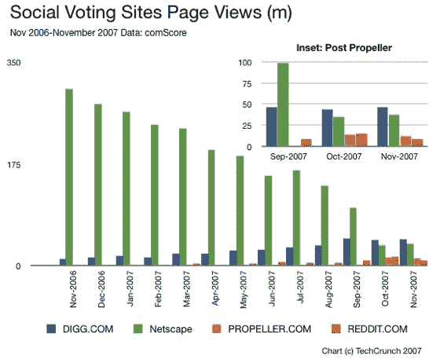

# 数字上的 2007:美国在线扼杀网景流量的一年 

> 原文：<https://web.archive.org/web/https://techcrunch.com/2007/12/23/2007-in-numbers-the-year-aol-killed-netscapes-traffic/>

# 数字上的 2007 年:美国在线扼杀网景流量的一年

社交投票在 2007 年仍然很受欢迎，像 Digg 这样的网站拥有超过三倍的观众，但是根据 comScore 的数据，一些网站的表现比其他网站要好。

一个历史悠久的名字是美国在线拥有的 Netscape.com T4。该网站于 2006 年 6 月重新推出作为 Digg 的复制品，并被寄予厚望，希望新一代人会使用这个曾经伟大的品牌作为 Digg 的替代品。这一战略令人沮丧地失败了，但最终的结局更糟。从 2006 年 11 月到 2007 年 8 月(Digg 克隆版的最后一个整月),网景的访问量从每月 3 . 05 亿次页面浏览下降到 1 . 37 亿次，9 个月下降了 55.1%。9 月 19 日(T8)，AOL 在 Netscape 上放弃了社交投票，事情变得越来越糟，8 月份的访问量从 1.37 亿次页面浏览下降到 11 月份的 3800 万次，下降了 72.3%。

网景社交投票实验的新家 [Propeller](https://web.archive.org/web/20221006212844/http://www.propeller.com/) 表现尚可，但未能抓住网景之前的大部分社交投票受众。根据 comScore 的数据，Propeller 在 2007 年 11 月有 1300 万的页面浏览量，但在网景 8 月份的浏览量中，Propeller 只获得了不到 10%的用户。

社交投票领域的大赢家再次是 Digg。从 2006 年 11 月的 1100 万页面浏览量开始，12 个月后，Digg 的流量增长了 318%，达到 4600 万。Reddit 的表现很好，从 2007 年 2 月的 200 万页面浏览量(comScore 记录的第一个月)增加到 11 月的 900 万，尽管 10 月是 1600 万页面浏览量的高点。

