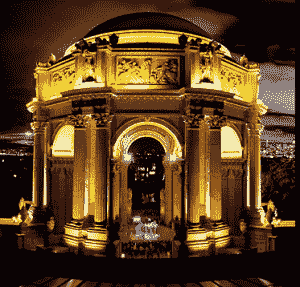

# 宣布您的 2010 年 Crunchies 决赛选手 

> 原文：<https://web.archive.org/web/http://techcrunch.com/2011/01/07/2010-crunchies-finalists/>

2010 年嘎吱嘎吱奖的入围者已经选出。各类投票超过 243，000 次，讨论了许多杰出的成就。与我们的合作伙伴 [GigaOm](https://web.archive.org/web/20230202231202/http://gigaom.com/) 和 [VentureBeat](https://web.archive.org/web/20230202231202/http://venturebeat.com/) 一起，我们非常自豪地宣布 2010 年最佳技术的入围名单。

类别从最佳社交应用和最佳移动应用到年度最佳天使和最佳新创公司或产品。就连维基解密创始人朱利安·阿桑奇也榜上有名，还有首次被提名的 Quora 和 Instagram。移动应用程序一直占据主导地位，去年的总冠军马克·扎克伯格被提名为年度首席执行官。

[投票现在开始](https://web.archive.org/web/20230202231202/http://crunchies2010.beta.techcrunch.com/vote/)。每个人都有资格并被鼓励投票。您可以每天为每个奖项类别投票一次，直到 2011 年 1 月 19 日晚上 11:30(太平洋标准时间)投票结束。有 20 个奖项类别开放投票，表彰各种领域和角色的最高成就。如果你是决赛选手，[制作一枚徽章](https://web.archive.org/web/20230202231202/http://crunchies2010.beta.techcrunch.com/embed)，让你的社区为这一荣誉而激动，并投票支持你成为获胜者。

为了纪念今天宣布的决赛选手，我们很高兴通过 [Eventbrite](https://web.archive.org/web/20230202231202/http://crunchies2010.eventbrite.com/) 发布我们的下一组门票。太平洋标准时间下午 1 点开始发布，所以请尽快行动[在你可以的时候](https://web.archive.org/web/20230202231202/http://crunchies2010.eventbrite.com/)拿到它们。

以下是您的决赛选手:

**最佳互联网应用**
[Chartbeat](https://web.archive.org/web/20230202231202/http://chartbeat.com/)
[Greplin](https://web.archive.org/web/20230202231202/https://www.greplin.com/)
[Pandora](https://web.archive.org/web/20230202231202/http://www.pandora.com/)
[Rdio](https://web.archive.org/web/20230202231202/http://www.rdio.com/)
[Ujam](https://web.archive.org/web/20230202231202/http://www.ujam.com/)

**最佳社交 App**
[city ville](https://web.archive.org/web/20230202231202/http://www.facebook.com/apps/application.php?id=291549705119)
[daily booth](https://web.archive.org/web/20230202231202/http://dailybooth.com/)
[four square](https://web.archive.org/web/20230202231202/http://foursquare.com/)
[group me](https://web.archive.org/web/20230202231202/http://groupme.com/)
[Twitter](https://web.archive.org/web/20230202231202/http://twitter.com/)

**最佳社交商务 App**
[Blippy](https://web.archive.org/web/20230202231202/http://blippy.com/)
[Groupon](https://web.archive.org/web/20230202231202/http://www.groupon.com/)
[Jetsetter](https://web.archive.org/web/20230202231202/http://www.jetsetter.com/)
[living Social](https://web.archive.org/web/20230202231202/http://livingsocial.com/)
[One Kings Lane](https://web.archive.org/web/20230202231202/https://www.onekingslane.com/Login.aspx?ReturnURL=/default.aspx)
[ShopKick](https://web.archive.org/web/20230202231202/http://www.shopkick.com/)

**最佳手机 App**
[Bump](https://web.archive.org/web/20230202231202/http://bu.mp/)
[Chomp](https://web.archive.org/web/20230202231202/http://chomp.com/)
[谷歌安卓手机地图](https://web.archive.org/web/20230202231202/http://www.google.com/mobile/android/)
[has shable](https://web.archive.org/web/20230202231202/http://hashable.com/beta)
[insta gram](https://web.archive.org/web/20230202231202/http://instagr.am/)

**最佳位置服务**
[脸书地点](https://web.archive.org/web/20230202231202/http://www.facebook.com/places/)
[四方](https://web.archive.org/web/20230202231202/http://foursquare.com/)
[Gowalla](https://web.archive.org/web/20230202231202/http://gowalla.com/)
[simple geo](https://web.archive.org/web/20230202231202/http://simplegeo.com/)
[优步](https://web.archive.org/web/20230202231202/http://www.uber.com/)

**最佳新设备**
[Boxee Box](https://web.archive.org/web/20230202231202/http://www.boxee.tv/)
[谷歌 Chrome 笔记本](https://web.archive.org/web/20230202231202/http://www.google.com/chromeos/pilot-program-cr48.html)
[iPad](https://web.archive.org/web/20230202231202/http://store.apple.com/us/browse/home/shop_ipad/family/ipad?afid=p219%7CGOUS&cid=OAS-US-KWG-iPad-US)
[iPhone 4](https://web.archive.org/web/20230202231202/http://www.apple.com/iphone/)
[Kno](https://web.archive.org/web/20230202231202/http://www.kno.com/waitlist-landing)
[Xbox Kinect](https://web.archive.org/web/20230202231202/http://www.xbox.com/en-US/kinect?WT.srch=1)

**最佳技术成就**
[Blekko](https://web.archive.org/web/20230202231202/http://blekko.com/)
[谷歌自动驾驶汽车](https://web.archive.org/web/20230202231202/https://techcrunch.com/2010/10/09/google-automated-cars/)
[预感](https://web.archive.org/web/20230202231202/http://hunch.com/)
[Palantir](https://web.archive.org/web/20230202231202/https://techcrunch.com/2010/06/25/palantir-the-next-billion-dollar-company-raises-90-million/)
[Qwiki](https://web.archive.org/web/20230202231202/http://qwiki.com/)
[文字镜头](https://web.archive.org/web/20230202231202/https://techcrunch.com/2010/12/16/world-lens-translates-words-inside-of-images-yes-really/)

**最佳设计**
[1000 memories](https://web.archive.org/web/20230202231202/http://1000memories.com/)
[about . me](https://web.archive.org/web/20230202231202/https://about.me/)
[Airbnb](https://web.archive.org/web/20230202231202/http://www.airbnb.com/)
[Flipboard](https://web.archive.org/web/20230202231202/http://www.flipboard.com/)
[gogo bot](https://web.archive.org/web/20230202231202/http://www.gogobot.com/)
[Qwiki](https://web.archive.org/web/20230202231202/http://www.qwiki.com/)

**最佳触控界面**
[Flipboard](https://web.archive.org/web/20230202231202/http://www.flipboard.com/)
[Fotopedia 传承 iPad app](https://web.archive.org/web/20230202231202/http://www.fotopedia.com/products/heritage-info)
[Osmos](https://web.archive.org/web/20230202231202/http://www.hemispheregames.com/osmos/)
[脉冲新闻阅读器](https://web.archive.org/web/20230202231202/http://itunes.apple.com/us/app/pulse-news-reader/id371088673?mt=8)
[Sencha Touch](https://web.archive.org/web/20230202231202/http://www.sencha.com/products/touch/)
[Swype](https://web.archive.org/web/20230202231202/http://swypeinc.com/)

**最佳自举启动**
[沉迷(iMob)](https://web.archive.org/web/20230202231202/http://www.addmired.com/)
[白鲸](https://web.archive.org/web/20230202231202/http://belugapods.com/)
[画架](https://web.archive.org/web/20230202231202/http://www.easellearning.com/)
[快社会](https://web.archive.org/web/20230202231202/http://fastsociety.com/)
[Instapaper](https://web.archive.org/web/20230202231202/http://www.instapaper.com/)
[Techmeme](https://web.archive.org/web/20230202231202/http://techmeme.com/)

**最佳企业**
[37 信号](https://web.archive.org/web/20230202231202/http://37signals.com/)
[哥们传媒](https://web.archive.org/web/20230202231202/http://www.buddymedia.com/)
[cloud app](https://web.archive.org/web/20230202231202/http://getcloudapp.com/)
[inDinero](https://web.archive.org/web/20230202231202/https://indinero.com/)
[千禧传媒](https://web.archive.org/web/20230202231202/http://www.millennialmedia.com/)
[Salesforce](https://web.archive.org/web/20230202231202/http://www.salesforce.com/)

**最佳国际**
[Crivo](https://web.archive.org/web/20230202231202/http://www.crivo.com.br/)
[PCH 国际](https://web.archive.org/web/20230202231202/http://www.pchintl.com/)
[Soluto](https://web.archive.org/web/20230202231202/http://www.soluto.com/)
[ViKi](https://web.archive.org/web/20230202231202/http://www.viki.com/)
[VNL](https://web.archive.org/web/20230202231202/http://www.vnl.in/)
[Wonga](https://web.archive.org/web/20230202231202/https://www.wonga.com/)

**最佳清洁技术**
[cooler ado](https://web.archive.org/web/20230202231202/http://www.coolerado.com/)
[Kopernik](https://web.archive.org/web/20230202231202/http://www.thekopernik.org/)
[micro geen](https://web.archive.org/web/20230202231202/http://www.microgreeninc.com/)
[Puralytics](https://web.archive.org/web/20230202231202/http://www.puralytics.com/html/home.php)
[史密斯电动车](https://web.archive.org/web/20230202231202/http://www.smithelectricvehicles.com/)
[SolarCity](https://web.archive.org/web/20230202231202/http://www.solarcity.com/campaigns/sem/official/default.aspx?thankyou=1&cm_mmc=SEM-_-Google-_-CA-FosterCity-Solar-City-_-covsolggl89200000010393s%7C7375835374&)

**最佳时间下沉应用**
[愤怒的小鸟](https://web.archive.org/web/20230202231202/http://shop.angrybirds.com/)
[城市小镇](https://web.archive.org/web/20230202231202/http://www.facebook.com/apps/application.php?id=291549705119)
[网飞流媒体](https://web.archive.org/web/20230202231202/http://www.netflix.com/NetflixReadyDevices?cid=Game+Consoles)
[Quora](https://web.archive.org/web/20230202231202/http://www.quora.com/)
[stumble upon](https://web.archive.org/web/20230202231202/http://www.stumbleupon.com/)

**年度天使**

**年度 VC(个人)**
[马克·安德森&本·霍洛维茨](https://web.archive.org/web/20230202231202/http://blog.pmarca.com/2009/07/06/introducing-our-new-venture-capital-firm-andreessen-horowitz/)
鲁洛夫博塔、红杉资本
[吉姆·布雷耶、Accel Partners](https://web.archive.org/web/20230202231202/http://www.crunchbase.com/person/jim-breyer)
[约翰·杜尔登、凯鹏华盈](https://web.archive.org/web/20230202231202/http://www.kpcb.com/team/doerr)
[尤里·米尔纳、DST](https://web.archive.org/web/20230202231202/http://www.crunchbase.com/person/yuri-milner)
[弗雷德·威尔森、联合广场风投](https://web.archive.org/web/20230202231202/http://www.avc.com/a_vc/about.html)

**年度创始人**
[朱利安·阿桑奇](https://web.archive.org/web/20230202231202/http://en.wikipedia.org/wiki/Julian_Assange)
[丹尼斯·克劳利、Foursquare](https://web.archive.org/web/20230202231202/http://www.denniscrowley.com/)
[杰克·多西、Square](https://web.archive.org/web/20230202231202/http://www.crunchbase.com/person/jack-dorsey)
[凯文和茱莉亚·哈茨、Eventbrite](https://web.archive.org/web/20230202231202/http://www.eventbrite.com/team/)
[戴维·卡普、Tumblr](https://web.archive.org/web/20230202231202/http://www.crunchbase.com/person/david-karp)[马克·平卡斯、Zynga](https://web.archive.org/web/20230202231202/http://www.crunchbase.com/person/mark-pincus)

**年度 CEO**
[迪克·科斯特罗，推特](https://web.archive.org/web/20230202231202/http://www.crunchbase.com/person/dick-costolo)
[雷德·哈斯汀斯，网飞](https://web.archive.org/web/20230202231202/http://www.crunchbase.com/person/reed-hastings)
[德鲁·休斯顿，Dropbox](https://web.archive.org/web/20230202231202/http://www.crunchbase.com/person/drew-houston)
[安德鲁·梅森，Groupon](https://web.archive.org/web/20230202231202/http://www.crunchbase.com/person/andrew-mason)
[马克·扎克伯格，脸书](https://web.archive.org/web/20230202231202/http://www.crunchbase.com/person/mark-zuckerberg)

**2010 年最佳新创公司或产品**
[Flipboard](https://web.archive.org/web/20230202231202/http://www.flipboard.com/)
[group me](https://web.archive.org/web/20230202231202/http://groupme.com/)
[Instagram](https://web.archive.org/web/20230202231202/http://instagr.am/)
[Quora](https://web.archive.org/web/20230202231202/http://www.quora.com/)
[Square](https://web.archive.org/web/20230202231202/https://squareup.com/)
[优步](https://web.archive.org/web/20230202231202/http://www.uber.com/)

**2010 年最佳整体创业公司或产品**
[脸书](https://web.archive.org/web/20230202231202/http://www.facebook.com/)
[Groupon](https://web.archive.org/web/20230202231202/http://www.groupon.com/)
[Quora](https://web.archive.org/web/20230202231202/http://www.quora.com/)
[Twitter](https://web.archive.org/web/20230202231202/http://twitter.com/)
[Zynga](https://web.archive.org/web/20230202231202/http://www.zynga.com/)

颁奖典礼将于 2011 年 1 月 21 日晚上 7:30 在旧金山的[艺术宫剧院](https://web.archive.org/web/20230202231202/http://www.palaceoffinearts.org/)举行，之后的派对将在[探索博物馆](https://web.archive.org/web/20230202231202/http://www.exploratorium.edu/)举行。和往常一样，门票包括太平洋标准时间晚上 11:30 前的惊喜派对。我们将有一个完全托管的酒吧，无限量的小吃，一个有趣的游戏室，和许多其他令人兴奋的惊喜。

如果您想赞助或支持我们的活动，请联系 [Jeanne Logozzo](https://web.archive.org/web/20230202231202/mailto:jeanne@beta.techcrunch.com) 了解赞助机会。

祝所有决赛选手好运。让[投票开始](https://web.archive.org/web/20230202231202/http://crunchies2010.beta.techcrunch.com/vote)！