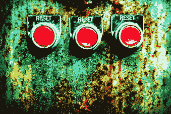
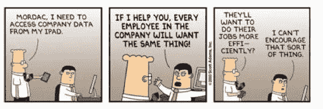
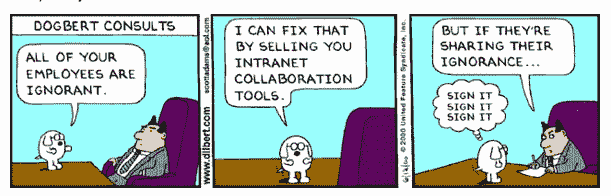

# 2011 年:企业重置 TechCrunch

> 原文：<https://web.archive.org/web/https://techcrunch.com/2011/01/02/2011-enterprise/>

*这篇文章由【Box.net】[的首席执行官兼联合创始人](https://web.archive.org/web/20230203032233/http://www.box.net/)[亚伦·李维](https://web.archive.org/web/20230203032233/http://www.crunchbase.com/person/aaron-levie)撰写。他为我们写的最后一篇客座博文是[“构建简单的企业”](https://web.archive.org/web/20230203032233/https://techcrunch.com/2010/11/07/building-the-simple-enterprise/)* 。

在最近的一次电话会议上，一位分析师讲述了一家公司的故事，该公司的 IT 基础架构在一场自然灾害中被彻底摧毁。该公司被迫从零开始，重塑了其企业 it 战略的精神和组成，从废墟中涌现出的一系列解决方案使他们的组织在本质上更具移动性和效率。这就引出了一个问题:如果所有公司都有机会“重新开始”，企业 IT 会是什么样子 2011 年，我们可能会发现。其他破坏性较小但极其强大的变革驱动力也在发挥作用，未来一年将是企业大规模转型的一年。

**云已经向企业倾斜**

[IDC 预测](https://web.archive.org/web/20230203032233/http://www.computerweekly.com/Articles/2010/12/03/244327/IDC-predicts-IT-boom-in-2011.htm)今年全球 IT 支出将达到 1.6 万亿美元，其中 13%的增长来自软件和服务，公共云解决方案构成了最大的增长领域。云服务不再处于边缘地位。2011 年无疑将使这一点变得清晰，随着云跨越从早期采用者到更大、更务实的组织的鸿沟，将带来大规模的采用、创新和转型浪潮。

云已经倾斜的证据随处可见。当我在一家蓝筹纸业公司工作的父亲告诉我，他的一个业务部门最近采用了 NetSuite 时，我特别震惊。微软已经开始在机场和电视上宣传他们的云产品。2010 年，美国政府认定谷歌应用程序对美国总务署来说足够安全，微软的 T2 应用程序对美国农业部来说足够安全，并声称每年可以节省数百万美元的成本。就连云计算最大的批评者之一拉里·埃里森[也在甲骨文全球大会的主题演讲](https://web.archive.org/web/20230203032233/http://www.youtube.com/watch?v=0FacYAI6DY0)中谈到了云计算。

可以说，我们正处于历史上最重要的计算变革之中。正如之前发生的其他重大范式转变一样，新的企业将会出现，以定义和主导市场。当我们从大型机转向个人机时，苹果和微软接管了我们。谷歌的力量伴随着消费互联网时代的兴起而增长。脸书拥有社交网络。我们知道该怎么做。我们会惊奇地回顾这一时期，从现在起的五年后，管理自己的服务器和基础设施将会变得像[比尔·盖茨据说说过的话](https://web.archive.org/web/20230203032233/http://online.wsj.com/article/SB10001424052748704039704574616401913653862.html)“没有人需要超过 637KB 的内存。”

企业中的云是一个经典的颠覆性故事。它最初是作为一种交付低端应用程序的方式，我们并不关心或知道我们需要这些应用程序。大多数现有供应商忽视或试图推迟早期指标。但所有颠覆性的故事都是这样开始的:从低端开始，随着技术的成熟——更高的安全性、更长的正常运行时间、更大的吸引力——浪潮开始形成势头。很快，企业意识到，这种开展业务的方式不仅更省时、更具成本效益，还改变了他们组织的运营方式。

大型企业中的首次云部署总是最大的障碍，但一旦沃尔玛实施了绩效管理的成功因素，或者奇基塔的首席信息官认为 Workday 足够可靠，可以作为其人力资源记录系统，那么这些组织将其他非核心系统迁移到外部供应商的努力就不会受到阻碍。

他们对云的采用为其他人铺平了道路，在各种规模的组织中产生了连锁反应。如果你在一年前调查过市场，你会发现许多企业仍然对其业务的云解决方案的状态保持警惕，但我们现在看到相反的情况成为事实:当可信的基于 web 的替代方案存在时，企业不再愿意投资于本地系统。

正如当个人电脑和服务器更有效地匹配它们的能力时，大型机计算变得过时一样，今天的大型 IT 基础设施很可能会看到它自己对于大多数需求的过时。事实上，也许最有先见之明的一句话来自 IBM 前总裁托马斯·J·沃森，他说，“我认为世界市场上可能只有五台电脑。”他早了大约 60 岁。

**移动企业将最终实现**

如今，移动性正在创造对云产品的主要需求，它本身就是一股颠覆性力量。在去年的夏季财报电话会议上，苹果首席运营官公司的蒂姆·库克在 T4 分享道，“……在最初的 90 天里，我们已经有 50%的财富 500 强企业在部署或测试 iPad。”2010 年，AT & T 称[近 40%的 iPhone 销售](https://web.archive.org/web/20230203032233/http://www.engadget.com/2010/05/27/atandt-40-percent-of-iphones-are-enterprise-android-built-with/)给了企业和企业，2010 年企业市场份额的最大相对增长[来自 Android 设备。](https://web.archive.org/web/20230203032233/http://www.investorplace.com/18151/google-android-os-major-corporate-smart-phone-winner/)

正如 Aberdeen 的 Andrew Borg 指出的那样，这些设备还没有完全为企业做好准备，然而不需要太多的洞察力就可以看出这种趋势将在 2011 年继续增长；随着企业中复杂移动设备的日益多样化，出现了全新的颠覆机会。

为了使这些新设备完全适用于企业，他们需要无缝访问电子邮件系统、业务数据和情报、通信工具等。云改写了这里的规则，使新手机和平板电脑能够像任何其他电脑一样连接到“网格”，这最终使移动工作场所成为现实。随着真正的移动工作人员，全新的计算案例正在出现。

远程销售团队在现场手持 iPad，从云端下载库存或产品信息。屋顶上的建筑工人正在查看来自总部的最新数字蓝图。祝你在 SharePoint 上好运。移动设备正在成为全新企业应用的催化剂，反之亦然。这两者的结合是如此独特而强大，以至于企业将在未来几年经历一波生产力转型。

一夫多妻制企业和微软一夫一妻制的衰落

虽然前几十年的企业可能主要依靠在 Redmond 和 Redwood Shores 开发的软件组合生存，但 2011 年的企业不会这样。现代企业 IT 部门的任务正在从维护和升级有限供应商的系统转变为试验和实施一套多样化的服务来解决问题。

我们甚至在硬件方面也看到了这种转变，因为 MAC 以更大的比例进入企业，[在大型企业和政府内看到了两位数甚至三位数的增长](https://web.archive.org/web/20230203032233/http://tech.fortune.cnn.com/2010/08/23/mac-enterprise-sales-surged-in-june/)。近乎宗教般地采用巨型供应商的垂直集成工具的时代即将结束，这为竞争企业客户的最佳解决方案提供了前所未有的机会。

微软可能是受影响最大的一方，但 2011 年企业将立即开始感受到好处和管理压力。随着新的异构解决方案的闸门打开，我们将继续看到员工自己直接大量采用技术。这正迅速成为新软件和硬件的最快入口，而这些工具不会马上被 IT 关掉。

在今年 Dreamforce 大会的一次观众调查中，一半的人说他们的组织中有 SharePoint 然而，当被问及有多少人打算在未来一年关闭 SharePoint 时，超过一半的人仍然举着手。鲍尔默和他的公司仍在试图弄清楚如何在一个不以他们为中心的世界中运营，而云计算和移动设备的兴起正在产生这种效果。微软——一家传统上通过复杂性和新产品线成长的公司——将不得不努力保持竞争力。

**社交和个性化将渗透到所有商业应用中**

所有这些多样性通常会造成混乱，除非这些应用程序正以令人难以置信的强大方式连接起来。他们会更加努力地为我们工作，为被动用户提供比主动用户在他们孤立的遗留软件中可能发现的更多的相关信息。

社交功能将改变我们与应用程序的交互方式，而不仅仅是在企业社交软件的范畴内，随着 Gartner 估计 2011 年 1B 市场规模为美元，企业社交软件终于开始从边缘走向主流。为了走得更远，[Forrester 的 Rob Koplowitz 指出](https://web.archive.org/web/20230203032233/http://blogs.forrester.com/rob_koplowitz/10-12-01-collaboration_will_become_more_people_centric_in_2011_and_will_challenge_cc_pros)商业价值必须建立，组织必须学会接受不同类型的风险，这表明今天没有足够的共享比拥有过多的透明度更危险。

这不仅仅是我们的软件在现代意义上变得更加社会化，用户之间有状态信息和交流。这是关于我们的软件变得更加个性化，在它拥有更多知识的领域比我们更聪明。您的内容管理解决方案应该显示与您当前项目相关的信息和协作者。

你的社交软件平台应该在没有提示的情况下为你组建的团队推荐专家。LinkedIn 应该会告诉你哪些候选人适合你要招聘的职位。随着商业社交层的不断增长，一个丰富的应用程序生态系统将会出现。这将导致在我们的商业社交软件之上编写混搭的能力，在“图形”之上拥有病毒式的商业应用，以及在 2011 年实现更加个性化和更加符合我们工作行为的企业体验。

云在企业中的颠覆性故事仍处于早期阶段，但在 2011 年，这将是不可否认的。如果移动性的崛起、供应商霸权的衰落以及社交功能在所有业务应用中的传播给企业软件市场带来了巨大的动荡，这比我们在过去五年中看到的总和还要多，请不要感到惊讶。(我在这里可能有偏见，因为我经营的是企业云创业公司，但我也可能是对的)。

这也将为 It 部门带来短期挑战，因为他们要在一个需要管理的应用程序和设备比以往任何时候都多的世界中找到自己的位置，但从长期来看，系统维护的大幅减少以及角色本身更具战略性和动态性也是一个优势。然而，对于用户来说，这种颠覆只会带来好处。他们想要使用的设备终于是他们配备的设备，而且由于云应用程序，他们现在可以在任何地方工作。

他们使用的技术是同类最佳的，而不是默认选择或供应商锁定的。已经彻底改变了他们个人生活的社交能力现在正以可以说是更强大的方式应用到他们的工作生活中。欢迎来到 2011 年。

*图片来源:Flickr/ [詹妮弗·科宁](https://web.archive.org/web/20230203032233/http://www.flickr.com/photos/jkonig/450664690/)*