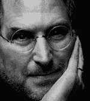
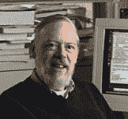
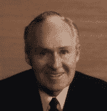
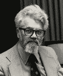
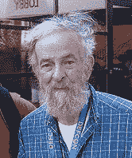
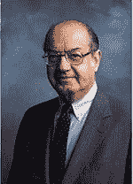

# 技术领域的 2011 年:损失惨重的一年

> 原文：<https://web.archive.org/web/https://techcrunch.com/2011/12/16/2011-in-tech-a-year-of-great-losses/>

我对 a .萨克斯了解不多，除了他的一句名言:“死亡比生命更普遍；每个人都会死，但不是每个人都活着”。

事实上，基本上活在借来的时间里的人的百分比是刻在石头上的(百分之百),而任何人都猜不到地球上“真正活着”的人的百分比是多少——即使这样，每个人都有自己的定义。

随着 2011 年接近尾声，至少根据公历，我认为花些时间纪念一些在今年去世的人是件好事，但他们的生活足以在他们去世之前对科技行业——更广泛地说，对世界——产生影响。

显然，不可能列出今年科技行业中每一个取得成就并去世的人，但如果你认为有明显的遗漏，请[让我们知道](https://web.archive.org/web/20221003022236/https://beta.techcrunch.com/contact/)。

**史蒂夫·乔布斯**(1955 年 2 月 24 日—[2011 年 10 月 5 日](https://web.archive.org/web/20221003022236/https://beta.techcrunch.com/2011/10/05/steve-jobs-has-passed-away/))

对于这位才华横溢的创新者，这位纯粹的开拓者，他在有生之年成功地激发并改变了整个行业，我们还能说些什么呢？并不是所有这个人触摸过的东西都能变成金子，但是他将作为我们这个时代最伟大的发明家之一而被人们长久铭记。

乔布斯对细节的关注、商业天赋、专注的能力和不懈的努力应该也将成为未来许多代企业家的灵感源泉。

**丹尼斯·里奇**(1941 年 9 月 9 日—[2011 年 10 月 12 日](https://web.archive.org/web/20221003022236/https://beta.techcrunch.com/2011/10/13/father-of-c-and-unix-dennis-ritchie-passes-away-at-age-70/))

如果没有受人尊敬的计算机科学家 dmr，他负责 C 编程语言的创建和 UNIX 操作系统的共同发明，我们所有人会做什么？

在他死后，计算机历史学家保罗·克鲁兹在我看来说得很好:“里奇不为人知。他的名字并不家喻户晓，但是……如果你有一台显微镜，可以在电脑里看到他的作品，你会发现里面到处都是。”

**鲍勃·高尔文**(1922 年 10 月 9 日—[2011 年 10 月 11 日](https://web.archive.org/web/20221003022236/https://beta.techcrunch.com/2011/10/12/longtime-motorola-ceo-robert-w-galvin-passes-away-at-age-89/))

罗伯特·威廉·“鲍勃”·高尔文是摩托罗拉创始人保罗·高尔文的儿子，他从 1959 年到 1986 年担任公司的首席执行官。在 Galvin 的领导下，摩托罗拉基本上领导了全球移动电话行业的创建。

在他的指导下，摩托罗拉还成为半导体、寻呼、双向无线电、空间和军事通信以及汽车嵌入式控制技术的全球领导者。

**约翰·麦卡锡**(1927 年 9 月 4 日—[2011 年 10 月 24 日](https://web.archive.org/web/20221003022236/https://beta.techcrunch.com/2011/10/24/creator-of-lisp-john-mccarthy-dead-at-84/))

麦卡锡创造了 Lisp 编程语言，可以说是现代人工智能(AI)之父，这个术语也是他创造的。他说他想出了 Lisp 来在他可支配的有限计算环境中创建图灵机。

约翰·麦卡锡是一位受人尊敬的计算机科学家和斯坦福大学教授，直到 2000 年底退休。

罗伯特·莫里斯(1932 年 7 月 25 日至 2011 年 6 月 26 日)

作为一名密码学家和计算机科学家，莫里斯被广泛认为是计算机安全领域的先驱。莫里斯从 1960 年到 1986 年在贝尔实验室担任研究员，在那里他从事 Multics 和后来的 UNIX 操作系统的研究。

Morris 对早期 UNIX 版本的贡献包括数学库、bc 编程语言、程序“crypt”和用于用户认证的密码加密方案。

他曾经说过:“确保计算机安全的三条黄金法则是:不拥有计算机；不要打开电源；不要使用它”。

伊利亚·日托米尔斯基(1989 年 10 月 12 日—[2011 年 11 月 12 日](https://web.archive.org/web/20221003022236/https://beta.techcrunch.com/2011/11/13/diaspora-co-founder-ilya-zhitomirskiy-passes-away-at-21/)

Zhitomirskiy 是一名俄罗斯裔美国软件开发人员，是开源社交网络 Diaspora 的联合创始人和开发者。

他没有时间像这篇文章中提到的其他人那样改变世界，但他在 22 岁时去世，对整个科技界来说仍然是一个巨大的冲击。

**保罗·巴兰**(1926 年 4 月—[2011 年 3 月](https://web.archive.org/web/20221003022236/http://www.nytimes.com/2011/03/28/technology/28baran.html))

作为一名波兰裔美国工程师，他发明了分组交换技术，是计算机网络发展的先驱，他帮助为阿帕网奠定了技术基础。

作为一名成功的企业家，他创办了几家公司并开发了一些技术，这些技术如今已成为互联网和其他现代数字通信的重要组成部分。

1968 年，巴兰是未来研究所的创始人之一。他还发明了第一个金属探测器，一个门口枪探测器。

2011 年全球失去的其他科技名人:

Max Mathews—“电脑音乐之父”(1926 年 11 月—[2011 年 4 月](https://web.archive.org/web/20221003022236/http://www.nytimes.com/2011/04/24/arts/music/max-mathews-father-of-computer-music-dies-at-84.html))

**Julius Blank**——一名机械工程师，他共同创立了飞兆半导体公司(1925 年 6 月—[2011 年 9 月](https://web.archive.org/web/20221003022236/http://www.nytimes.com/2011/09/23/technology/julius-blank-who-built-first-chip-maker-dies-at-86.html))

**Jean Jennings Bartik**——世界上第一位在计算机行业工作的女性，她参与编写了 ENIAC 计算机程序(1924 年 12 月—[2011 年 3 月](https://web.archive.org/web/20221003022236/http://www.nytimes.com/2011/04/08/business/08bartik.html))

**Norio Ohga**——索尼高级顾问、前总裁兼董事长(1930 年 1 月—[2011 年 4 月](https://web.archive.org/web/20221003022236/http://www.sony.net/SonyInfo/News/Press/201104/11-0423E/index.html))

约翰·r·欧宝(John r . Opel)——曾担任 IBM 的总裁、首席执行官和董事长，监督该公司进军个人电脑领域(1925 年 1 月—[2011 年 11 月](https://web.archive.org/web/20221003022236/http://www.nytimes.com/2011/11/05/business/john-r-opel-who-made-ibm-a-colossus-dies-at-86.html?pagewanted=all))

**迈克尔·s·哈特**—发明电子书，创立古腾堡计划(1947 年 3 月—[2011 年 9 月](https://web.archive.org/web/20221003022236/http://latimesblogs.latimes.com/jacketcopy/2011/09/project-gutenberg-founder-michael-s-hart-has-died.html))

**丹尼尔·麦克拉肯**——计算机科学家和二十多本计算机编程教科书的作者，包括《Fortran 编程指南》(1930 年 7 月—[2011 年 7 月](https://web.archive.org/web/20221003022236/http://www.nytimes.com/2011/08/13/technology/daniel-d-mccracken-dies-at-81-wrote-best-sellers-on-using-computers.html))

肯尼斯·奥尔森(Kenneth Olsen)——远见卓识的发明家，共同创立并领导了小型计算机巨头数字设备公司，更广为人知的名称是 DEC(1926 年 2 月—[2011 年 2 月](https://web.archive.org/web/20221003022236/http://www.latimes.com/news/obituaries/la-me-kenneth-olsen-20110209,0,2274343.story))

**帕特丽夏·邓恩**——惠普公司前董事长(1953 年 3 月—[2011 年 12 月](https://web.archive.org/web/20221003022236/http://allthingsd.com/20111205/former-hp-chairman-patricia-dunn-central-figure-in-pretexting-case-dies/))

**史蒂夫·莱西**——企业家和软件工程师，曾为微软(飞行模拟器！)，脸书，以及最近的谷歌。(出生日期不详-[2011 年 7 月](https://web.archive.org/web/20221003022236/http://www.geekwire.com/2011/google-engineer-steve-lacey-victim-car-wreck-kirkland))

**更新—**在年底之前，还有一些损失需要承认:

晶体管的倡导者诺曼·克里姆去世，享年 98 岁

施乐实验室创始人雅各布·戈德曼去世，享年 90 岁

安息吧，所有人，感谢你们给我们剩下的人一个可以依靠的肩膀。

(最佳图片归功于 [Flickr 用户奥林·泽贝斯](https://web.archive.org/web/20221003022236/http://www.flickr.com/photos/orinrobertjohn/123109062/)