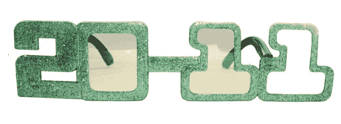
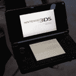
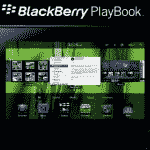
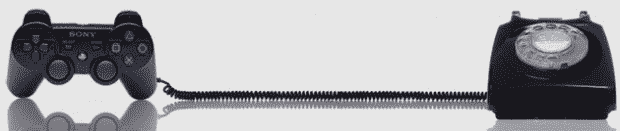
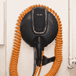
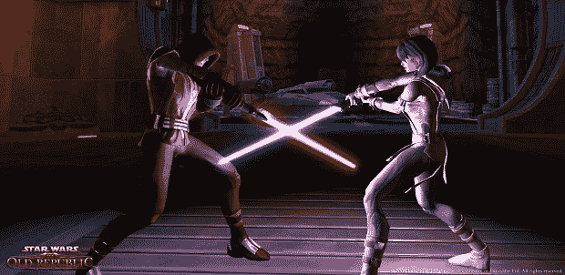

# 2011 年十大最受期待的设备 

> 原文：<https://web.archive.org/web/http://techcrunch.com/2010/12/22/2011s-top-10-most-anticipated-gear/>

谁准备好迎接 2010 年的结束了？伙计，我们是。这并不是说 2010 年是糟糕的一年，而是所有的 iPad-这个，iPhone-以及一些零星的 Android 新闻。

随着以下列表中的产品陆续发布，2011 年将会是更加平衡的一年。当然，苹果仍将是新闻周期中的主要部分，但从任天堂到惠普，甚至像概念墨水这样的初创公司，每个人都应该能够享受聚光灯的公平份额。

** 3DS**

背景故事:去年三月，任天堂随机公布了一款 3D 版的 Game Boy [。这个公告确实是突然出现的。任天堂，“嘿，哟。我们正在制作 DS 的 3D 版本。再见！”但是后来 E3 在 3DS 正式亮相的地方转了一圈，我们动手做了。然而，这两个公告都没有提到价格或发布日期，这引起了业界的广泛猜测。最后，任天堂宣布，虽然最初计划在 2010 年推出，但 3DS 将于 2 月 26 日在日本上市，3 月在美国和欧洲上市。](https://web.archive.org/web/20230203211317/http://www.crunchgear.com/2010/03/23/3ds-nintendo-announces-portable-3d-gaming-device/)

2011 年的热门:3D 很有趣，但目前用眼镜和其他东西实现的东西扼杀了这种吸引力。3DS 不需要眼镜，它真的是 3D 的。好莱坞可能会在这项技术上笨手笨脚，但任天堂 3DS 可能会将其推向主流。该系统将会很贵，大约 300 美元，但这不是虚拟男孩。这是真正的交易，你必须去百思买看看，才能相信这些游戏在 3D 效果上有多好。

## iPad 2

背景故事:史蒂夫·乔布斯坐在旧金山莫斯康中心舞台上舒适的皮椅上，毫不费力地推出了 iPad。它现在是历史上销售最快的设备之一，仅在问世的前三个月就售出了 300 多万台。有人估计，iPad 以高达 95%的市场份额位居整个平板电脑市场之首。但它并不完美。端口缺失，没有摄像头，4:3 的宽高比不适合看电影，等等。这就是 iPad 2 的用武之地。

2011 年热门:苹果可以简单地将目前的 iPad 改变成不同的尺寸，它仍然会打破所有的销售记录。但我希望苹果公司听取了对最初 iPad 的批评，并采纳了一些建议。早期的泄露似乎表明它至少会有一个摄像头，这只有在苹果最近的 Facetime 虚拟产品战略中才是有意义的。更低的价格也不错，即使这意味着更小的屏幕尺寸。

##  黑莓 PlayBook

背景故事:RIM 经常被认为是智能手机竞赛中的失败者，但这家总部位于加拿大的公司在大规模推出黑莓手机的同时，静静地坚持自己的路线。每个季度他们的出货量都比上一季度多。他们知道自己在做什么，该公司的第一款平板电脑 [PlayBook](https://web.archive.org/web/20230203211317/http://www.crunchgear.com/tag/playbook/) 将利用这种品牌爱。在一系列的泄露和预告之后，这款手机早在 9 月份就宣布上市了，尽管它要到 2011 年第一季度(可能是 3 月份)才会上市。它会像风暴一样失败吗？也许吧。但也许不是。

2011 年热门:RIM 对企业市场在移动领域的需求略知一二——或许比微软或苹果更了解。这就是剧本给人留下最深刻印象的地方。企业可能会抢购 PlayBook，而不是 iPad，只要它与他们的 it 基础设施集成没有问题。PlayBook 可能不会在直接消费者市场上大受欢迎——它可能会抢走三星 Galaxy Tab 的销量，而不是 iPad 的销量——但只要公司和政府代理人为高管购买它们，RIM 就会很好。奥巴马喜欢他的国家安全局专用黑莓手机。也许他也会得到一本特别的剧本。

## 摩托罗拉 Droid 平板电脑

背景故事:目前的安卓平板电脑很不好吃。甚至三星 Galaxy Tab 也只针对死忠 Android 粉丝。不过，这不是三星或任何制造商的错。谷歌目前的安卓版本根本不适合平板电脑。Android 3.0 将改变这一局面，摩托罗拉 droid 平板电脑可能会是第一款采用新界面的平板电脑。主流消费者对 Droid 品牌比对 Android 更熟悉，这主要是因为在该操作系统短暂的生命周期中，该系列是唯一真正受欢迎的硬件。

2011 年热门:摩托罗拉知道如何制造安卓手机。硬件是一流的。营销也是如此。据说，摩托罗拉和谷歌正在密切合作开发这款平板电脑，因此它应该会纠正当前安卓平板电脑的许多缺点。希望两家公司都效仿苹果，创造一种以用户体验为中心的产品，而不是硬件规格——但是有一个 Tegra 2 在里面会很好。

## 威瑞森 iPhone 4

背景故事:iPhone 4 很棒。美国电话电报公司不是。就是这样。

2011 年热门:iPhone 4 很棒，威瑞森也很棒。就是这样。

## 掌上电脑

背景故事:Palm 在智能手机领域的最后努力失败了。但这不是软件的错。Pre 和 Pixi 运行着(可能)令人惊叹的 webOS 操作系统。碰巧的是，硬件和无线运营商的推出都低于标准。所以 TL；Palm 博士正快速走向电子产品的炼狱，直到惠普以 10 亿多美元收购了他们。新霸主很快公开声明，包括平板电脑在内的新 webOS 产品已经上市。[掌上电脑](https://web.archive.org/web/20230203211317/http://www.crunchgear.com/tag/palmpad)——或者是掌上电脑？—可能是第一个真正的 iPad 竞争者。

2011 年热门:WebOS 提供了一种奇妙的用户体验，感觉在更大的屏幕上会更好。PalmPad 的理念可能很像 iPad，硬件退居软件之后。然后，借助惠普市场领先的制造和分销渠道的力量，PalmPad 必将大受欢迎。

## 索尼 PSP 手机

 背景故事:现在安卓手机在手机市场已经很稳固了。他们可能被许多消费者称为机器人，但摩托罗拉的营销妙招只是帮助了整个行业的发展。还有索尼爱立信，其安卓手机 Xperia 并不完全是市场领导者。PSP 手机可能会改变这一点，成为第一款真正的游戏手机——嗯，是自 N-Gage 去世以来的第一款。

2011 年热门:苹果公司现在已经完全掌控了手机游戏领域。值得一说的安卓游戏屈指可数。但是有太多的 PSP 游戏。如果索尼能够将 Android 的移动能力与 PSP 的游戏库结合起来，它将立即占据美味的 Android 市场份额的很大一块。嗯，只要它以有竞争力的价格在正确的运营商上推出。

## 概念墨水亚当

背景故事:2009 年末，概念墨水公司披露了一个惊人的硬件概念。随后，CES 2010 推出了不同形式的硬件，该公司展示了智能界面。但这就是童话的结局。亚当号是第一艘预计在 2010 年夏天运往 T4 的 T3。那没有发生。然后就[拖到 11 月](https://web.archive.org/web/20230203211317/http://www.crunchgear.com/2010/06/05/notion-ink-adam-delayed-until-november/)。他们也错过了最后期限。现在这款平板电脑已经开始接受预购，第一批已经售罄，预计将于 2011 年初发货。

2011 年热门:价格合适，硬件似乎也足够。公司发布的软件演示展示了一个平滑流畅的界面。这家年轻的公司犯了一些营销失误，主要是因为承诺过多和交付不足，但如果 Adam 真的开始按时在全球发货，并像宣传的那样，这对许多用户来说可能是一款伟大的平板电脑。

##  雪佛兰伏特 2.0

背景故事:通用汽车的雪佛兰 Volt 在创纪录的时间内从工作概念变成了经销商的产品。对那些记录在案的人来说不到四年。该汽车制造商正采取了相当数量的广告宣传的 41，000 美元以上的标价虽然。尽管如此，通用汽车仍在前进，传言称另一款(或两款)基于 Volt 的 Voltec 插电式混合动力系统的汽车将在 1 月份的北美国际车展上亮相。

2011 年热点:下一款 Voltec 汽车据说会将这项技术推向低端市场。随着汽车制造商开发许多车辆共享的平台，这当然是一直以来的计划，但价格较低的 Volt 应该可以作为反对高价的许多论点的反击。这款更便宜的 Volt 可能会有一个更普通的造型，并且缺少 Volt 内部的一些高科技设备。重要的是价格。我们的目标应该是在政府税收抵免生效之前，让价格接近 3 万美元大关。

## 旧共和国(个人电脑版 BioWare 的星球大战 MMO)

背景故事:有没有什么游戏有可能“废黜”魔兽世界？是的，它叫做《旧共和国》,暂定于明年某个时候发行。这有几个原因，其中最主要的是 BioWare *通常*制作 OK 游戏。它是否知道如何制造 MMO 还有待观察。另外，这个游戏(显然)有星球大战许可，那些家伙如果不忠于宇宙就什么都不是。

2011 年热门:旧共和国*应该是 2011 年一款非常重要的游戏，但前提是 EA Louse 的指控不真实。这只虱子几周前震动了整个行业，当时他(它？)指责 BioWare 是一群笨手笨脚的傻瓜，他们不知道自己在做什么，烧钱就像在里克·罗斯的视频中一样。(他在视频里烧钱吗？这似乎是他会做的事。)但考虑到这款游戏已经被大肆宣传了好几年，我认为它不会大受欢迎——至少在第一个月不会。*

