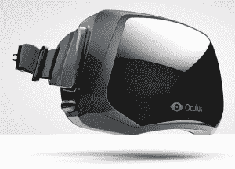

# Oculus VR 筹集了 1600 万美元来制造他们疯狂的虚拟现实游戏护目镜——第 216 页——TechCrunch

> 原文：<https://web.archive.org/web/https://techcrunch.com/2013/06/17/oculus-vr-raises-16m-to-build-their-crazy-virtual-reality-gaming-goggles/216/>

继他们获得巨大成功的 240 万美元 Kickstarter campagin 之后，Oculus VR [刚刚锁定了](https://web.archive.org/web/20190122013028/http://pandodaily.com/2013/06/17/virtual-gaming-headset-oculus-rift-raises-16-million-from-spark-capital/)一笔 1600 万美元的巨额 A 轮投资，以帮助他们建造真正令人惊叹的 Oculus Rift 虚拟现实护目镜。

如果你不知何故错过了所有关于裂缝的喧嚣，这里是你需要知道的:这很可能是目前游戏中最令人兴奋的事情。它与 3D 立体显示器和大量运动传感器紧密结合，是科幻小说几十年来向我们承诺的虚拟现实耳机。把裂缝绑在脸上，启动一个兼容的游戏，就像进入了一个全新的世界。

还是迷路了？看看这段我们的安东尼·哈在 CES 上演示裂缝的视频:

作为一个足够幸运曾经在我的头上绑着裂缝的人:我不能。等等。当微软用看似无限弹药的半自动手枪搬起石头砸自己的脚，而索尼在 PS4 上基本上只是遵循自然进化的道路时，这些(现在不是了)小家伙们试图改革游戏。

【顺便说一句，微软:如果你想扭转你正在淹没的潮流，哪怕只是一点点……拥抱 Oculus。很快。或者，你知道，让[索尼去做，继续绝对主导心智份额](https://web.archive.org/web/20190122013028/https://beta.techcrunch.com/2013/06/11/sony-wins-the-next-gen-console-war-or-at-least-my-heart-in-just-22-seconds/)，引领下一代。]

那么为什么要加注呢？他们从 Kickstarter 获得的 240 万美元还不够吗？

几乎没有。虽然这是一个好的开始(Kickstarter 肯定在传播这个词方面做了非常好的工作)，但最初的注入是为了 Oculus Rift 开发工具包的创建和分发——这是一个粗糙的原型硬件，旨在供开发人员进行测试，并开始在他们的游戏中实现 Rift 兼容性。

他们仍然需要构建他们的生产/零售硬件，继续构建他们的 SDK，大力宣传所有这些，让足够多的开发人员参与进来，让产品变得有价值，然后找出如何在迄今为止已经接受它的著名但相对较小的极客群体之外销售它。

他们已经做了很好的工作，说服了科技界的大部分人(包括我自己)，Oculus Rift 很可能会改变游戏的面貌——但如果是这样的话，他们面前还有一个更艰难的工作:说服其他所有人*。*

 *Oculus VR 并不是第一个在 Kickstarter 活动成功后不久就筹集大笔资金的公司。Pebble 在 Kickstarter 上筹集了 1000 万美元，然后一年后[筹集了 1500 万美元的 A 轮融资](https://web.archive.org/web/20190122013028/https://beta.techcrunch.com/2013/05/16/pebble-nabs-15m-in-funding-outs-pebblekit-sdk-and-pebble-sports-api-to-spur-smartwatch-app-development/)。Ouya 在 Kickstarter 上融资 800 万美元，然后从凯鹏华盈(Kleiner Perkins)融资 1500 万美元。这似乎开始成为大型浮华硬件初创公司的一种趋势:拥有一个巨大的 Kickstarter，推出你的原型，然后在几个月内从更传统的资金来源筹集约 1500 万美元。

本轮由 Spark Capital 和 Matrix Partners 领投。作为交易的一部分，Spark Capital 创始人 Santo Politi 和 Matrix Partner 的 Antonio Rodriguez 将加入 OculusVR 的董事会。*