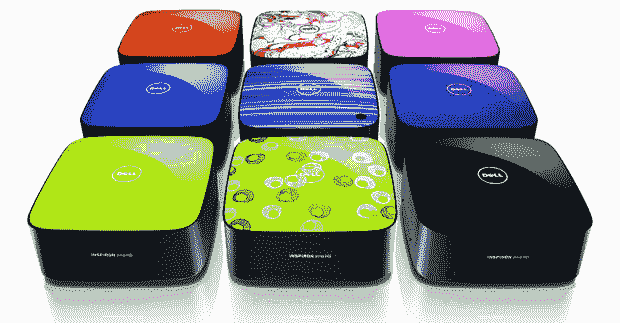

# 229 美元的戴尔 Zino HD  的 5 大最佳用途

> 原文：<https://web.archive.org/web/https://techcrunch.com/2009/11/12/229-dell-zino-hd/>

[戴尔](https://web.archive.org/web/20230327185945/http://www.crunchgear.com/tag/dell/)刚刚正式发布 [Inspiron 灵越 Zino HD](https://web.archive.org/web/20230327185945/http://www.crunchgear.com/2009/08/12/dell-inspiron-zino-hd-a-baby-dell-htpc/) 价格和 spces。过去几天，博客上出现了一些拆箱和预览，我已经爱上了这台小电脑。它比 [Mac Mini](https://web.archive.org/web/20230327185945/http://www.crunchgear.com/tag/mac-mini/) 略大，但我相信它的功能更加丰富。

HTPC:这是既定事实。229 美元的戴尔 Zino HD 放在 A/V 机架上会感觉像在家一样。Athlon CPUs 和可选的 ATI 镭龙 HD 4330 512MB GPU 有足够的能量向您的高清电视输出 1080p。选中可选蓝光驱动器和电视调谐器的复选框，即可在一个盒子中创建真正的 HTPCIB–家庭影院电脑。

**WHS**——已经有大约 12 个半内置的 [Windows Home Server](https://web.archive.org/web/20230327185945/http://www.crunchgear.com/tag/whs/) 可供选择。惠普制造了以媒体为中心的 MediaSmart 系列，宏碁制造了 Atom 包装的 easyStore 系列，联想有多种选择，这样的例子不胜枚举。它们是有能力的机器，但是它们都没有 AMD 选项在 Zino HD 中提供的处理能力，如果你想把服务器变成一个 torrent 下载怪物，这是很重要的。选择集成显卡，但选择至少 2GB 的 RAM 和 1TB 硬盘。2 个 eSATA 端口确保您永远不会耗尽存储容量。

时髦的办公电脑——运行微软 office 应用程序不再需要太多时间。当好玩的 Zino HD 也可以完成工作时，为什么要和一个无聊的灰色塔住在一起呢？即使是基本型号也能胜任大多数办公任务。

车载电脑(In-car computer)–Mac Mini 可能会让你在汽车调试人群中摆出极客的姿势，从而获得书呆子的分数，但也有许多仅限 PC 的车载应用程序，这使得 Zino HD 成为一个完美的解决方案。它占地面积小，运行 GPS 和音乐软件绰绰有余。但最重要的是，电脑有足够的颜色选择，你应该可以找到一个匹配你的车。

**老年人电脑**——现在老年人在电脑上做什么？玩脸书？仅此而已，Zino HD，以及无数其他选项，有足够的能力成为他们的可靠计算机。Athlon 内核应该能够处理[至少五个 Internet Explorer 工具栏](https://web.archive.org/web/20230327185945/http://www.crunchgear.com/2009/10/09/this-is-what-happens-when-your-mother-in-law-uses-internet-explorer/)和几个伪装成纸牌游戏的间谍软件程序。尝试使用 Atom CPU。

Zino HD 产品页面已经打开，但是你还不能定制或者订购。这可能会在今天的某个时候改变。

新闻稿，

> Inspiron 灵越 Zino HD 有多种颜色可供选择，可以轻松实现个性化，为家中的任何房间增添光彩。
> 
> **新闻:**
> 
> Inspiron Zino HD 的起价为 229 美元，包括标准的高清集成显卡、HDMI 输出和内置网络，使其能够智能地处理典型的家庭和学生计算活动，如文字处理、电子邮件、整理照片和音乐以及网上冲浪。
> 
> 经济实惠的 Inspiron Zino HD 配备可选的附加内存、硬盘存储、组合蓝光光盘播放器、高清电视调谐器、无线遥控器和 Windows 7 媒体播放器，可转变为功能强大的家庭媒体中心计算机。在这种情况下，Inspiron 灵越 Zino HD 可以录制和播放您最喜爱的电视节目，显示来自互联网的高清内容，并非常好地存储和传输音乐、视频和照片。
> 
> Inspiron 灵越 Zino HD 还是额外的家用电脑的理想之选，可以放入狭小的空间，让家庭网络变得轻而易举。它大约 7.75 平方英寸，3.5 英寸高。虽然尺寸很小，但 Inspiron 灵越 Zino HD 在以下方面表现出色:
> 
> *   超小型设计，适合几乎任何地方。
> *   Inspiron Zino HD 有九种颜色可供选择，轻松实现个性化。
> *   选择 AMD 处理器或双核速龙新 X2 6850e。
> *   最高 8GB 双通道 DDR 2 内存。
> *   高达 1TB 的内置硬盘存储。
> *   组合 DVD/CD RW 光驱，可选配蓝光光盘组合。
> *   集成 10/100/1000 网络和无线选项。
> *   可选电视调谐器、无线键盘和鼠标。
> *   内置 2.1 高清音频和 4 合 1 多媒体读卡器。
> *   带有标准 HDMI 和 VGA 视频连接的集成 ATI 图形适配器，以及可选的 512MB 独立图形适配器。
> *   四个 USB 端口(2 个前置/2 个后置)；两个 eSATA 端口(后部)。
> *   符合能源之星 5.0 标准。
> 
> 在某些地区将提供不带高清功能或升级选项的基本 Inspiron Zino。