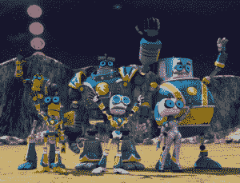

# 24/7 3D 网络 3net 将儿童友好的内容带入第三维 

> 原文：<https://web.archive.org/web/http://techcrunch.com/2011/08/26/247-3d-network-3net-brings-kid-friendly-content-to-the-third-dimension/>

# 24/7 3D 网络 3net 将儿童友好的内容带入第三维空间

如果你拥有一台 3D 电视，你应该已经了解了 [3net](https://web.archive.org/web/20230205044000/https://techcrunch.com/2011/02/14/3net-the-247-3d-network-launches-with-documentaries-galore/) 。这是索尼、Discovery 和 IMAX 的合资网络，每天全天显示 3D 内容，考虑到 3D 内容的数量严重不足，这非常棒。它最初推出了相当多的自然风格的节目和纪录片，非常适合 3D 空间，但今天宣布了一个更适合孩子的产品。

从 9 月 25 日晚上 8 点开始，3net 将首播两个新的面向儿童的 3D 节目，首先是 3D 动画系列《闪电与闪电》，然后是《梦想保卫者》。然后在 10 月 1 日，在通常的周六上午时尚，3net 三迪儿童周末阵容将首映 30 小时的家庭友好的 3D 内容。

节目包括原创系列《喂食时间》(Feeding Time)，以及《小狗碗》(3net exclusive)，还有一些索尼电影公司的 3D 家庭电影。3net 承诺在未来几个月推出更多游戏，但现在，请做好准备迎接闪电和梦想捍卫者。

 【博尔特】& Blip 星两个最好的朋友，只是碰巧是机器人。他们尽最大努力成为战斗机器人，在机器人运动的月球联盟中战斗(到目前为止，这真的很令人兴奋)，直到他们意识到他们可能已经超出了他们的能力范围。这部连续剧由 26 集半小时组成。

由双胞胎赞和佐伊主演的《梦想捍卫者》讲述了一对兄妹的故事，他们是保护现实世界免受梦幻世界可怕生物袭击的最后一道防线。听起来像是每个孩子想象中的同一个故事，所以在 3D 中应该会很受欢迎。哦，还有一台超级计算机叫宙斯。还有谁不爱超级计算机？

《梦想保卫者》和《闪电与信号》在 9 月 25 日首映后，孩子们将不得不等到 10 月 1 日的下一个周末才能看到他们周六早上的卡通片。只不过这些孩子来自未来，他们的卡通是 3D 的。确实很时髦。