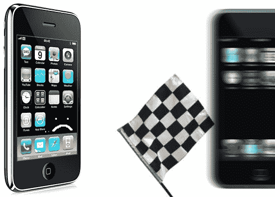

# 第二代 iPod Touch 是苹果游戏家族中“迄今”最快的产品 

> 原文：<https://web.archive.org/web/https://techcrunch.com/2008/11/23/2g-ipod-touch-fastest-by-far-of-the-apple-family-for-games/>

# 第二代 iPod Touch 是苹果家族中速度最快的游戏产品

啊，对。另一个要归入“抹去 iPhone 用户脸上的笑容”类别的仿真陈述。你看，我并不反对 iPhones，但我确实不喜欢人们说话的样子，好像他们在某个秘密的特权俱乐部一样。事实证明，第二代 iPod Touch 比苹果的其他可触摸产品拥有近 100MHz 的优势，当你谈论游戏和几乎肯定的其他应用程序时，这一点非常重要。

[的开发者在这次采访](https://web.archive.org/web/20221007165916/http://toucharcade.com/2008/11/23/2nd-generation-ipod-touch-faster-than-iphone/)中提到，在为 Touch 2G 编码时，他们可以在网球比赛中的每个球员身上多放 500 个多边形，这也表明图形硬件也已经升级了。当然，由于不具备手机和互联网设备的功能，Touch 无疑占用了更少的内存和缓存。让我更加想要一个。
【via[MAC rumors](https://web.archive.org/web/20221007165916/http://www.macrumors.com/2008/11/22/2nd-generation-ipod-touch-faster-than-iphone/)