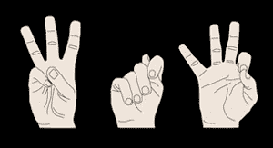

# 电视节目前我想从 Twitter 上看到的 300 件事

> 原文：<https://web.archive.org/web/https://techcrunch.com/2009/05/25/300-things-id-like-to-see-from-twitter-before-a-tv-show/>

 这不是一个糟糕的笑话，推特显然不知何故卷入了一个[新电视节目](https://web.archive.org/web/20230223123029/https://techcrunch.com/2009/05/25/twitter-heads-to-hollywood-plans-to-develop-tv-show/)。除此之外，这也为我们的[赢得了很少在手语图像中使用的](https://web.archive.org/web/20230223123029/https://techcrunch.com/2008/06/14/hey-microsoft-how-bout-we-do-that-first-deal-you-offered/)“WTF”。

Twitter 尚未回复电子邮件，但投资者[弗雷德·威尔逊](https://web.archive.org/web/20230223123029/http://www.crunchbase.com/person/fred-wilson)似乎认为这是一个好主意，他说*“电视不再是电视了。它只是房子里最大的屏幕。”*

因此，我们将等待更多的节目细节浮出水面之前，我们写不可避免的博客文章诋毁这个想法(**更新:** [细节！](https://web.archive.org/web/20230223123029/http://blog.twitter.com/2009/05/twitter-goes-hollywood.html))。与此同时，推特，作为一个重度用户，我宁愿你们花时间去做无数的事情，而不是去好莱坞。这里有几个关键的，我猜更多的会出现在评论中，我们会找到至少 300 个左右 Twitter 可以更好地利用时间的事情。

保持灯亮着。 [Twitter 仍然不是一个稳定的服务](https://web.archive.org/web/20230223123029/https://techcrunch.com/2009/05/08/twitter-and-friendfeed-battle-for-downtime-scobles-head-explodes/)。

**修正轨道。这是 Twitter 的“Google Alerts”功能，曾在 2007 年短暂出现过，但在 2008 年的正常运行时间大战中被取消。当时移除它可能是有意义的，但是我们早就应该使用这个急需的功能了。**

**修复搜索。** Twitter 的[主要价值是作为搜索引擎](https://web.archive.org/web/20230223123029/https://techcrunch.com/2009/03/05/its-time-to-start-thinking-of-twitter-as-a-search-engine/)，也挺[破](https://web.archive.org/web/20230223123029/http://www.louisgray.com/live/2009/05/twitter-search-engine-is-very-very.html)。这里有很多工作要做。

停止打碎东西。 Twitter 似乎对自己的皮肤感到不舒服，[做出改变](https://web.archive.org/web/20230223123029/https://techcrunch.com/2009/05/12/twitter-decides-were-not-smart-enough-for-replies-changes-them-again/)以适应只是混乱和需要扭转的大众。

**修复私信。** Twitter 的直接消息(私信)偶尔会打嗝。有时它们会被误送，比如送错了人。那是不可能发生的。

**也许会推出一些功能。Twitter 如此关注正常运行时间，以至于他们很少(从不)推出新功能。像 FriendFeed 这样的网站正在用创新使他们难堪，而其他像脸书这样的网站正在抄袭 Twitter 的核心服务。我知道正常运行时间很重要，但如果你有时间在好莱坞开会，你就有时间添加新功能。至少花点时间面试新工程师。你急需更多的人。**

好的，这是第六个。在参与电视节目之前，请在评论中告诉我你希望看到 Twitter 做什么，我们会在主帖子中添加最聪明和最有趣的内容。

**更新:**来自评论的一些更好的建议:

**群组/好友列表**——@ zee 和@blackrabbit

**API 请求增加/无限制** —萨姆·休斯顿和杰夫

**“一种商业模式。”**——@ robinwauters

**垃圾邮件过滤** —肖恩·帕西瓦尔

**与蒸汽整合**——@ carlton prest

**30 秒编辑窗口**——@希莫斯

**分析**——@ MiikoMentz

iTunes 天才般的推荐引擎

标签的自动链接

**线程对话** — jcunwired

有些建议更有趣一些:

**《向 FF 投降》** —约翰尼·施罗夫

将一只猫的粉丝数量限制在 499，999——@ robinwauters

**“淋病——我想在推特电视节目开始前看看。”** —但丁

**“一个电话号码，我可以在那里做空计划播出这个节目的电视网的股票。”** —锻造

“在我希望人们参与电视节目之前，我希望看到推特允许人们通过推特@推特蛋糕来订购芝士蛋糕。”——@ chacha 102