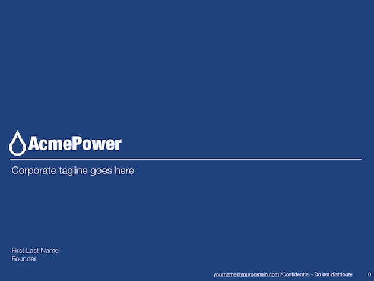
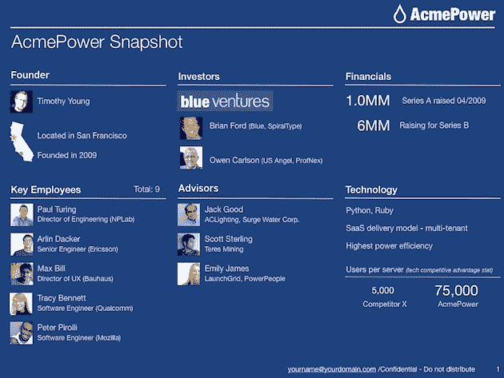
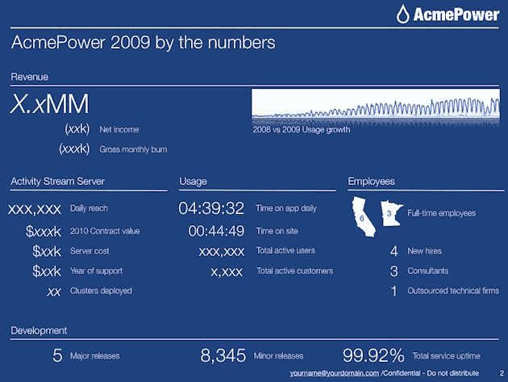
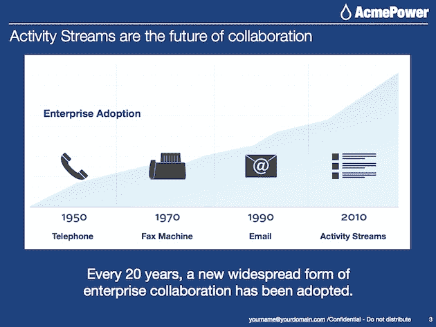
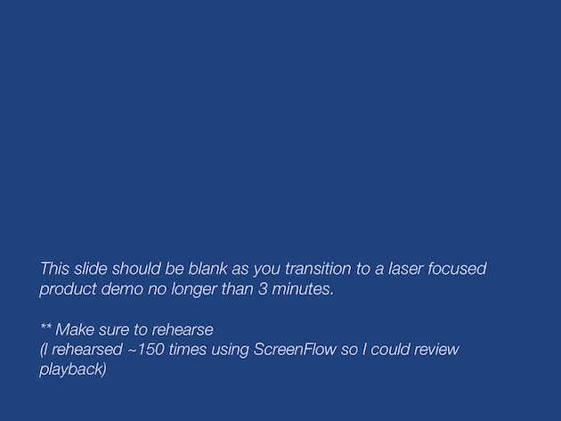
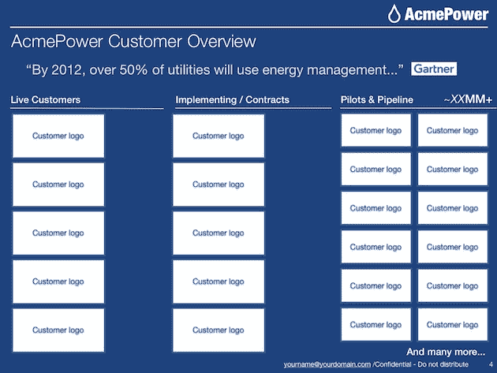
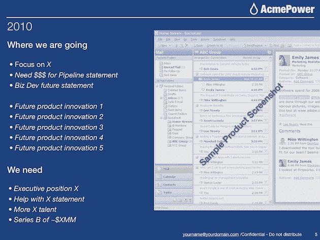

# 365 天，1000 万美元，3 轮，2 家公司，5 张神奇幻灯片 

> 原文：<https://web.archive.org/web/http://techcrunch.com/2010/11/02/365-days-10-million-3-rounds-2-companies-all-with-5-magic-slides/>

 * **编者按:**以下是 [Socialcast](https://web.archive.org/web/20230203072434/http://socialcast.com/) 创始人 [Tim Young](https://web.archive.org/web/20230203072434/http://www.crunchbase.com/person/tim-young) 的一篇客座博文，详细讲述了他是如何用 5 张幻灯片在一年时间内筹集了 3 轮总计 1000 万美元的风投资金。这篇文章最初发表在[“知识是社会的”](https://web.archive.org/web/20230203072434/http://knowledgeissocial.com/365-days-10-million-3-rounds-2-companies-all-with-5-magic-slides/)*

“我有一个简短的五张幻灯片的幻灯片，它为理解我们的业务提供了一个坚实的框架。”

自从一年多前搬到旧金山，我每天都在帮助建立 Socialcast 和 about.me。在此期间，我已经为 [Socialcast](https://web.archive.org/web/20230203072434/https://techcrunch.com/2010/03/31/socialcast-8-million-series-b/) 和 [about.me](https://web.archive.org/web/20230203072434/https://techcrunch.com/2010/09/10/reserve-your-name-at-about-me/) 筹集了超过 1000 万美元的资金。说服风险投资家在不到 365 天的时间里投资两家初创公司是一项具有挑战性的任务，但它很快教会了我融资的该做和不该做的事情。以下是我在筹款过程中学到的独特经验的概述，主要集中在初次见面，这是最重要的，因为你是第一次介绍你的公司和愿景。

**首次会议停止使用投影仪**

我最初的大多数风险合伙人会议都是在会议室结束的。为了投影我的幻灯片，我通常会带一个苹果迷你显示端口到 VGA 适配器。在一家知名大型基金的办公室，我意识到我把适配器忘在了另一个包里。我决定调整我的计划，用我的笔记本电脑屏幕浏览幻灯片，而不是看起来毫无准备地去借一个适配器。如果你要和两个人以上的人会面，我不建议你这么做，但是这次会面是我最好的一次，并且达成了一份协议。为什么会这样？通常，在推介会议上，你和投资者坐在会议桌的两边。但是共享一个屏幕，坐得离得很近，环境自然就变得更加舒适和放松。

**理解投资者的观点**

每个风险投资伙伴都有自己了解您的业务的理想方法。有些人是“产品人员”,他们会真正想了解您的产品或服务。其他人是资助集中，而其他人将最初集中在你组建的团队。了解您是哪种类型的创始人对于找到合适的投资伙伴至关重要。你想和一个和你一样专注的人一起工作吗？或者您更愿意与一位为公司带来不同但互补的投资者合作？您应该始终了解您遇到的每个投资者的背景，并在遇到他们之前尝试确定他们的关注点。您可以通过查看他们以前的工作经验来做到这一点——他们是否管理过销售组织或产品组？或者他们的整个职业生涯都在冒险？他们以前的经历可以让你对他们在公司建设方面的观点和专业知识有一个相当自信的想法。

**初始滑台**

通常，首次会议持续 30 分钟至 1 小时。时间过得很快，我坐在球场上，投资者没有时间回答问题。这通常是由于创始人带来了过多的幻灯片，其中大部分都是不必要的。初次会面的存在是为了让你可以向潜在的投资者介绍你的公司，测量他们的兴趣，并进入下一步。为了达到这个预期的结果，你必须给出一个可靠的业务概述，不要陷入讨论或技术陷阱。老鼠洞通常是由于幻灯片过多而出现的，这会减慢会议的进程和流量。在筹集资金的过程中，我对最初的会议采取了极端的方式，只使用了 5 张幻灯片。你能做的最糟糕的事情就是打开一个 30 页中第 1 页的演示文稿。如果您不能在 5 张幻灯片中概述您的业务，您应该回到画板上，简化您的信息传递。在会议开始时进行了初步介绍和闲聊后，我通常会从以下内容开始我的演示:

*“我有一个简短的五张幻灯片要分享，它为理解我们的业务提供了一个坚实的框架。”*

用这个简单的陈述开始，在投资者的脑海中形成你的陈述。他们现在已经知道，幻灯片只有 5 张，而不是 30 张。当我开始陈述时，我立即注意到潜在投资者的参与度有所提高。请注意，下面只是几张幻灯片，因为我直接谈到了业务的大部分愿景、战略、价值和潜力。

**神奇 5 滑架**

我直接从我的实际舞台上制作了下面的幻灯片，只是交换了一些机密的细节和人物。AcmePower 是一家虚构的公司。

**幻灯片 0:在幻灯片盖上公司标志和日期**

**幻灯片 1:公司快照**

包含当前参与人员的快速视图，包括:创始人、投资者(天使、朋友和家人等。)、关键员工和顾问、财务(筹集的资金，如果有的话，以及所需的资金数额)、技术(您使用的是什么？–不需要具体说明)，以及客户(主要客户、活跃用户数量等)。)

**幻灯片 2:数字**

包含公司迄今为止的数字故事，包括收入(如果有的话)(也包括净收入，当前每月燃烧)。

**幻灯片 3:时间线(又称金钱幻灯片)**

人类喜欢模式。这是我们解释世界的方式。把这张幻灯片放在一起需要时间和研究，但它被证明是最有价值的。在过去的 6 个月里，我认识了另外 5 家使用这种幻灯片的创业公司，它们都成功地筹集了资金。我认为这是整套幻灯片中最重要的一张。在这里，您可以设置趋势模式，然后直接进入演示。这创造了一个强有力的叙述，你告诉他们你知道未来，然后用你的演示向他们展示未来。注意:下面我使用了我的 Socialcast 幻灯片中的真实幻灯片，介绍了活动流的兴起。

**空白幻灯片:产品演示**

无论是向一个合伙人推销还是向公司的所有合伙人推销，有时候我想提出一个观点，但总有人想回头讨论当前或之前的幻灯片。这种情况发生了两次后，我调整了我的演示文稿，加入了空白幻灯片。我会在我的幻灯片中插入空白幻灯片，在那里我想表达一个强有力的口头观点或过渡。空白的幻灯片立刻把大家的注意力拉回到我身上。我会稀疏地使用空白幻灯片，因为你不想做得太多(它们是用于戏剧效果的)。在我最初的会议五张幻灯片中，我在演示中间使用了一张空白幻灯片来过渡到一个简短的产品演示。

**幻灯片 4:牵引/客户概述**

**
**

**幻灯片 5:我们要去哪里**

首先，你要列出公司目前最关注的 3 个优先事项，并确保包括你认为投资者可以如何提供帮助。这些都是你推销的谈话要点。

**支持幻灯片**

有了这 5 张幻灯片，我还准备了大约 40 张辅助幻灯片。在最初的会议中，我很少使用这些幻灯片，但在随后的会议中会用到它们。这些幻灯片是在一个单独的演示中，只有在部分讨论需要更深入的背景知识时，我才会进行介绍。我会在推销过程中谈论业务的所有这些方面，如果需要，我可以在讨论过程中迅速提出来分享。大约 40 张幻灯片分为以下几个部分:

*深入了解每个团队成员的背景

*概述价值主张的几个现有客户案例研究

*几张关于客户获取战略的幻灯片

*深度技术概述

*目标客户概况

*市场规模机会

**幻灯片规则**

我总是遵循一些简单而重要的幻灯片规则:

1.面孔面孔面孔。这都是关于脸的(对戴夫·麦克卢尔的一点赞美)。在幻灯片中，记得使用员工的面孔。不要只列出一堆员工的名字。记住，投资者主要投资于一个团队。一定要突出并强化它们。

2.保持简单，文字越少越好。我尽量不要让每张幻灯片包含一个以上的要点或关键信息。任何更多，你会看到人们拿起他们的黑莓手机。

3.确保你的幻灯片传达了一个故事。当然，产品和团队都很棒，但你想分享旅程，让投资者搭顺风车。

4.千万不要看你的幻灯片。潜在投资者试图了解你是谁，以及你能把自己的愿景推销得多好。阅读你的幻灯片会让演讲失去激情。

5.幻灯片应该只有支持数据。记住你所说的是最重要的；不仅仅是你幻灯片上的内容。

最重要的是:

6.幻灯片看不到人的眼睛。你可以。你的眼睛有助于推销你的愿景、激情、热情，最重要的是，你想与潜在投资者分享的旅程。

希望这些课程能帮助你筹集资金，并清晰地传达你的愿景。您可以在此下载 PDF 格式的幻灯片: [Magic 5 幻灯片 PDF](https://web.archive.org/web/20230203072434/http://cl.ly/20cdd29126cf87efd794)

如果你想要原始的主题演讲资料，请发邮件给我，我会发给你:【tim@socialcast.com
