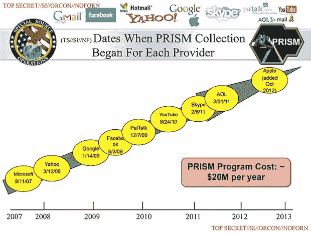

# 谷歌、脸书、Dropbox、雅虎、微软、Paltalk、美国在线和苹果否认参与美国国家安全局棱镜监控项目——第 38 页——

> 原文：<https://web.archive.org/web/https://techcrunch.com/2013/06/06/google-facebook-apple-deny-participation-in-nsa-prism-program/38/>

# 谷歌、脸书、Dropbox、雅虎、微软、Paltalk、AOL 和苹果否认参与 NSA 棱镜监控项目

《华盛顿邮报》今天[报道](https://web.archive.org/web/20190910003128/http://www.washingtonpost.com/investigations/us-intelligence-mining-data-from-nine-us-internet-companies-in-broad-secret-program/2013/06/06/3a0c0da8-cebf-11e2-8845-d970ccb04497_story_1.html)谷歌、苹果、脸书、Dropbox、微软、Paltalk、AOL (TechCrunch 的母公司)和雅虎参与了[所谓的棱镜计划](https://web.archive.org/web/20190910003128/https://beta.techcrunch.com/2013/06/06/report-nsa-collects-data-directly-from-servers-of-google-apple-microsoft-facebook-and-more/)，该计划为 [NSA](https://web.archive.org/web/20190910003128/http://www.nsa.gov/) 提供了看似几乎直接访问其服务器和用户数据的途径。

我们现在已经联系了所有这些公司，它们都断然否认参与其中。

考虑到包括[《今日美国》](https://web.archive.org/web/20190910003128/http://www.usatoday.com/story/news/2013/06/06/nsa-surveillance-internet-companies/2398345/)在内的许多出版物现在都引用消息来源来证实这个项目的存在，这些否认显得特别奇怪。根据这些报道，棱镜计划并没有针对美国公民或任何在美国的人。

这是我们目前得到的信息:

**脸书**

“我们不向任何政府机构提供直接访问脸书服务器的权限。当脸书被要求提供有关特定个人的数据或信息时，我们会仔细审查任何此类要求，以符合所有适用法律，并仅在法律要求的范围内提供信息。”

**谷歌**

“谷歌非常关心我们用户数据的安全。我们依法向政府披露用户数据，并仔细审查所有此类请求。人们不时声称，我们在我们的系统中建立了一个政府“后门”,但谷歌没有让政府获取私人用户数据的后门。"

苹果

 **苹果给 AllThingsD 的声明是这样的:

“我们从未听说过棱镜。我们不向任何政府机构提供直接访问我们服务器的权限，任何政府机构要求获得客户数据都必须获得法院指令。”

**微软**

“我们只有在收到具有法律约束力的命令或传票时才会提供客户数据，而不是在自愿的基础上。此外，我们只遵从有关特定账户或身份的请求。如果政府有一个更广泛的自愿国家安全计划来收集客户数据，我们不会参与其中。”

雅虎

“雅虎！非常重视用户的隐私。我们不会让政府直接访问我们的服务器、系统或网络。"

**Dropbox**

“我们看到有报道称，Dropbox 可能会被要求参与一项名为 PRISM 的政府项目。我们不是任何此类计划的一部分，并将继续致力于保护我们用户的隐私。"

**帕特洛克**

“我们没有听说过棱镜。Paltalk 极其谨慎地保护和确保用户数据的安全，只在法律要求的情况下响应法院命令。Paltalk 不向任何政府机构提供对其服务器的直接访问。"

美国在线

“我们对棱镜计划一无所知。在没有法院命令、传票或正式法律程序的情况下，我们不会向政府机构披露用户信息，也不会让任何政府机构访问我们的服务器。”

当我们收到文件中提到的其他公司的来信时，我们会更新这篇文章。

**