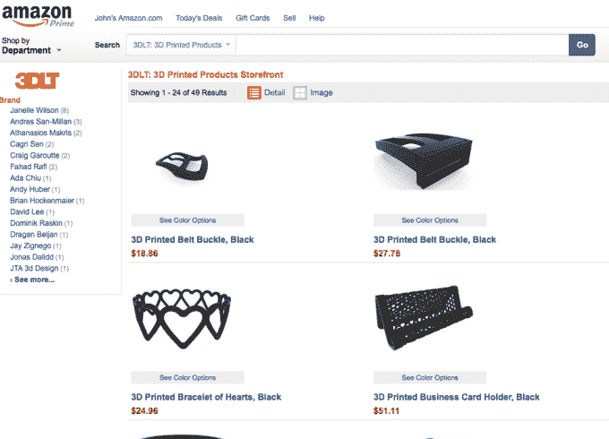

# 3D Marketplace 3DLT 谈论在亚马逊 上销售首款 3D 打印设备

> 原文：<https://web.archive.org/web/https://techcrunch.com/2014/03/10/3d-marketplace-3dlt-talks-about-selling-the-first-3d-printed-gear-on-amazon/>

# 3D Marketplace 3DLT 谈论在亚马逊上销售第一个 3D 打印的设备

我们第一次见到辛辛那提的 3DLT [是在去年](https://web.archive.org/web/20230405170017/https://techcrunch.com/2013/04/30/3dlt-launches-the-first-store-for-printable-3d-objects/)，当时他们在 Disrupt 上宣布了他们的 3D 打印市场。由于亚马逊在[的新努力，该团队又回到了新闻中，在他们已经庞大的商品选择中增加了印刷商品。](https://web.archive.org/web/20230405170017/http://www.amazon.com/gp/node/index.html?ie=UTF8&marketplaceID=ATVPDKIKX0DER&me=A1V9JQ2VE1JCFX&merchant=A1V9JQ2VE1JCFX&redirect=true)

现在事情还处于实验阶段，但我给首席执行官小约翰·j·豪尔发了几个问题，他给了我们一些澄清，关于亚马逊打开 3D 打印闸门意味着什么。
 **TC:你是如何接洽亚马逊来销售这些商品的？**

豪尔:我们试图建立一个商店，销售 3D 打印产品。他们联系我们，告诉我们他们没有 3D 打印产品类别。我们问他们是否会创造一个。他们告诉我们，他们正在考虑一个试点，后来要求我们加入。
 **TC:你是怎么选择卖什么的？
**

Hauer:亚马逊要求我们提供 4 类产品——珠宝、家居装饰、玩具和时尚配饰(包括科技配饰)。

**TC:你真的是按需印刷吗？你有库存吗？**

豪尔:现在我们是按需印刷。一旦他们对数量有了感觉，他们可能会要求我们打印库存并运送到他们的仓库。这可能允许他们使这些产品符合主要条件。你在打印什么？

Hauer:通过我们的服务合作伙伴，产品正在尼龙塑料中进行激光烧结。

**TC:亚马逊和 3DLT 的未来如何？你会允许亚马逊用户上传模型吗？**

Hauer:我们将在接下来的几个月进行测试，根据需求我们可能会扩大试点范围。我们最初不打算让亚马逊用户上传模型，但这是一个有趣的概念。

**TC:澄清一下，说亚马逊和你们合作有点不真诚。我或许可以在我的地下室里做这件事，然后建立一个亚马逊卖家账户。这有什么不同？** 

豪尔:这是一个封闭的试点。我们是仅有的五个参与合作伙伴之一，并被亚马逊选中。

