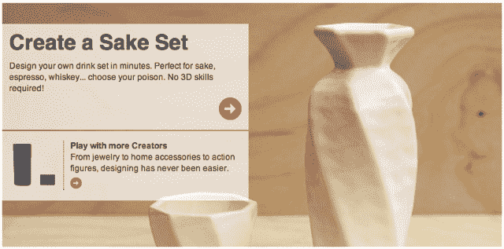

# 3D 打印初创公司 Shapeways 筹集 510 万美元，计划在纽约建立生产设施 

> 原文：<https://web.archive.org/web/http://techcrunch.com/2011/11/17/3d-printing-startup-shapeways-raises-an-additional-5-1-million-plans-nyc-production-facility/>

# 3D 打印初创公司 Shapeways 筹集了 510 万美元，计划在纽约建立生产设施

在科技发展的所有酷事物中，我最喜欢的是 3D 打印。它有这样一种未来派的品质:输入一个数字原理图，你就会得到一个按照你的具体规格定制的实体产品。*想打印自行车零件就可以*。多神奇啊。

抱歉，我还没想明白。无论如何，我不是唯一一个感到兴奋的人:[Shapeways](https://web.archive.org/web/20230203153837/http://www.shapeways.com/)——一家希望将 3D 打印带给大众的公司——刚刚从现有投资者 Union Square Ventures 和 Index Ventures 那里额外筹集了 510 万美元，它还从纽约投资基金获得了 120 万美元的贷款承诺。该公司去年秋天筹集了 500 万美元。

对于 Shapeways 的客户来说，也有一些好消息:该公司计划于 2012 年在纽约市推出印刷设施。历史上，通过 Shapeways 订购(然后印刷)的商品要么通过签约的第三方制造，要么通过公司自己在荷兰埃因霍温的工厂制造。

现在，它将能够在美国本土打印，最终结果将是更快的客户投票时间，更低的价格。该公司还没有具体说明预计会节省多少钱，但我被告知会相当可观。

对于那些没有使用过它的人来说，Shapeways 既是一项打印 3D 设计的服务，也是设计师向客户出售定制打印产品的市场。该服务还有一套向导，允许没有任何 3D 设计经验的用户定制某些对象，比如这个新的[清酒套装](https://web.archive.org/web/20230203153837/http://www.shapeways.com/creator/sake-set/)。产品可以由一系列材料制成，包括从白色、坚固的塑料到不锈钢的各种材料(你可以在这里找到 25 种以上材料的清单)。

该公司表示，其市场现在有超过 30 万种产品和 10 万名用户。他们的纽约办公室现在有 19 个人。

