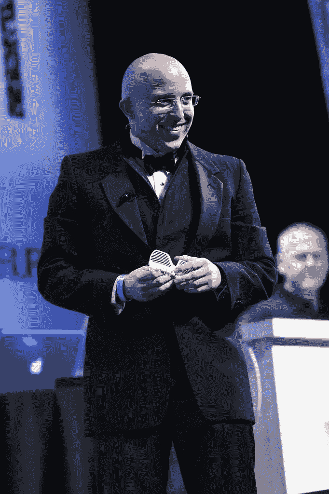

# 3DLT 推出第一家可打印 3D 对象商店

> 原文：<https://web.archive.org/web/https://techcrunch.com/2013/04/30/3dlt-launches-the-first-store-for-printable-3d-objects/>

# 3DLT 推出第一家可打印 3D 对象商店

俄亥俄州的辛辛那提以孟加拉虎、布茨·柯林斯和[天际线辣椒](https://web.archive.org/web/20230405002438/http://en.wikipedia.org/wiki/Skyline_Chili)而闻名，但它即将成为首批拥有真正 3D 打印设计市场的城市之一。 [3DLT](https://web.archive.org/web/20230405002438/http://3dlt.com/) 是一家位于 Cincy 的小公司，由一组程序员创建，正在将免费的 3D 建模世界整合起来，实质上是为 ABS 制作 Etsy。

该团队由 Pablo Arellano、John Hauer、Colin Klayer 和 Tim Maggart 组成，迄今为止已经筹集了 10，000 美元的个人投资。今天，他们宣布了一项赠送 1000 万美元免费 3D 物体积分的计划。他们还将在全国范围内建立一个 3D 打印机网络，让用户能够与可以按需购买的打印机建立联系。

“我们是 Graphic River、iStockPhoto 和其他内容市场的忠实粉丝，”阿雷利亚诺说。“我们认为，当 3D 打印变得可行时，将需要一个 3D 可打印内容的市场。”

“我们在两个方面具有颠覆性:我们将通过提供跨多个类别的广泛选择、组织有序的设计，加速日常消费者对 3D 打印产品的采用。我们还让消费者——从你的祖母到你的孙子——更容易购买他们可以在家里、网上或当地 3D 打印店打印的 3D 设计，”他说。
 
他们还旨在通过与 3D 打印提供商合作，使 3D 打印商品化，并使其更加“经济实惠”。

该公司今天在纽约的 [Disrupt](https://web.archive.org/web/20230405002438/https://techcrunch.com/tag/Disrupt) 发布。

“3D 打印已经在价值 230 亿美元的原型市场中广泛使用，并在汽车、时尚、玩具和其他许多领域迅速获得牵引力。在不久的将来，日常用品，从镜框到家具，从运动鞋到高跟鞋，都将被 3D 打印出来。阿雷利亚诺说:“3DLT 是这个行业引发一个转折点所需要的。