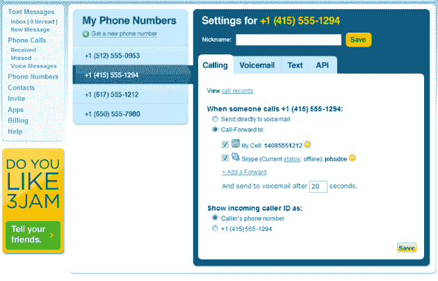
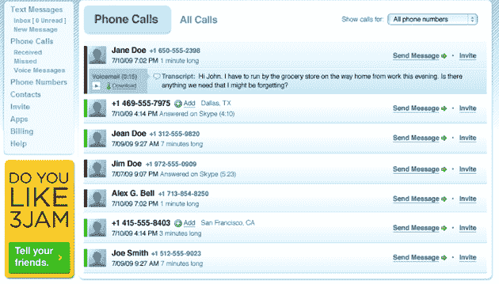

# 3jam 推出虚拟号码，直面谷歌语音 TechCrunch

> 原文：<https://web.archive.org/web/https://techcrunch.com/2009/07/30/3jam-launches-virtual-numbers-takes-google-voice-head-on/>

最近，谷歌语音登上了许多头条，但不是你希望的原因。这项服务已经遭遇了来自苹果的令人沮丧的反对[和可能在& T 的反对](https://web.archive.org/web/20221006195117/http://www.beta.techcrunch.com/2009/07/27/apple-is-growing-rotten-to-the-core-and-its-likely-atts-fault/)(取决于你相信谁)。今天，它遭到了另一种形式的反对:3jam，一家迄今为止主要提供短信服务的公司，正在扩展提供电话服务，将与 Google Voice 正面交锋。

3jam 提供了许多与谷歌语音相同的核心功能，包括一个电话号码呼叫多部电话的能力，以及一个管理语音邮件和短信的在线界面，尽管它缺乏一些更高级的功能(稍后会详细介绍)。但它确实有一些谷歌语音没有的功能，比如在 Skype、AOL 和 Yahoo Messenger 上接听电话的能力(为什么你要坐在电脑前浪费时间呢？)

3jam 也有一些令人印象深刻的短信功能，考虑到该公司在短信方面的历史，这是有意义的。其中之一是群发短信聊天，让你指定一个新的电话号码作为“群发号码”，然后选择你的联系人在你的群中。每当群组中的某个人向该号码发送消息时，该消息也会发送给群组中的其他人。外人可以尝试向特殊号码发送消息，但不会有任何效果。

3jam 还试图解决谷歌语音面临的最大问题之一:号码可移植性，允许你将当前的电话号码转移到新服务中。我们听说谷歌正试图制定细节，以便在今年的某个时候推出他的功能，但这带来了许多后勤问题。首先，用户可能会意外取消他们的运营商合同，导致高额费用。等待一个号码从运营商转移到服务可能需要几个星期。但这并没有阻止 3jam。尽管存在这些障碍，该公司仍允许用户转移他们的号码，尽管用户会被警告这个过程可能需要长达 45 天。

因此，3jam 有一些优势，但在一些关键领域仍落后于谷歌语音。3jam 缺乏谷歌语音的许多更高级的功能，如呼叫过滤选项——谷歌语音允许你设置用户列表并相应地过滤呼叫(例如，我可以在下午 6 点后直接给某些人发语音邮件，但让我的家人随时给我打电话)，而 3jam 不提供任何类似的功能。3jam 需要付费，计划从每月 5 美元左右开始(谷歌语音的大部分功能都是免费的)。

当然，这种服务的市场是巨大的，因此 3jam 即使与谷歌语音在同一领域也可能有机会，但它仍然有许多障碍。这个概念对大多数人来说还是很新奇的，有些人可能会拒绝将他们的电话服务交给一家初创公司。当 3Jam 试图将其服务引入智能手机时，它将不得不面临与谷歌相同的问题，尽管运营商可能不像谷歌那样对初创公司那么熟悉。

尽管面临这些挑战，3jam 还是有了一个相当好的开端。该公司正在提供一种白色标签的产品，该产品已经获得了生产小型移动通信设备的 [Peek](https://web.archive.org/web/20221006195117/http://www.getpeek.com/) 公司的许可。现在面临更大的挑战:让普通人理解并注册这项服务。

更多信息，请点击查看网站介绍[。](https://web.archive.org/web/20221006195117/http://prezi.com/115735/view/)

