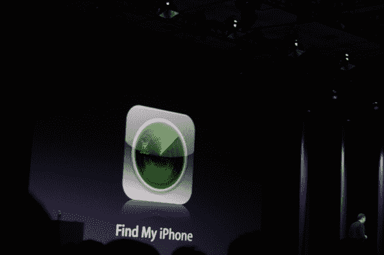

# iPhone 生态系统的现状:4000 万台设备和 50000 个应用程序| TechCrunch

> 原文：<https://web.archive.org/web/https://techcrunch.com/2009/06/08/40-million-iphones-and-ipod-touches-and-50000-apps/>

苹果刚刚宣布了其广受欢迎的应用商店的又一个里程碑:商店中现在有 50，000 个应用程序可用。这一消息是在旧金山的 WWDC 活动上宣布的，同时有消息称苹果已经售出约 4000 万部 iPhones 和 iPod touches。

此前，苹果在 4 月达到了第 10 亿次应用下载[，并在当月晚些时候](https://web.archive.org/web/20230320003258/https://techcrunch.com/2009/04/23/apples-app-store-1-billion-served/)[达到 35，000 次应用下载](https://web.archive.org/web/20230320003258/https://techcrunch.com/2009/04/22/economy-be-damned-apple-posts-its-best-second-quarter-earnings-ever/)。该平台没有显示出放缓的迹象，这对竞争对手来说是个坏消息，包括新的 Palm Pre，它在周六推出，减少了大约 49，981 个应用程序。

苹果继续展示了 iPhone 3.0 的一些功能——有 100 多个新功能，1000 多个新 API。不幸的是，看起来美国的 MMS 支持要到今年夏天晚些时候才可用——显然是美国电话电报公司的阻碍。正如我们之前听到的，剪切、复制和粘贴将会出现在 3.0 中——这是许多用户长期以来所期望的。

苹果还推出了一种方法，可以通过 iTunes 从你的 iPhone 上以无线方式租借和购买电影。你也可以购买电视节目、音乐视频和有声读物。iPhone 现在也支持 iTunes U。

看起来苹果终于解决了棘手的家长限制问题，因为这是 iPhone 的内置功能。这不仅适用于电影和电视节目，更重要的是适用于应用程序。现在，这应该可以解决 App Store 中一些愚蠢的应用程序拒绝问题。

网络共享现在可以在苹果电脑和个人电脑上使用了。它通过 USB 或蓝牙有线工作，苹果称之为“无缝”，表明它非常容易设置。它将在“稍后”推出引来了人群的嘲笑。

iPhone 版 Safari 的 JavaScript 速度将提高 3 倍。它将支持 HTML 5——这是一个新标准，谷歌在两周前的谷歌 I/O 大会上强调了它的重要性。

新的“查找我的 iPhone”功能引来一片欢呼。如果你在任何地方丢失了你的 iPhone，并且有一个 MobileMe 帐户，你可以在网上的地图上找到你的 iPhone 的确切位置。你也可以远程 ping 你的 iPhone，它会发出一个警告噪音来显示它的位置。如果它真的被偷了，你现在可以发送一个远程擦除命令，删除手机上的所有内容。一个很好的特征。

一个健康应用程序的演示，你可以远程监控某人的生命体征，通过书店应用程序进行应用内购买，以及 TomTom 的逐向导航，都赢得了欢呼。

一个新的 ZipCar 应用程序非常酷。你可以让喇叭鸣响，并直接从 iPhone 应用程序解锁你借来的车。

iPhone 3.0 将于 6 月 17 日上市。开发商今天拿到金主。

